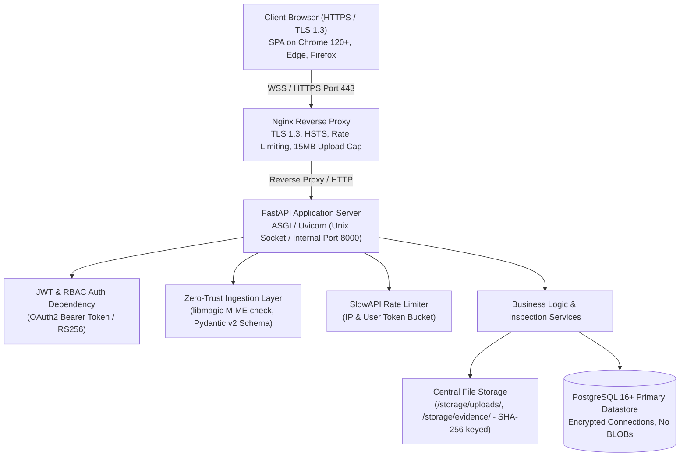
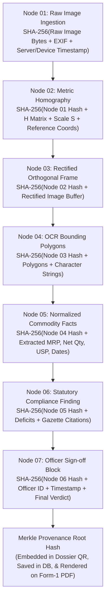

# FINAL SECURITY AND AUDIT SPECIFICATION

**Project ID:** SIH26034  
**Product:** NyayaDrishti-LM  
**Governing Legal Standard:** Section 63 Bharatiya Sakshya Adhiniyam, 2023 (BSA 2023)  
**Governing Privacy Standard:** Digital Personal Data Protection Act, 2023 (DPDP Act 2023)  
**Status:** FROZEN  

---

### 1. Security Architecture & Threat Model

NyayaDrishti-LM operates primarily as a centralized, online-first web application deployed within government cloud/server infrastructure, with an optional offline/local capability for field officers in network-deprived circles. The security architecture addresses both cloud/web vulnerability vectors and regulatory chain-of-custody requirements under three non-negotiable principles:

1. **Cryptographic Chain of Custody & Tamper Evidence:** Every inspection artifact (raw images, homography metrics, OCR bounding boxes, compliance deficits, and generated PDF dossiers) forms an immutable cryptographic DAG (Directed Acyclic Graph). Under Section 63 BSA 2023, mathematical integrity is verifiable by any court or adjudicating controller.
2. **Strict Web Authentication & Role-Based Access Control (RBAC):** All administrative, supervisory, and enforcement endpoints are gated behind token-based authentication (JWT) with fine-grained role privileges.
3. **Defense in Depth & Zero-Trust Ingestion:** All incoming web data (multipart uploads, JSON payloads, external web scraping inputs) are strictly validated, sanitized, and isolated. Images and documents are stored on an isolated filesystem or object storage, never executed and never stored as raw BLOBs in relational tables.

---

### 2. Web Application Security Architecture



#### 2.1 Transport Security (TLS 1.3 & HTTP Headers)
- **Encryption in Transit:** Nginx terminates all incoming external connections over TLS 1.3 (with TLS 1.2 fallback using AEAD cipher suites: `TLS_AES_256_GCM_SHA384`, `TLS_CHACHA20_POLY1305_SHA256`). Plain HTTP on port 80 issues an unconditional `301 Moved Permanently` redirect to HTTPS.
- **Security Headers:**
  - `Strict-Transport-Security: max-age=63072000; includeSubDomains; preload`
  - `X-Content-Type-Options: nosniff`
  - `X-Frame-Options: DENY`
  - `Content-Security-Policy: default-src 'self'; img-src 'self' data: blob:; script-src 'self'; style-src 'self' 'unsafe-inline'; font-src 'self'; connect-src 'self'; object-src 'none'; frame-ancestors 'none';`
  - `Referrer-Policy: strict-origin-when-cross-origin`
  - `Permissions-Policy: camera=(self), geolocation=(self), microphone=()`

#### 2.2 Central Authentication & Token Lifecycle
- **Algorithm:** RS256 (Asymmetric RSA-2048) or Ed25519 signed JSON Web Tokens (JWT). Private key resides exclusively in the server environment; public key is shared across internal microservices/dependencies.
- **Access Tokens:** Short-lived (15 minutes expiry) containing user ID, role, jurisdiction circle, and session ID.
- **Refresh Tokens:** Long-lived (7 days expiry), stored in an `HttpOnly`, `SameSite=Lax`, `Secure` cookie, paired with server-side token family revocation in Redis/PostgreSQL.
- **Credential Storage:** Inspector and administrative passwords hashed using **Argon2id** (memory cost 64MB, 3 iterations, 4 parallelism lanes) or bcrypt (work factor 12). Plaintext passwords are never logged or stored.

#### 2.3 Role-Based Access Control (RBAC) Matrix

```
┌──────────────────────────────────────────────────────────────────────────────────────────────────────┐
│                                     ROLE-BASED ACCESS MATRIX                                         │
├───────────────────────────────┬───────────────────────────────┬──────────────────────────────────────┤
│ ROLE                          │ PRIMARY PERMISSIONS           │ STATUTORY & SYSTEM SCOPE             │
├───────────────────────────────┼───────────────────────────────┼──────────────────────────────────────┤
│ 1. FIELD LMO (Inspector)      │ • Create/save new inspection  │ Restricted to assigned circle/block. │
│                               │ • Upload packaging facet images│ Can create draft inspection memos    │
│                               │ • Review visual overlays      │ only. Read-only access to own circle │
│                               │ • Digitally sign draft memo   │ inspection history. Cannot compound. │
├───────────────────────────────┼───────────────────────────────┼──────────────────────────────────────┤
│ 2. ADJUDICATING CONTROLLER    │ • Review filed dossiers       │ Jurisdiction over district/state.    │
│   (Assistant/Deputy)          │ • Issue Section 36 notices    │ Statutory authority to review        │
│                               │ • Record compounding fees     │ appeals, schedule compounding, and   │
│                               │ • Escalate to Magistrate      │ escalate prosecution to Magistrate.  │
├───────────────────────────────┼───────────────────────────────┼──────────────────────────────────────┤
│ 3. CENTRAL DoCA ADMIN         │ • National analytics dashboard│ Read-only analytical access to       │
│                               │ • Category deficit trends     │ anonymized compliance metrics.       │
│                               │ • Offender registry search    │ Manage system users, circles, and    │
│                               │ • Rule parameter configuration│ gazette threshold configurations.    │
├───────────────────────────────┼───────────────────────────────┼──────────────────────────────────────┤
│ 4. PRE-PRINT FMCG USER        │ • Upload packaging artwork PDF│ Sandboxed evaluation only.           │
│   (Self-Screening Sandbox)    │ • Run pre-production check    │ Zero access to enforcement logs or   │
│                               │ • Download advisory scorecard │ government officer records.          │
└───────────────────────────────┴───────────────────────────────┴──────────────────────────────────────┘
```

#### 2.4 File Upload & Ingestion Hardening
- **Strict Size Bounds:** Nginx enforces `client_max_body_size 15M;`. FastAPI stream validators abort uploads exceeding 15MB.
- **Magic Byte Verification:** File extensions (`.jpg`, `.png`, `.pdf`) are not trusted. The backend inspects initial file bytes via `python-magic` / MIME sniffing:
  - Allowed MIME Types: `image/jpeg` (`FF D8 FF`), `image/png` (`89 50 4E 47 0D 0A 1A 0A`), `image/webp` (`52 49 46 46 ... 57 45 42 50`), and `application/pdf` (`25 50 44 46`).
  - Prohibited: Executables (`.exe`, `.sh`, `.bat`), script vectors (`.svg`, `.html`, `.php`), archives (`.zip`, `.tar`). SVG is strictly disallowed due to embedded XML script execution vectors.
- **Storage Decoupling:** Uploaded files are renamed using their SHA-256 hash digest (e.g., `/storage/uploads/a1b2c3d4...jpg`) and saved with restricted POSIX permissions (`0640`, non-executable). Upload directories are mounted `noexec` on the Linux host. Database tables store only relative file paths and cryptographic hashes, preventing SQL bloat and SQL injection vector traversal.

#### 2.5 Rate Limiting & Anti-Abuse
- **Nginx Ingress Zone:** IP-based connection limit (`limit_req zone=req_limit_per_ip burst=20 nodelay;`).
- **Application Level (SlowAPI):**
  - Public / FMCG Sandbox: 10 requests / minute / IP.
  - Inspection Pipeline Analysis: 30 requests / minute / authenticated inspector.
  - Authentication Login Endpoint: 5 attempts / minute / IP (exponential backoff after 3 failed attempts).

#### 2.6 CORS & Cross-Site Protection
- **Allowed Origins:** Explicit whitelist configured in FastAPI `CORSMiddleware` (e.g., `https://nyayadrishti.doca.gov.in` in production, `http://localhost:3000` in dev).
- **Credentials:** `allow_credentials=True` allowed strictly for trusted origin domains. Wildcard `allow_origins=["*"]` is strictly prohibited in production.

---

### 3. Section 63 BSA 2023 Cryptographic Provenance Architecture

Under Section 63 of the **Bharatiya Sakshya Adhiniyam, 2023** (which repealed and superseded Section 65B of the Indian Evidence Act, 1872 on 1 July 2024), electronic records are admissible as secondary evidence provided their technical integrity, device provenance, and unbroken custodial chain are certified by a responsible official.



#### Cryptographic Sealing Protocol:

1. **Ingestion Sealing:** At the moment of image upload or camera snapshot, raw image bytes are hashed via **SHA-256** before any processing, resizing, or metric rectification takes place.
2. **Environmental Binding:** In Online Mode, the server's NTP-synchronized monotonic UTC clock (`clock_source: SERVER_NTP_ATOMIC`) records the upload timestamp. Client-reported EXIF metadata and device geolocation (if permitted by inspector) are bound into `Node 01`.
3. **Pipeline Merkle DAG:** Each pipeline stage calculates its SHA-256 hash using the parent stage hash as salt. Any modification to bounding boxes, OCR strings, or measurement scales cascades to alter the final Merkle Root.
4. **Officer Sign-Off:** The final Merkle Root is bound to the inspecting officer's ID, session timestamp, and digital signature block on the official Form-1 inspection dossier.
5. **Technical Integrity vs Judicial Admissibility:** The Merkle DAG provides mathematical proof of data integrity (zero bit-level modification between ingestion and PDF generation). Under Section 63 BSA 2023, this technical proof forms the basis of the official Electronic Evidence Certificate; final legal admissibility is determined by the presiding magistrate or adjudicating controller.

---

### 4. Mode B (Optional Local Inspection Mode) Security Specifications

When operating in offline field conditions (Mode B):

1. **Local Encryption at Rest:** The field inspection database is an embedded SQLite datastore encrypted using **SQLCipher (AES-256-CBC)**. Encryption keys are derived via PBKDF2 (100,000 iterations) from the officer's PIN and hardware device fingerprint.
2. **Local Monotonic Clock:** Mode B records timestamps with the explicit provenance flag `clock_source: LOCAL_DEVICE_MONOTONIC` to ensure transparent disclosure to adjudicating controllers that field time was not validated via central NTP.
3. **Sync Bundle Integrity:** Exported synchronization bundles (`.tar.gz` or JSON payload containing inspection records and images) are hashed (SHA-256) and signed with the officer's local key before transfer.
4. **Re-Verification on Ingestion:** When a sync bundle is uploaded to the central PostgreSQL server, the backend re-computes all pipeline Merkle node hashes. If any hash mismatch is detected (indicating local database alteration), the bundle is quarantined and flagged for administrative security review.

---

### 5. Privacy, Secret Management & DPDP Act Compliance

1. **Digital Personal Data Protection Act, 2023 (DPDP Act):**
   - Inspection records contain commercial product packaging data, which is publicly displayed packaging by definition.
   - Any personal identifying data collected during enforcement (e.g., store owner name, Aadhaar/ID presented during spot compounding, officer contact numbers) is classified as Protected Enforcement Data and encrypted in PostgreSQL using column-level encryption or restricted view permissions.
2. **Secrets Management:**
   - Database credentials, JWT signing keys, and cloud storage tokens are injected exclusively via environment variables (`.env` managed by Docker secrets or Kubernetes Secrets).
   - Zero hardcoded passwords or keys exist in version control. `.gitignore` strictly blocks all `.env`, `.pem`, and certificate files.
3. **Audit Logging & Non-Repudiation:**
   - Every security-sensitive transaction (login, inspection creation, notice issuance, deficit override, bundle export/import) is recorded in an append-only audit log table with monotonic sequence numbers, officer IP address, and timestamp.
