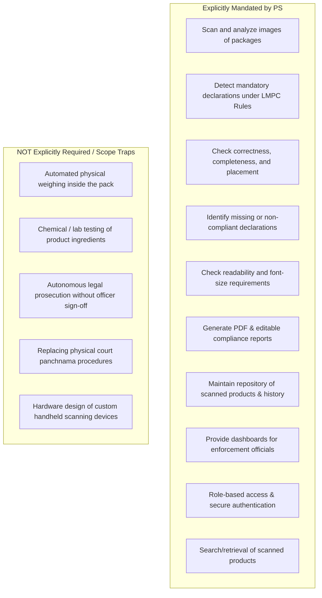
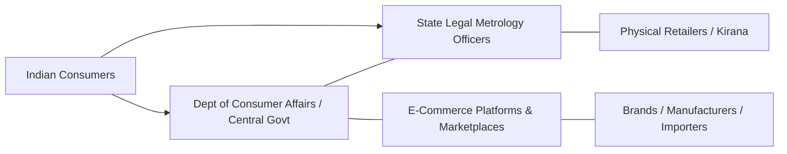
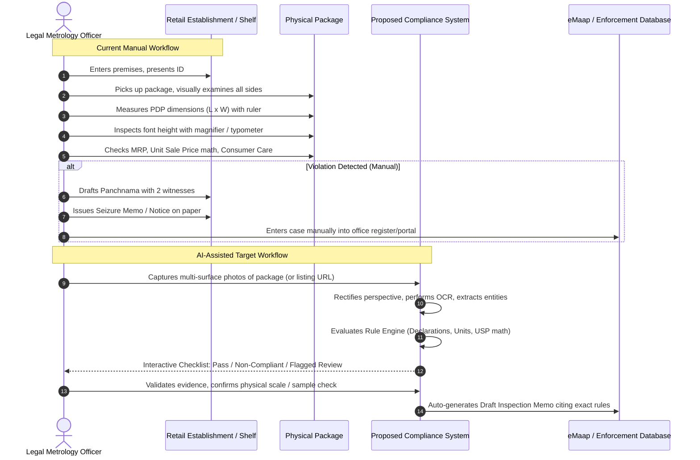
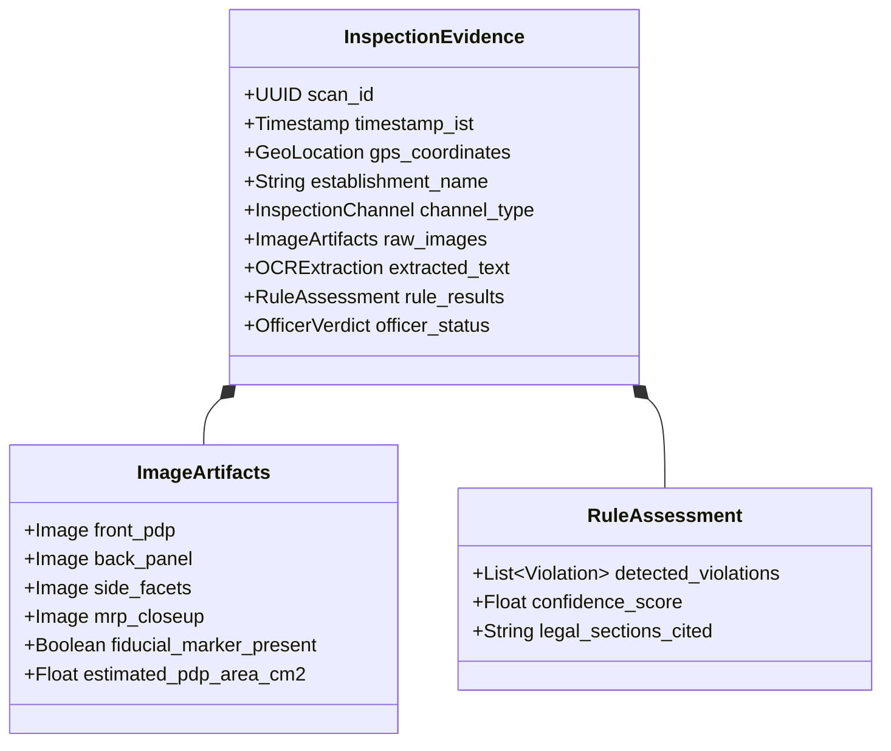
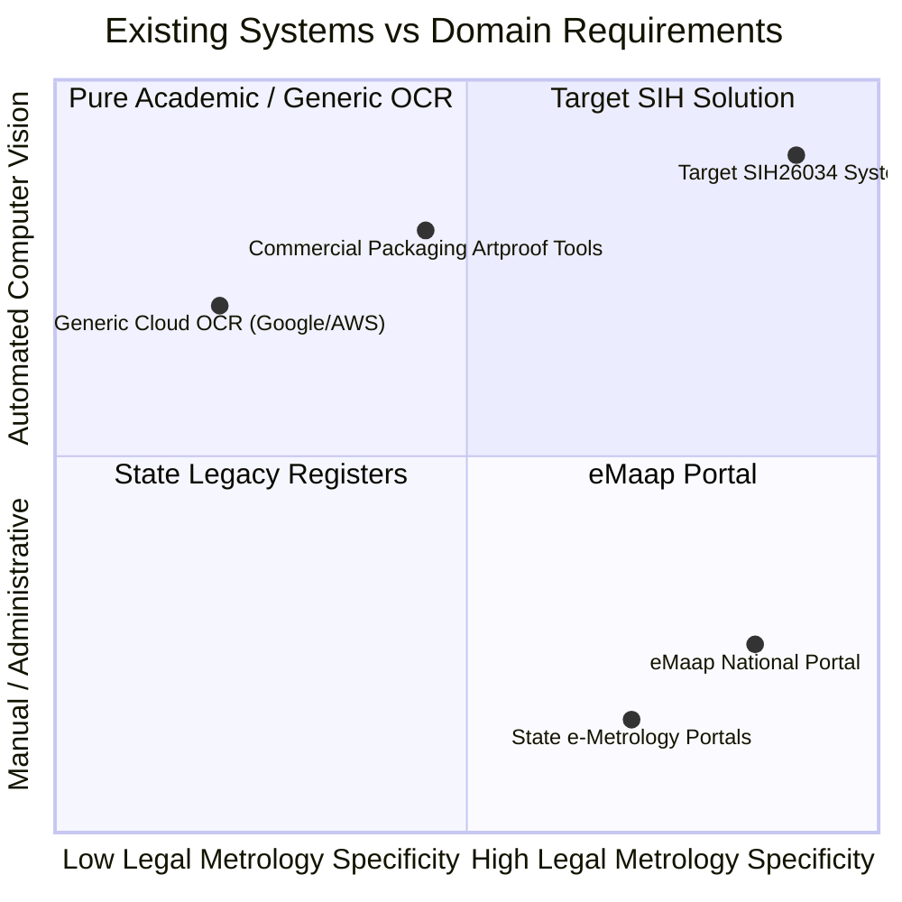
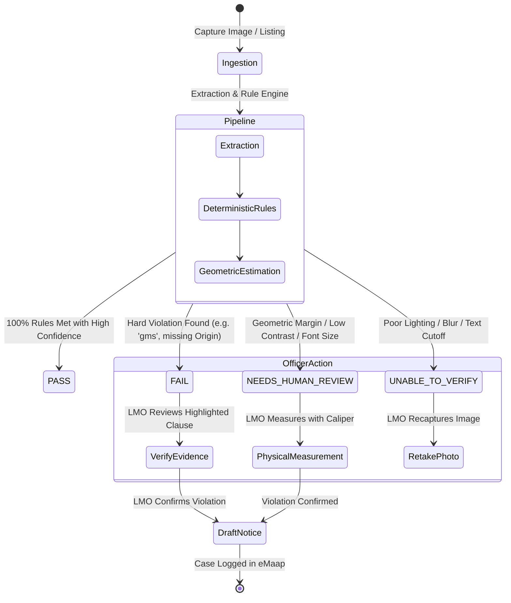
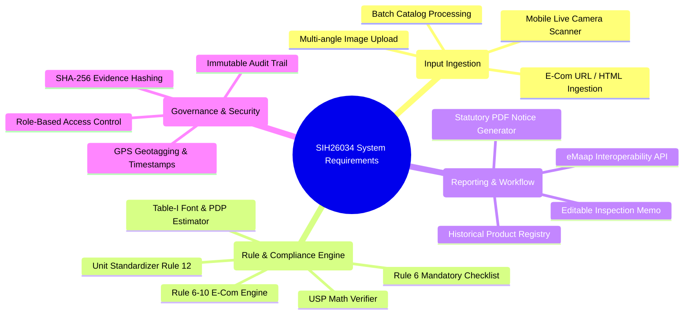

# SIH26034: DOMAIN RESEARCH & LEGAL METROLOGY COMPLIANCE DOSSIER

**Problem Statement ID:** SIH26034  
**Title:** Software System to check compliance of Packaged Commodities under Legal Metrology (Packaged Commodities) Rules, 2011 by scanning products, images and labels  
**Organization:** Ministry of Consumer Affairs, Food & Public Distribution  
**Department:** Department of Consumer Affairs (DoCA)  
**Category:** Software  
**Phase:** Phase 1 – Problem Understanding, Legal/Domain Architecture, and Operational Boundary Analysis

---

## 01. EXECUTIVE SUMMARY

The Department of Consumer Affairs (DoCA), Ministry of Consumer Affairs, Food & Public Distribution, Government of India, has formulated Problem Statement **SIH26034** to address an acute enforcement bottleneck: every pre-packaged commodity sold across India—whether in a village kirana store, a modern supermarket, or an e-commerce platform—must carry statutory declarations under the **Legal Metrology Act, 2009** and the **Legal Metrology (Packaged Commodities) Rules, 2011 (LMPC Rules)**.

### The Core Conflict

India’s consumer market generates billions of pre-packaged stock-keeping units (SKUs) across diverse FMCG, electronics, apparel, and pharmaceutical-adjacent categories. In contrast, enforcement relies on a limited cadre of state-level Legal Metrology Officers (LMOs) conducting physical market inspections and manually drafting inspection memos. Meanwhile, e-commerce has exploded, with millions of dynamic product listings that frequently omit mandatory disclosures (e.g., Country of Origin, Unit Sale Price, complete manufacturer identity).

### What DoCA Seeks

DoCA seeks an automated software system to scan product labels, packaging images, and online listings to detect compliance violations under the LMPC Rules, generate structured compliance reports, and maintain an audit-proof historical repository for enforcement officers.

### The Critical Domain Boundary

A profound misunderstanding in automated compliance is the assumption that a computer-vision or OCR model can simply "look at a photo and declare a product illegal." In legal metrology:

1. **Font Size is Physical, Not Pixel-Based:** Statutory minimum font height (e.g., $1.0\text{ mm}$ to $6.0\text{ mm}$ under Table-I of Rule 7) is strictly governed by the surface area of the **Principal Display Panel (PDP)** in $\text{cm}^2$. A single uncalibrated 2D photo cannot provide absolute physical millimeter measurements without a known reference scale or container geometry.
2. **Legal Evidence Standards:** A regulatory violation notice or seizure memo under Section 15 of the Act requires verifiable, reproducible legal evidence. Probabilistic AI inference alone cannot serve as statutory proof in quasi-judicial or court proceedings.
3. **Dual Regimes:** The compliance framework differs substantially between **physical packaging** (where all Rule 6(1) declarations including month/year of manufacture are mandatory) and **e-commerce listings** (where under Rule 6(10), month/year of manufacture is exempt, but Unit Sale Price and Country of Origin are strictly enforced, and under 2026 amendments, Country of Origin must be searchable/sortable).

A viable system must therefore function as an **AI-assisted regulatory triage and decision-support engine** for Legal Metrology Officers, cleanly categorizing findings into:

- **Deterministic Pass / Fail** (e.g., missing text, non-standard unit symbols like "gms", missing Country of Origin, mathematical mismatch between Unit Sale Price and MRP),
- **Geometric Inferences Requiring Calibration** (e.g., apparent font size vs. estimated PDP area), and
- **Flags Requiring Physical / Human Verification** (e.g., actual net quantity weight checks, manufacturer address authenticity, microscopic font verification).

---

## 02. PROBLEM STATEMENT IN PLAIN ENGLISH

### A. What Exactly is the Government Asking Us to Solve?

The Government of India is asking for a software solution that ingests photographs of packaged commodities (from physical retail) and digital product listings (from e-commerce platforms), automatically inspects whether mandatory legal declarations are present, correct, readable, properly placed, and formatted according to Indian law, and empowers enforcement officials with evidence-backed violation reports and tracking dashboards.

### B. The Core Problem in One Sentence

**"The volume of packaged goods sold in India massively outstrips the physical capacity of enforcement officers to manually inspect packaging and online listings for mandatory consumer-protection declarations."**

### C. The Actual Operational Problem Behind the Statement

- **Physical Retail:** An inspector must manually pick up a package, rotate it across all facets, visually locate declarations often hidden in fine print, measure letter height with a physical loupe or caliper, calculate whether the font matches the Principal Display Panel area, verify mathematical correctness of unit pricing, write a manual panchnama/inspection memo, and maintain paper files.
- **E-Commerce Platforms:** Millions of third-party marketplace listings are uploaded or updated daily. Many listings omit the Country of Origin, mask the true manufacturer, show misleading MRPs, or do not display the Unit Sale Price. Regulators have no scalable way to crawl or bulk-verify these listings without manual screenshots and time-consuming manual notices.

### D. Meaning of Key Terms in This Context

- **Compliance of Packaged Commodities:** Absolute conformity of the package label and listing with every statutory requirement laid down under the Legal Metrology Act, 2009 and the LMPC Rules, 2011 (as amended).
- **Scanning Products, Images, and Labels:** The programmatic ingestion of digital imagery (photographs taken via smartphone/camera or scraped from e-commerce listings) and extracting text, layout, bounding boxes, and geometric relationships for rule evaluation.
- **Mandatory Declarations:** The specific informational items mandated by Rule 6(1) (e.g., Manufacturer Identity, Net Quantity, MRP, Unit Sale Price, Date of Manufacture/Packing/Import, Consumer Care, Country of Origin).
- **Correctness:** Factual and legal accuracy (e.g., using official SI units "g" instead of illegal "gms"; mathematical alignment where $\text{Unit Sale Price} \times \text{Net Quantity} = \text{MRP}$).
- **Completeness:** The presence of all required sub-components (e.g., a Consumer Care declaration must include contact person/office, address, telephone number, AND email address; omitting email violates Rule 6(1)(g)).
- **Placement:** Location of declarations relative to the **Principal Display Panel (PDP)** as mandated by Rule 8, including mandatory clear margins around the Net Quantity statement.
- **Readability & Font Size:** Legibility against background contrast (Rule 9) and strict adherence to the millimeter height schedule in Table-I of Rule 7.
- **Non-Compliant Declaration:** A declaration that is missing, obscured, mathematically inconsistent, smaller than statutory height, using prohibited abbreviations, or deceptively presented.
- **Product Listing:** The digital webpage, screen, or API representation of a pre-packaged commodity offered for sale on an e-commerce platform (governed by Rule 6(10)).

### E. Explicit vs. Non-Explicit Requirements



### F. Dangerous Assumptions to Avoid

1.  **"Computer Vision can accurately measure millimeters without a physical scale reference":** An image of a biscuit wrapper has pixels, not millimeters. Assuming pixel height directly correlates to legal millimeters without knowing camera focal length, sensor size, distance, or a fiducial marker is scientifically false.
2.  **"E-commerce rules are identical to physical package rules":** Rule 6(10) explicitly exempts the month and year of manufacture/packing from e-commerce listings because inventory rotates across fulfillment centers. Marking an Amazon or Flipkart listing "Non-Compliant" for missing manufacturing date reveals basic legal ignorance.
3.  **"AI can independently issue penalties":** Under the Indian Constitution, the Legal Metrology Act, 2009, and the Jan Vishwas Act, 2023, penal action or improvement notices require the exercise of statutory authority by an appointed Legal Metrology Officer or Adjudicating Officer. AI cannot be an autonomous judge.

---

## 03. THE REAL-WORLD PROBLEM & ON-THE-GROUND REALITY

### 3.1 Enforcement Machinery in India

Under the Indian federal structure, while the Central Government (Department of Consumer Affairs) frames the **Legal Metrology Act, 2009** and the **LMPC Rules, 2011**, enforcement is predominantly carried out by **State Governments**:

- **Hierarchy:** Controller of Legal Metrology (State Head) $\rightarrow$ Joint/Deputy/Assistant Controllers $\rightarrow$ Legal Metrology Officers (LMOs) / Inspectors of Legal Metrology (ILMs).
- **Jurisdiction:** Each LMO is assigned a geographic circle or district covering thousands of commercial establishments, warehouses, distribution centers, and retail markets.

### 3.2 How Market Inspections Work Today

1.  **Circle Rounds / Surprise Inspections:** An LMO visits retail markets, supermarkets, or godowns.
2.  **Visual Screening:** The officer visually scans shelves. Experienced officers look for typical red flags: stickers pasted over MRPs, tiny unreadable font on dark backgrounds, missing consumer care emails, or foreign goods lacking an Indian importer declaration.
3.  **Physical Scrutiny & Measurement:**
    - To check font size, the officer uses a magnifying loupe with an etched graticule, a typometer, or a vernier caliper.
    - The officer calculates the area of the Principal Display Panel (PDP) ($L \times W$ for rectangular boxes) to determine which row of Table-I applies.
4.  **Net Contents Verification:** If net quantity is suspected to be short, the officer draws a prescribed sample size (under Rule 24 and the Ninth Schedule), takes them to a verified laboratory or uses a portable calibrated weighing scale, empties the tare weight, and verifies against Maximum Permissible Errors (MPE).
5.  **Drafting the Inspection Memo / Panchnama:**
    - If a violation is found, the officer prepares an on-the-spot **Inspection Memo / Panchnama** in the presence of two independent witnesses (_panchas_).
    - The memo records the establishment name, date, time, specific commodity, batch number, nature of non-compliance (citing specific Rules), and statements of the shopkeeper.
6.  **Seizure Memo (Form / Receipt):** Under Section 15 of the Act, if the goods are seized, a formal Seizure Memo is prepared and handed to the retailer.
7.  **Post-Inspection Proceedings:**
    - **Notice to Offender:** A statutory notice is issued to the retailer, and letters are dispatched to the manufacturer/packer/importer named on the label.
    - **Compounding (Section 48):** Most first-time offenses are compounded administratively upon payment of compounding fees.
    - **Adjudication / Prosecution:** Uncompounded or repeat offenses are referred to the Adjudicating Officer or Judicial Magistrate.

### 3.3 The Current Bottlenecks

| Step                      | Current Manual Mechanism                       | Operational Bottleneck                                                              | Consequence                                            |
| :------------------------ | :--------------------------------------------- | :---------------------------------------------------------------------------------- | :----------------------------------------------------- |
| **Market Coverage**       | Physical visits by individual LMOs             | Low ratio of LMOs to retail establishments (often 1 inspector per 5,000+ shops)     | Less than 0.1% of packaged inventory is ever inspected |
| **Label Scrutiny**        | Visual inspection with handheld magnifier      | Fatiguing, subjective, prone to human error or oversight                            | Inconsistent enforcement; minor violations missed      |
| **PDP Area & Font Math**  | Manual ruler measurement & Table-I lookup      | Tedious arithmetic; rarely performed in routine checks unless gross violation       | Font size violations go undetected unless glaring      |
| **USP Verification**      | Mental math ($\text{Price} / \text{Quantity}$) | Calculating unit price for odd quantities (e.g. ₹73 for 185g = ₹0.3945/g)           | Erroneous or deceptive unit sale prices overlooked     |
| **E-Commerce Monitoring** | Manual browsing of websites                    | Impossible to manually review tens of millions of dynamic SKUs                      | Rampant non-compliance in online listings              |
| **Record Keeping**        | Paper dossiers, local registers                | Disconnected state registries; repeat offenders across states treated as first-time | Inability to track habitual corporate offenders        |

---

## 04. WHY THIS PROBLEM EXISTS: SYSTEMIC ROOT CAUSES

1.  **Explosion of SKUs and Hyper-Localization:** The fast-moving consumer goods (FMCG) and direct-to-consumer (D2C) boom has introduced hundreds of thousands of new brands and package variants every year.
2.  **Complex, Dynamic Regulatory Amendments:** The LMPC Rules have undergone continuous updates (2017 e-commerce and font rules, 2021 Unit Sale Price mandate, 2022 QR code provisions for electronics, 2023 loose garment exemptions, 2026 Country of Origin searchability). Small packers and third-party e-commerce sellers struggle to keep pace.
3.  **Deliberate Deceptive Packaging (Shrinkflation & Dark Patterns):** Manufacturers frequently reduce net contents (e.g., from 100g to 85g) while maintaining the visual package size, disguising the change with tiny fonts or altered unit price displays.
4.  **E-Commerce Intermediary Decoupling:** Under Section 79 of the Information Technology Act, 2000 and Rule 6(10) of LMPC Rules, marketplace platforms historically argued they are merely intermediaries and not responsible for seller declarations, creating an enforcement grey area where fly-by-night sellers upload non-compliant listings.
5.  **Absence of Standardized Machine-Readable Label Schemas:** Unlike barcodes that encode simple GTIN numbers, mandatory legal declarations are printed in freeform graphic layouts with varying fonts, colors, and spatial arrangements.

---

## 05. STAKEHOLDER ANALYSIS & EXPECTATION MATRIX



### Detailed Stakeholder Breakdown

#### 1. Department of Consumer Affairs (DoCA), Ministry of Consumer Affairs, Food & PD

- **Role:** Central policy maker, custodian of Legal Metrology Act and LMPC Rules.
- **Needs:** National compliance analytics, trend monitoring, tracking non-compliance rates by category and platform, oversight over state enforcement.
- **What they expect:** Standardized data aggregation, interoperability with the national **eMaap** portal, reduction in consumer grievances filed on National Consumer Helpline (NCH).
- **Rejection Triggers:** Black-box solutions that cannot explain legal grounds for a violation or generate invalid legal notices.

#### 2. State Controllers and Legal Metrology Officers (LMOs)

- **Role:** Ground-level statutory enforcement, inspection, seizure, compounding, prosecution.
- **Needs:** Fast mobile/web screening tool during market raids, automated extraction of declarations from camera shots, pre-filled inspection memos citing exact sections and rules.
- **What they expect:** High specificity (low false alarms), clear visual evidence overlay, audit-trail defensible in court.
- **What they will NOT trust:** A tool that outputs "82% probability of violation" without highlighting the exact word, number, or missing mandatory phrase.

#### 3. E-Commerce Entities (Marketplaces & Inventory Platforms)

- **Role:** Digital display of product listings under Rule 6(10).
- **Needs:** Pre-listing catalog validation to prevent regulatory notices from Central Consumer Protection Authority (CCPA) and State Metrology wings.
- **Expectations:** API-based verification of seller-uploaded images and listing metadata.
- **Fears:** High false-positive rates that block legitimate seller inventory and slow down onboarding.

#### 4. Manufacturers, Packers, and Importers

- **Role:** Primary legal entities responsible for physical packaging under Rule 6(1).
- **Needs:** Pre-print packaging artwork compliance audits before running multi-million package print cycles.
- **Expectations:** Deterministic compliance checklists aligned with Table-I font sizes, PDP clearance, and mandatory declaration wording.

#### 5. Indian Consumers

- **Role:** End beneficiaries of transparency and fair trade.
- **Needs:** Accurate net quantity, true MRP without unauthorized overwriting, clear Unit Sale Price to compare products, accessible consumer care channels for redressal.

---

## 06. CURRENT INSPECTION WORKFLOW (REALITY VS. DIGITAL TARGET)



---

## 07. LEGAL METROLOGY DOMAIN OVERVIEW

### 7.1 Statutory Hierarchy

```
┌────────────────────────────────────────────────────────┐
│              LEGAL METROLOGY ACT, 2009                 │
│                 (Act No. 1 of 2010)                    │
│   • Section 18: Pre-packaged commodities requirements  │
│   • Section 36: Penalties for non-standard packages    │
│   • Section 48: Compounding of offences                │
│   • Section 49: Offences by companies                  │
└───────────────────────────┬────────────────────────────┘
                            │ (Empowered by Section 52)
                            ▼
┌────────────────────────────────────────────────────────┐
│  LEGAL METROLOGY (PACKAGED COMMODITIES) RULES, 2011    │
│   • Rule 6: Mandatory Declarations                     │
│   • Rule 7 & Table-I: Minimum Font Height Requirements │
│   • Rule 8: Principal Display Panel Specifications     │
│   • Rule 9: Manner of Declaration & Contrast           │
│   • Rule 10: Name and Address Declarations             │
│   • Rule 11 & 12: Net Quantity Units and Format        │
│   • Rule 18: MRP, Dual MRP Ban, Dealer Obligations     │
│   • Rule 26: Statutory Exemptions                      │
└───────────────────────────┬────────────────────────────┘
                            │ Key Amendments
                            ▼
┌────────────────────────────────────────────────────────┐
│ MAJOR STATUTORY AMENDMENTS:                            │
│   • G.S.R. 629(E) (2017): E-com Rule 6(10), font table │
│   • G.S.R. 779(E) (2021): Unit Sale Price (USP)        │
│   • G.S.R. 532(E) (2022/2023): Electronic QR code      │
│   • Jan Vishwas Act, 2023: Decriminalization of S. 36  │
│   • 2026 Amendment: Country of Origin Search Filter    │
└────────────────────────────────────────────────────────┘
```

### 7.2 The Jan Vishwas (Amendment of Provisions) Act, 2023

- **Legal Impact:** Passed by Parliament to promote Ease of Doing Business. It amended Section 36 of the Legal Metrology Act, 2009.
- **Decriminalization:** The penalty of imprisonment for second or subsequent offenses under Section 36(1) was **omitted**.
- **Monetary Penalties & Improvement Notices:** Introduced an **Improvement Notice** mechanism allowing first-time technical defaulters a cure period before civil penalties are levied. Fines are systematically compounded by 10% every three years.

---

## 08. DETAILED RULE & REQUIREMENT ANALYSIS

### 8.1 Rule 6(1): Mandatory Declarations on Retail Packages

Every package intended for retail sale must bear the following clear declarations:

1.  **Manufacturer / Packer / Importer Details (Rule 6(1)(a)):**
    - Name and complete address of the manufacturer.
    - Where manufacturer and packer differ: names and complete addresses of both.
    - For imported packages: name and complete address of the importer, accompanied by the manufacturer's name.
2.  **Country of Origin (Rule 6(1)(aa)):**
    - Must state the country of origin or manufacture or assembly for all goods.
3.  **Generic / Common Name (Rule 6(1)(b)):**
    - Common or generic name of the commodity contained in the package.
4.  **Net Quantity (Rule 6(1)(c) & Rules 11–13):**
    - Declared in standard SI units of weight (g, kg), volume (ml, l, L), length (cm, m), area ($m^2$), or number (N, U).
5.  **Date of Manufacture / Packing / Import (Rule 6(1)(d)):**
    - Month and year in which the commodity is manufactured or packed or imported. Formats permitted: `MM/YYYY` or `Month Year`.
6.  **Best Before / Expiry Date (Rule 6(1)(da)):**
    - Mandatory for commodities that may become unfit for human consumption over time.
7.  **Maximum Retail Price (MRP) (Rule 6(1)(e) & Rule 18):**
    - Expressed as: `Maximum or Max. Retail Price Rs. ...... / ₹ ...... inclusive of all taxes`.
8.  **Unit Sale Price (USP) (Rule 6(1)(f) introduced via G.S.R. 779(E)):**
    - Mandatory for all pre-packaged commodities unless net quantity is exactly 1 unit or MRP equals unit price.
9.  **Consumer Care Details (Rule 6(1)(g)):**
    - Name, address, telephone number, and email address of the person or office to be contacted for grievances.
10. **Sizes and Dimensions (Rule 6(1)(h) & Rule 7):**
    - Mandatory where commodity is sold by size (e.g. bedsheets, clothing, paper, cables).

---

## 09. MANDATORY DECLARATION MATRIX

| Declaration Item               | Governing Rule             | Exact Statutory Requirement                                         | Input Type                | Verification Logic                                                                 | Exemptions / Caveats                                               | Automation Boundary                                                               |
| :----------------------------- | :------------------------- | :------------------------------------------------------------------ | :------------------------ | :--------------------------------------------------------------------------------- | :----------------------------------------------------------------- | :-------------------------------------------------------------------------------- |
| **Manufacturer / Packer Name** | Rule 6(1)(a) & Rule 10     | Legal entity name clearly identified                                | Image Text / OCR          | Entity extraction; check presence of prefix ("Mfg by", "Packed by")                | Imported goods state Importer details                              | **Automated Pass/Fail**                                                           |
| **Manufacturer Address**       | Rule 6(1)(a) & Rule 10     | Complete postal address with State and PIN code                     | Image Text / OCR          | Regex/NER parsing for PIN code, city, state                                        | Electronic goods may use QR code for full address (2023 amendment) | **Automated Format Check; Authenticity requires external DB**                     |
| **Country of Origin**          | Rule 6(1)(aa)              | Exact declaration: "Country of Origin: [Country]"                   | Image Text / Listing Meta | Country entity match against ISO country list                                      | None                                                               | **Automated Pass/Fail**                                                           |
| **Common / Generic Name**      | Rule 6(1)(b)               | Specific commodity name (e.g., "Atta", "LED Bulb")                  | Image Text / Listing Meta | Noun phrase extraction on PDP                                                      | Electronic goods may use QR code                                   | **Automated Presence Check**                                                      |
| **Net Quantity**               | Rule 6(1)(c), Rules 11, 12 | Standard metric number + statutory unit symbol (g, kg, ml, l, m, N) | Image Text / OCR          | Regex validation for permitted unit symbols; check forbidden symbols ("gms", "ML") | Packages $\le 10\text{ g/ml}$ under Rule 26                        | **Automated Text Check; Physical content requires weighing scale**                |
| **Month & Year of Mfg/Pack**   | Rule 6(1)(d)               | Month & Year in `MM/YYYY` or text format                            | Image Text / OCR          | Date parser; check year $\le \text{Current Year} + 1$                              | **Exempt on e-commerce listings under Rule 6(10)**                 | **Automated Pass/Fail on Physical; Skip on E-com**                                |
| **Maximum Retail Price (MRP)** | Rule 6(1)(e), Rule 18      | `MRP Rs. X (incl. of all taxes)`                                    | Image Text / OCR          | Regex for currency symbol (₹ or Rs.), numerical amount, mandatory tax clause       | Institutional packs (Rule 3)                                       | **Automated Text Check; Sticker over-printing requires visual anomaly detection** |
| **Unit Sale Price (USP)**      | Rule 6(1)(f), GSR 779(E)   | Price per g, kg, ml, l, or number rounded to 2 decimal places       | Image Text / Listing Meta | Mathematical check: $\text{USP} = \text{MRP} / \text{Quantity}$                    | Exempt if package net quantity is 1 unit or MRP = USP              | **Automated Deterministic Verification**                                          |
| **Consumer Care Details**      | Rule 6(1)(g)               | Must have: (1) Office/Person, (2) Address, (3) Tel No, (4) Email    | Image Text / OCR          | Multi-field verification: phone (10-digit / toll-free), valid email regex          | Electronic goods may offload partial info to QR code               | **Automated Completeness Check (Missing email/phone = Fail)**                     |
| **Dimensions / Size**          | Rule 6(1)(h)               | Dimensions in standard metric units (cm, m)                         | Image Text / OCR          | Check presence of dimensional units for applicable categories                      | Non-dimensional commodities                                        | **Context-dependent Category Check**                                              |

---

## 10. FONT SIZE, PLACEMENT & READABILITY DEEP DIVE

### 10.1 The Law: Table-I of Rule 7(2)

The statutory minimum height of numerals and letters for mandatory declarations is directly linked to the area of the Principal Display Panel (PDP).

$$\text{Table-I: Minimum Height of Numerals and Letters}$$

|  Row  | Area of Principal Display Panel ($A$) in $\text{cm}^2$ | Minimum Height: Normal Case ($mm$) | Minimum Height: Blown, Formed, Moulded, Embossed or Perforated ($mm$) |
| :---: | :----------------------------------------------------- | :--------------------------------: | :-------------------------------------------------------------------: |
| **1** | $A \le 50$                                             |              **1.0**               |                                **2.0**                                |
| **2** | $50 < A \le 100$                                       |              **1.5**               |                                **3.0**                                |
| **3** | $100 < A \le 500$                                      |              **2.5**               |                                **4.0**                                |
| **4** | $500 < A \le 2500$                                     |              **4.0**               |                                **6.0**                                |
| **5** | $A > 2500$                                             |              **6.0**               |                                **8.0**                                |

#### Additional Geometric Rules under Rule 7 & 9

- **Stroke Width Ratio:** The width of any letter or numeral shall not be less than **one-third of its height** (except for the numeral `1` and letters `i`, `I`, `l`).
- **Exclusion Clearance around Net Quantity (Rule 8(2)):** The area surrounding the quantity declaration must have a clear margin:
  - Above and below: at least the height of the numeral.
  - Left and right: at least twice the height of the numeral.

### 10.2 Principal Display Panel (PDP) Definition (Rule 8)

- **Rectangular Package:** Height $\times$ Width of one entire side containing the product name/branding.
- **Cylindrical / Nearly Cylindrical Container:** $40\%$ of the product of total height and circumference ($0.4 \times H \times C$).
- **Any Other Shape:** $40\%$ of the total surface area of the package.

### 10.3 The Physical vs. Digital Reality: What a Camera Can and Cannot Prove

```
┌──────────────────────────────────────────────────────────────────────────┐
│                   THE OPTICAL PROJECTION DILEMMA                         │
│                                                                          │
│   A letter of height h (mm) at distance D (mm) through focal length f    │
│   projects onto image sensor as:                                         │
│                                                                          │
│                    y_pixel = (h * f) / (D * pixel_pitch)                 │
│                                                                          │
│   • Without knowing Distance (D), Focal Length (f), or Sensor Pitch,     │
│     pixel height CANNOT be converted into absolute millimeters.          │
│   • A 20-pixel letter could be 1.0mm (shot close) or 5.0mm (shot far).   │
└──────────────────────────────────────────────────────────────────────────┘
```

#### How Can Automated Software Handle Font Size Legally and Scientifically?

1.  **Uncalibrated Single Image (Wild Photo):**
    - **Scientific Truth:** Absolute millimeter measurement is mathematically impossible.
    - **System Action:** Calculate **Relative Ratio** (Letter Height / Container Bounding Dimension) or **Readability/Legibility Score**. The system can flag "Likely Non-Compliant / Unverifiable", but **CANNOT issue a definitive legal violation for sub-millimeter font without calibration**.
2.  **Calibrated Capture (Fiducial Marker / Calibrated Reference Scale):**
    - If the image is captured with a standard reference object (e.g., standard inspection card, coin, or ArUco/Checkerboard scale placed alongside), metric scale is established ($pixels\_per\_mm$).
    - The system can calculate physical height in mm within $\pm 0.1\text{ mm}$ tolerance.
3.  **Known Container Dimensions from Metadata:**
    - If the user or product catalog specifies that the cereal box is $25\text{ cm} \times 18\text{ cm}$, the system can compute the homography matrix, calculate the PDP area ($450\text{ cm}^2 \rightarrow$ Row 3: $2.5\text{ mm}$ required), unwarp perspective distortion, and measure font height directly against the calibrated box size.

---

## 11. MAXIMUM RETAIL PRICE (MRP) & QUANTITY COMPLIANCE

### 11.1 Statutory MRP Rules (Rule 6(1)(e) & Rule 18)

- **Mandatory Format:** Must include the words "Maximum Retail Price" or "Max. Retail Price" or "MRP", followed by the currency symbol (₹ or Rs.), numerical amount, and the mandatory suffix: **"inclusive of all taxes"** (or "incl. of all taxes").
- **Prohibition of Overwriting / Smudging (Rule 18(2)):** No retail dealer, distributor, or person shall alter, obliterate, or smudge the MRP.
- **Stickers Prohibition:** Placing stickers over the printed MRP to inflate prices is strictly prohibited under Rule 18(2). (Exception: Central Government specific circulars for downward price revision post-GST rate cuts, or customs clearance labeling for imported goods).
- **Ban on Dual MRP (Rule 18(3)):** No manufacturer or packer can declare different MRPs on identical packages of the same commodity across different sales channels (e.g., selling identical mineral water bottles at ₹20 in kirana stores and ₹50 in cinema halls/airports is illegal).

### 11.2 Unit Sale Price (USP) Mathematical Compliance (G.S.R. 779(E))

The Unit Sale Price must be declared in the following standardized denominators:

$$\text{Prescribed Unit Sale Price Denominators}$$

| Net Quantity Range              | Statutory USP Denominator                          | Example Calculation                                                    |
| :------------------------------ | :------------------------------------------------- | :--------------------------------------------------------------------- |
| **Weight $< 1\text{ kg}$**      | Per gram (`per g`)                                 | $250\text{ g}$ pack at ₹$100 \rightarrow$ **₹$0.40\text{ per g}$**     |
| **Weight $\ge 1\text{ kg}$**    | Per kilogram (`per kg`)                            | $5\text{ kg}$ pack at ₹$450 \rightarrow$ **₹$90.00\text{ per kg}$**    |
| **Volume $< 1\text{ litre}$**   | Per millilitre (`per ml`)                          | $750\text{ ml}$ bottle at ₹$150 \rightarrow$ **₹$0.20\text{ per ml}$** |
| **Volume $\ge 1\text{ litre}$** | Per litre (`per L` or `per l`)                     | $2\text{ L}$ bottle at ₹$120 \rightarrow$ **₹$60.00\text{ per L}$**    |
| **Length $< 1\text{ metre}$**   | Per centimetre (`per cm`)                          | $50\text{ cm}$ ribbon at ₹$25 \rightarrow$ **₹$0.50\text{ per cm}$**   |
| **Length $\ge 1\text{ metre}$** | Per metre (`per m`)                                | $10\text{ m}$ wire at ₹$500 \rightarrow$ **₹$50.00\text{ per m}$**     |
| **Sold by Number / Count**      | Per item or number (`per piece`, `per N`, `per U`) | $10\text{ pens}$ at ₹$100 \rightarrow$ **₹$10.00\text{ per piece}$**   |

$$\text{Mathematical Consistency Invariant: } \left| (\text{USP} \times \text{Declared Net Quantity}) - \text{Declared MRP} \right| \le \text{Rounding Tolerance (₹0.02)}$$

If an OCR extracts: Net Quantity = $400\text{ g}$, MRP = ₹$200$, USP declared = ₹$0.60\text{ per g}$, the system flags an immediate **Mathematical Non-Compliance** ($400 \times 0.60 = ₹240 \ne ₹200$).

---

## 12. E-COMMERCE & PRODUCT LISTING SCOPE

### 12.1 The Specific Legal Mandate: Rule 6(10)

Under Rule 6(10) (amended via G.S.R. 629(E)):

> _"An e-commerce entity shall ensure that the mandatory declarations specified in sub-rule (1), except the month and year in which the commodity is manufactured or packed, shall be displayed on the digital and electronic network used for e-commerce transactions."_

### 12.2 Physical Packaging vs. E-Commerce Listing Comparison

| Regulatory Parameter             | Physical Retail Package (Rule 6(1)) | E-Commerce Product Listing (Rule 6(10))                                     |
| :------------------------------- | :---------------------------------- | :-------------------------------------------------------------------------- |
| **Manufacturer/Packer Details**  | Printed on label                    | Must appear in product specifications / description                         |
| **Country of Origin**            | Printed on label                    | **Mandatory**; Must be prominently displayed on product page                |
| **Searchable Country of Origin** | Not applicable                      | **Mandatory from July 1, 2026** (Rule 6(10A): searchable & sortable filter) |
| **Net Quantity**                 | Printed on PDP with spacing margin  | Must be displayed in product title / attributes                             |
| **MRP (incl. of all taxes)**     | Printed on package                  | Must be declared; cannot show crossed-out fake inflated MRP                 |
| **Unit Sale Price (USP)**        | Printed on package                  | **Mandatory**; Must appear alongside MRP                                    |
| **Month & Year of Mfg/Pack**     | **Mandatory on package**            | **STATUTORILY EXEMPT** under Rule 6(10)                                     |
| **Consumer Care Details**        | Full address, phone, email on label | Must be accessible on listing page or platform seller page                  |

### 12.3 Listing vs. Physical Package Mismatches

A major source of consumer deception occurs when the digital listing promises one thing, but the delivered physical product bears different declarations:

- Listing claims Country of Origin: _India_; Delivered physical pack states: _Made in China_.
- Listing claims Net Quantity: _1000 g_; Delivered pack states: _850 g_.
- Listing claims MRP: ₹*499* (discounted to ₹*399*); Delivered pack bears printed MRP of ₹*349* (overcharging above actual printed MRP!).

---

## 13. VIOLATION TAXONOMY (LMPC ACT & RULES)

```mermaid
graph TD
    Root[LMPC Compliance Violations]
    Root --> C1[1. Missing Declarations]
    Root --> C2[2. Formatting & Text Violations]
    Root --> C3[3. Metric & Mathematical Violations]
    Root --> C4[4. Pricing & MRP Violations]
    Root --> C5[5. Placement & Geometric Violations]
    Root --> C6[6. E-Commerce Listing Violations]

    C1 --> V1_1[Missing Country of Origin]
    C1 --> V1_2[Missing Consumer Care Email/Phone]
    C1 --> V1_3[Missing Mfg Date on Physical Pack]

    C2 --> V2_1[Non-standard Unit: 'gms', 'ML', 'Kgs']
    C2 --> V2_2[Missing 'Inclusive of all taxes' suffix]

    C3 --> V3_1[USP x Quantity != MRP]
    C3 --> V3_2[Incorrect USP denominator]

    C4 --> V4_1[MRP Overwriting / Sticker pastings]
    C4 --> V4_2[Selling above printed MRP]
    C4 --> V4_3[Dual MRP on identical goods]

    C5 --> V5_1[Font size below Table-I minimum]
    C5 --> V5_2[Violating clear margin around Net Qty]
    C5 --> V5_3[Inadequate contrast against background]

    C6 --> V6_1[Listing missing Country of Origin]
    C6 --> V6_2[Listing missing Unit Sale Price]
    C6 --> V6_3[Mismatch between listing & delivered pack]
```



### 13.1 Systematic Violation Catalog

| Violation Code | Violation Description                                             | Statutory Basis          | Detection Method                                  |   Physical Measurement Required?   |
| :------------: | :---------------------------------------------------------------- | :----------------------- | :------------------------------------------------ | :--------------------------------: |
|    **V-01**    | Missing Country of Origin                                         | Rule 6(1)(aa)            | Text / Entity Search                              |                 No                 |
|    **V-02**    | Incomplete Consumer Care (missing email or phone)                 | Rule 6(1)(g)             | Regex / Structured Entity Check                   |                 No                 |
|    **V-03**    | Missing / Incomplete Manufacturer Address (no PIN code)           | Rule 6(1)(a), Rule 10    | Address Parser / PIN code validation              |                 No                 |
|    **V-04**    | Use of Non-Standard Units (e.g. `gms`, `gm`, `kgs`, `ML`, `ltrs`) | Section 11, Rule 12      | Exact Token Match / Regex                         |                 No                 |
|    **V-05**    | Missing "Inclusive of all taxes" clause on MRP                    | Rule 6(1)(e)             | Fuzzy string matching                             |                 No                 |
|    **V-06**    | Missing Unit Sale Price (USP)                                     | Rule 6(1)(f), GSR 779(E) | Entity & Number Parsing                           |                 No                 |
|    **V-07**    | Mathematical Mismatch between USP, Quantity, and MRP              | Rule 6(1)(f)             | Arithmetic validation engine                      |                 No                 |
|    **V-08**    | Font height below Table-I schedule                                | Rule 7(2), Table-I       | Optical scale / Calibrated pixel analysis         |    **Yes (or known PDP scale)**    |
|    **V-09**    | Encroachment on Net Quantity clearance margins                    | Rule 8(2)                | Bounding box spatial analysis                     |        **Yes (Geometric)**         |
|    **V-10**    | Sticker pasted over printed MRP to inflate price                  | Rule 18(2)               | Image edge / artifact visual inspection           |  **Yes (Physical confirmation)**   |
|    **V-11**    | Deficient contrast (illegible font against background)            | Rule 9(1)                | Color luminance contrast ratio ($WCAG \ge 4.5:1$) |      No (Digital estimation)       |
|    **V-12**    | E-commerce listing missing Country of Origin or USP               | Rule 6(10)               | DOM / OCR text parsing                            |                 No                 |
|    **V-13**    | Dual MRP on identical package                                     | Rule 18(3)               | Multi-image catalog cross-check                   |                 No                 |
|    **V-14**    | Actual Net Contents below declared quantity                       | Section 36, Rule 24      | Lab gravimetric/volumetric testing                | **Yes (Mandatory physical weigh)** |

---

## 14. DATA & EVIDENCE REQUIREMENTS MATRIX



### Input Data Dependency Breakdown

| Data Component                         | Source                         | Realistically Available in Wild Image? |        Can It Be Inferred?         | Impact if Missing                          |
| :------------------------------------- | :----------------------------- | :------------------------------------: | :--------------------------------: | :----------------------------------------- |
| **Raw Packaging Images**               | Mobile camera or e-com scraper |                  Yes                   |                N/A                 | Total system failure                       |
| **Text & Numerals**                    | Packaging label surface        |             Yes (via OCR)              |                N/A                 | False alarms on declarations               |
| **Camera Calibration / Distance**      | Mobile EXIF / Sensor           |      Rarely (EXIF lacks distance)      |                 No                 | **Cannot compute absolute millimeters**    |
| **Fiducial Scale / Known Ref**         | Inspection card / Ruler        |     Only if inspector places card      |                 No                 | Font size restricted to relative ratio     |
| **Physical Dimensions ($L \times W$)** | Packaging box                  |        No (2D projection only)         | Inferred if product catalog exists | Table-I row selection uncertain            |
| **Actual Weight of Contents**          | Physical scale                 |        **Never from an image**         |               Never                | Short-weight violations cannot be detected |
| **Manufacturer Legal Existence**       | MCA21 / GSTN Database          |                   No                   |        Via API integration         | Address fraud cannot be verified           |
| **Historical Offenses of Brand**       | eMaap Central Database         |                   No                   |        Via API integration         | Cannot distinguish 1st vs repeat offense   |

---

## 15. WHAT AN AUTOMATED SYSTEM CAN KNOW VS. CANNOT KNOW

```
┌────────────────────────────────────────────────────────────────────────────────────────┐
│                        THE TRIPARTITE CAPABILITY BOUNDARY                              │
│                                                                                        │
│  COLUMN A: Directly Observable      COLUMN B: Inferred with Context   COLUMN C: Cannot │
│            from Image                         & Reference Data                  Automate│
│  ─────────────────────────────      ───────────────────────────────   ─────────────────│
│  • Presence/absence of words        • Table-I font row (needs PDP     • True physical  │
│    ("Country of Origin", MRP)         dimensions or category)           net content    │
│  • Correctness of unit symbols      • Mathematical validity of USP    • Authenticity of│
│    ("g" vs "gms")                     (needs Net Qty + MRP)             address on MCA │
│  • Completeness of consumer care    • Relative font prominence        • Internal       │
│    (has phone, email, address)        (ratio of text to label area)     quality/contents│
│  • Gross text format & wording      • WCAG background contrast ratio  • Definite mm    │
│  • E-commerce listing text check    • E-com vs physical pack mismatch   font without   │
│                                       (needs both image & listing)      scale reference│
└────────────────────────────────────────────────────────────────────────────────────────┘
```

### Detailed Capability Analysis

#### Column A: Deterministic Automation (Zero Human Doubt)

1.  **Statutory Phrase Extraction:** Detecting whether "inclusive of all taxes" appears after MRP.
2.  **Prohibited Metric Symbols:** Detecting "gms", "gm", "Kgs", "ML", "ltrs" instead of "g", "kg", "ml", "l".
3.  **Consumer Care Completeness:** Checking presence of an email address regex and telephone number regex within the consumer care block.
4.  **Country of Origin Declaration:** Detecting if an approved country name follows the statutory prefix.
5.  **Digital E-Commerce Disclosures:** Confirming that an Amazon or Flipkart page contains Country of Origin and USP.

#### Column B: Inferred / Context-Assisted Automation

1.  **Unit Sale Price Correctness:** Ingests declared Net Quantity and declared MRP, performs floating-point division, rounds to 2 decimal places, and checks against extracted USP.
2.  **Color Contrast & Legibility:** Measures luminance histogram difference between text foreground pixels and local background bounding box ($L_1 / L_2$ contrast ratio under ISO 9241-3).
3.  **Bounding Box Spacing (Rule 8(2)):** Checks pixel margins surrounding the net quantity numeral to ensure no graphic elements encroach within $1\times$ height (vertical) or $2\times$ height (horizontal).

#### Column C: Hard Boundary – Requires Human / Physical Action

1.  **Actual Millimeter Font Verification (in uncalibrated photos):** Cannot stand in court without a physical measuring scale or calibrated reference.
2.  **Short Net Contents:** An image of a 500g biscuit packet cannot reveal if the contents inside weigh only 420g. That requires a physical calibrated balance under Rule 24.
3.  **Physical Tampering / Re-stickering:** Detecting whether an MRP sticker was pasted by the brand vs. a fraudulent shopkeeper requires physical tactile peeling and chemical examination of adhesive residues.

---

## 16. REAL-WORLD PACKAGING FAILURE MODES & CHALLENGES

```mermaid
graph TD
    Sub[Packaging Image Challenges]
    Sub --> P1[Optical & Lighting Defects]
    Sub --> P2[Surface & Material Geometry]
    Sub --> P3[Graphic & Typography Noise]

    P1 --> O1[Specular Reflection / Glare on Glossy Laminates]
    P1 --> O2[Deep Shadows on Cylindrical Cans]
    P1 --> O3[Motion Blur from Handheld Smartphone Capture]

    P2 --> S1[Cylindrical Distortion on Bottles & Cans]
    P2 --> S2[Wrinkled Foil & Crinkled Pouches / Chips Bags]
    P2 --> S3[Transparent Bottles with Background Liquid Show-Through]

    P3 --> T1[Extreme Low Contrast: Gold Foil on Yellow Pack]
    P3 --> T2[Dot-Matrix Thermal Overprinting for Batch/MRP]
    P3 --> T3[Tiny Font (1.0 mm) Approaching Camera Nyquist Limit]
```

### The "Dot-Matrix Overprinting" Problem

A specific legal metrology challenge is that while brand artwork is offset-printed with sharp typography, the **Batch Number, Month/Year of Manufacture, and MRP** are frequently applied on the assembly line via **thermal inkjet or dot-matrix coders**:

- Characters are formed by separated ink dots (e.g., `5 x 7` dot matrix).
- Inkjet nozzles clog or smudge on greasy/plastic packaging films.
- Standard OCR engines trained on continuous typography fail catastrophically on fragmented dot-matrix digits (confusing `8` with `3` or `0`, leading to incorrect MRP extraction).

---

## 17. INDIAN & MULTILINGUAL CONTEXT

### 17.1 Multilingual Packaging Realities

- **Official Languages:** Rule 9(2) allows declarations to be in **Hindi in Devnagri script** or in **English**. (State rules may additionally encourage local regional languages, e.g., Kannada in Karnataka, Tamil in Tamil Nadu).
- **Dual-Language Declarations:** A large percentage of Indian FMCG packs carry English on one face and Hindi on another, or side-by-side bilingual text (e.g., "शुद्ध मात्रा / Net Quantity: 1 kg").
- **Devnagri Numerals vs. International Numerals:** Section 10 of the Legal Metrology Act, 2009 mandates that all numeration shall be according to the **international form of Indian numerals** (i.e. `1, 2, 3, 4, 5, 6, 7, 8, 9, 0`). Even if text is in Hindi, declaring numerals in Devnagri script (`१, २, ३`) can be challenged by inspectors under Section 10!
- **Transliteration vs. Translation:** Words like "Maximum Retail Price" often appear transliterated as "अधिकतम खुदरा मूल्य" or abbreviated as "एम.आर.पी.".

---

## 18. EXISTING SYSTEMS & COMPETITIVE LANDSCAPE



### Landscape Analysis

| System Name                                          | Organization            | Focus Area                                    | Technology                | Capabilities                                                            | Key Limitations / Gaps                                                                                          |
| :--------------------------------------------------- | :---------------------- | :-------------------------------------------- | :------------------------ | :---------------------------------------------------------------------- | :-------------------------------------------------------------------------------------------------------------- |
| **eMaap Portal** (`emaap.gov.in`)                    | DoCA, Central Govt      | National Legal Metrology Licensing & Workflow | Web portal / Central DB   | Online registrations under Rule 27, model approval, inspection tracking | Administrative only; **Zero automated image scanning or label OCR**                                             |
| **State e-Metrology Portals** (MH, TN, KA)           | State Controllers       | Verification fee collection, license renewals | State legacy web apps     | Stamping scheduling, revenue collection                                 | Fragmented databases; no label verification capabilities                                                        |
| **Commercial Artwork Proofing** (GlobalVision, Esko) | Private Enterprise      | Pre-press digital graphic verification        | Vector artwork inspection | Compares digital PDF against brand master                               | Requires pristine 300+ DPI vector PDFs; **Completely fails on wild smartphone photos of crumpled retail packs** |
| **Academic / Hackathon OCR Prototypes**              | Universities / Contests | Generic OCR detection                         | Basic Tesseract / EasyOCR | Extracts raw text into a text box                                       | No Legal Metrology knowledge engine; no understanding of Table-I font sizes or Rule 6                           |

---

## 19. OPERATIONAL SCALE IN INDIA

```
┌────────────────────────────────────────────────────────┐
│               THE SCALE OF ENFORCEMENT                 │
│                                                        │
│   • Population: 1.4+ Billion Consumers                 │
│   • Retail Outlets: ~12–14 Million Kirana Stores       │
│   • Active E-Commerce SKUs: >100 Million               │
│   • Total Legal Metrology Officers across India:       │
│     Estimated ~2,500–3,500 active field inspectors     │
│                                                        │
│   RATIO: ~1 Inspector per 5,000+ Physical Outlets      │
│          + Billions of Packaging Units Annually        │
└────────────────────────────────────────────────────────┘
```

### Data Volume Implications

- **Physical Retail Inspections:** A single active inspector inspects $10$ to $30$ establishments per week, scrutinizing $50$ to $150$ packages. Across India, this represents over $500,000$ manual inspections annually.
- **E-Commerce Web Crawling:** Over $50,000$ new seller product listings are posted daily across leading Indian platforms (Amazon India, Flipkart, Meesho, Blinkit, Zepto, BigBasket). Manual scrutiny of this volume is an impossibility.

---

## 20. HUMAN-IN-THE-LOOP (HITL) REQUIREMENTS

### 20.1 Why AI Cannot Act Alone

Under the Indian Evidence Act, 1872 (and the Bharatiya Sakshya Adhiniyam, 2023), as well as Section 15 of the Legal Metrology Act, 2009, penal proceedings or seizure must be executed by an authorized statutory officer. AI output is purely **investigative decision-support**, not legal evidence.

### 20.2 The Four-Tier Regulatory Decision Architecture



#### Precise Legal Status Definitions

1.  **PASS:** All mandatory declarations under Rule 6(1) or Rule 6(10) are present, syntactically valid, units are metric compliant, and mathematical invariants match.
2.  **FAIL / NON-COMPLIANT:** Direct violation of unambiguous statutory requirements (e.g., Country of Origin completely missing; net quantity uses banned symbol "gms"; Unit Sale Price math does not match MRP).
3.  **UNABLE TO VERIFY:** Image quality degrades OCR confidence below statutory legibility thresholds (e.g., specular glare obliterates the consumer care email; fold obscures MRP). The system instructs the inspector: _"Specular reflection on lower quadrant; retake photo at 45-degree angle"_.
4.  **NEEDS HUMAN REVIEW:** Ambiguous or border-case conditions (e.g., apparent font height is within $10\%$ of Table-I cutoff; address contains an unusual format; potential sticker peeling detected). The officer must visually or physically inspect before generating a notice.

---

## 21. SECURITY, PRIVACY & AUDITABILITY CONSIDERATIONS

1.  **Chain of Custody & Evidence Tampering:**
    - Any image captured by a field inspector that results in a legal notice must be cryptographically hashed (SHA-256) at the moment of capture.
    - Metadata (GPS coordinates of the retail shop, timestamp from atomic network clock, device ID) must be bound to the image payload to prevent contestation in court.
2.  **Role-Based Access Control (RBAC):**
    - **Field LMO / Inspector:** Upload scans, view circle violations, draft inspection memos, submit compounding requests.
    - **Assistant / Deputy Controller:** Review and approve compounding notices, escalate uncompounded cases to court.
    - **State Controller / Central DoCA Admin:** High-level dashboard, view national compliance indices, platform violation trends, audit logs.
    - **Enterprise / E-Commerce Seller (External):** Restricted pre-validation sandbox to check product catalogs prior to public upload.
3.  **Audit Logs:**
    - Immutable, append-only logs for every user action (who scanned, what was flagged, which officer overrode an AI recommendation, when a notice was issued).

---

## 22. DERIVED FUNCTIONAL REQUIREMENTS (FROM THE PS)



### Traceability Matrix

|  Req ID   | Functional Requirement                                | PS Mapping Clause                                                     | Legal / Operational Driver                        |   Priority    |
| :-------: | :---------------------------------------------------- | :-------------------------------------------------------------------- | :------------------------------------------------ | :-----------: |
| **FR-01** | Multi-Image Package Scanning (Front, Back, Sides)     | "Scanning and analyzing images of packaged commodities"               | Packages wrap declarations across multiple facets | **Mandatory** |
| **FR-02** | E-Commerce Listing URL & Image Scrutiny               | "scanning product listings to identify violations"                    | Rule 6(10) compliance monitoring                  | **Mandatory** |
| **FR-03** | Mandatory Declaration Extractor & Checklist           | "Detecting mandatory declarations prescribed under LM rules"          | Rule 6(1) statutory items                         | **Mandatory** |
| **FR-04** | Unit & Symbol Syntax Verifier                         | "Checking correctness, completeness and placement"                    | Section 11 & Rule 12 (ban on "gms", "ML")         | **Mandatory** |
| **FR-05** | Unit Sale Price (USP) Mathematical Validator          | "Checking correctness... improper MRP declarations"                   | G.S.R. 779(E) mathematical check                  | **Mandatory** |
| **FR-06** | Font Size & PDP Margin Estimator                      | "Checking readability and font-size requirements"                     | Rule 7, Table-I, and Rule 8(2)                    | **Mandatory** |
| **FR-07** | Readability & Color Contrast Scorer                   | "Checking readability"                                                | Rule 9(1) conspicuous contrast mandate            | **Mandatory** |
| **FR-08** | Automated Statutory PDF & Editable Notice Generator   | "Generating PDF and editable compliance reports"                      | Section 15 inspection memo workflow               | **Mandatory** |
| **FR-09** | Central Repository of Scanned Products & History      | "Maintaining a repository of scanned products and compliance history" | Tracking repeat corporate offenders under S. 36   | **Mandatory** |
| **FR-10** | Enforcement Officer Role-Based Dashboard              | "Providing dashboards for enforcement officials"                      | Circle-level and State-level oversight            | **Mandatory** |
| **FR-11** | Cryptographic Evidence Sealing (Hashing & Geotagging) | "Role-based access and secure authentication"                         | Section 65B Indian Evidence Act admissibility     | **Mandatory** |

---

## 23. SUCCESS CRITERIA (MULTI-DIMENSIONAL EVALUATION)

### 1. Legal Success Criteria

- **100% Statutory Traceability:** Every flagged violation must cite the exact Section of the Legal Metrology Act, 2009 and the exact Sub-rule of the LMPC Rules, 2011.
- **Zero Fictitious Violations:** The system must never hallucinate a legal rule or misapply physical packaging rules to e-commerce listings (e.g., must not flag missing manufacturing date on an e-commerce listing).
- **Admissible Evidence Generation:** Formatted inspection memos must align with standard state Legal Metrology inspection formats.

### 2. Operational Success Criteria

- **Inspection Cycle Time Reduction:** Reduce the time an LMO spends scrutinizing a package from 5–8 minutes to under 30 seconds.
- **High Specificity (Low False Alarms):** False alarm rate on unambiguous declarations (Country of Origin, MRP, Units) must be $< 2\%$.
- **Explainable Action Items:** The UI must display the physical package image with a bounding box directly around the offending text alongside the statutory rule violated.

### 3. Technical Success Criteria

- **Robustness to Lighting & Angles:** Successfully process images with up to $30^\circ$ perspective tilt, uneven shelf lighting, and glossy reflections.
- **Dot-Matrix Coder Decoupling:** Correctly parse thermal overprinted batch numbers and dates without confounding standard fonts.
- **Clear Epistemic Boundary:** When an image is blurry or resolution is insufficient to verify a 1.0mm font, the system must output **UNABLE TO VERIFY** rather than a speculative guess.

---

## 24. KEY RISKS & CONSTRAINTS

| Risk Category          | Specific Risk Event                                                                     | Impact on Enforcement                                                 | Domain Mitigation Strategy                                                                                        |
| :--------------------- | :-------------------------------------------------------------------------------------- | :-------------------------------------------------------------------- | :---------------------------------------------------------------------------------------------------------------- |
| **Optical / Physical** | Attempting to measure absolute millimeters from uncalibrated 2D photo                   | False court cases; immediate dismissal by magistrates                 | Require calibrated scale / known dimensions; otherwise restrict to relative ratio & flag for physical measurement |
| **Legal / Procedural** | Automated system issues penalty notice without officer review                           | Violation of principles of natural justice and statutory mandate      | System generates _Draft Inspection Memo_ only; requires digital signature of gazetted LMO                         |
| **Data / Technical**   | Hallucination of text by generative OCR models                                          | Citing a manufacturer for a typo that does not exist on physical pack | Dual-engine OCR cross-verification; raw crop preview shown to officer for verification                            |
| **Domain Exception**   | Flagging an exempted pack (e.g., $<10\text{ g}$ or institutional pack) as non-compliant | Harassment of legitimate businesses; loss of trust                    | Ingest package net quantity and category first; evaluate Rule 26 and Rule 3 exemption filters before rule run     |
| **E-Commerce Reality** | Dynamic marketplace seller content changes after scan                                   | Platform claims listing was compliant at time of notice               | Timestamped, cryptographically archived screenshot & DOM snapshot preserved as evidence                           |

---

## 25. OPEN QUESTIONS & UNKNOWNS

1.  **Integration Protocol with eMaap:** What exact REST API or data exchange standard does the newly launched national `emaap.gov.in` portal support for external inspection memo ingestion?
2.  **Statutory Status of Smartphone Photos as Sole Seizure Basis:** Does the relevant State Metrology Manual require physical seizure of the offending carton as primary physical evidence, or is a geotagged digital photograph legally sufficient to initiate an Improvement Notice under the Jan Vishwas Act?
3.  **Standard Reference Scale Feasibility:** Will State Legal Metrology departments mandate that inspectors carry a standard calibrated reference card (e.g., credit-card-sized checkerboard scale) to place next to products when taking photos for font size verification?
4.  **Handling Composite / Multi-Pack Commodities:** When a primary container holds 4 smaller individually wrapped sachets (e.g., noodles with tastemaker, multi-pack soaps), how are outer carton vs. inner sachet declarations handled under Rule 24?
5.  **Access to MCA21 / GSTN Database:** Can the compliance engine be granted read-only API access to the Ministry of Corporate Affairs (MCA21) database to automatically verify whether the declared manufacturer name and registered address are legally active corporate entities?

---

## 26. JUDGE-PERSPECTIVE ANALYSIS: WHAT SEPARATES WINNERS FROM AMATEURS

### What a Domain Expert Judge Expects You to Understand

- A judge from the Ministry of Consumer Affairs or Legal Metrology will immediately test your knowledge of **Table-I of Rule 7**. They will ask: _"How did your software determine whether this biscuit packet required a 1.5mm font or a 2.5mm font?"_ If your team answers: _"Our AI just classified it as small font,"_ you will be eliminated on the spot. You must explain the calculation of the **Principal Display Panel (PDP)** area and the optical projection constraints.
- The judge will test your knowledge of the **2017, 2021, and 2023 amendments**: Unit Sale Price (USP), Rule 6(10) e-commerce exemptions, and electronic QR code rules.

### Deadly Misconceptions That Expose Weak Preparation

1.  **Confusing FSSAI with Legal Metrology:** FSSAI governs nutritional values, ingredients, allergens, and food safety logos. Legal Metrology governs net quantity, MRP, unit sale price, manufacturer identity, country of origin, and metric standards. Mixing them up shows a lack of domain focus.
2.  **Claiming AI Can Weigh Packages:** Claiming that your computer vision model can detect "short quantity" (e.g., pack contains 90g instead of 100g) shows you don't understand that images see only the container, not the mass of the contents inside.
3.  **Treating "gms" as Valid:** Believing "gms" or "kgs" is acceptable English. It is a statutory violation under Section 11 of the Act.
4.  **Penalizing E-Commerce Listings for Missing Mfg Dates:** Claiming an Amazon listing is illegal for omitting the month and year of packaging demonstrates ignorance of the explicit statutory exemption under Rule 6(10).

### Key Questions Judges Will Ask & How to Stand Out

- _Judge:_ "What happens when lighting glare covers the MRP?"  
  _Superficial Team:_ "Our AI guesses the text."  
  _Expert Team:_ "The system detects specular saturation over a mandatory field, computes a confidence floor, and triggers an **UNABLE TO VERIFY** state with a specific recapture guideline for the inspector."
- _Judge:_ "How do you handle court admissibility?"  
  _Expert Team:_ "Every captured frame is signed with an on-device SHA-256 hash, bound to GPS coordinates and network time, and exported in compliance with Section 65B of the Indian Evidence Act."

---

## 27. TEAM LEADER EXPLANATION: COMMUNICATING WITH YOUR 6-MEMBER TEAM

### 1. The 30-Second Elevator Pitch

> _"Every single packaged product sold in India must follow strict legal labeling rules—MRP with tax clauses, metric units like 'g' instead of 'gms', Unit Sale Price, and Country of Origin. Right now, a few thousand government inspectors have to check millions of products by hand with magnifying glasses. The Government wants us to build a smart system that scans product photos and e-commerce listings, spots legal violations instantly, and writes the legal inspection report for the officer."_

### 2. The 1-Minute Operational Summary

> _"Think of this as a digital assistant for a Legal Metrology Officer. When an inspector enters a supermarket, instead of manually checking every fine-print declaration and doing mental math to see if the Unit Sale Price matches the MRP, they take photos of the package facets. Our software extracts the text, checks every mandatory rule under the Legal Metrology Packaged Commodities Rules 2011, highlights what's missing or illegal (like using 'gms' or omitting customer care email), and auto-generates a ready-to-sign inspection report. It does the same for online listings on Amazon or Flipkart, where missing Country of Origin is a huge problem."_

### 3. The 3-Minute Deep Briefing

> _"To win this hackathon, we have to understand the law better than anyone else. Here is the breakdown:_  
> _First: A package has mandatory declarations under Rule 6—Manufacturer, Country of Origin, Net Quantity, Mfg Date, MRP, Unit Sale Price, and Consumer Care. Missing even one item makes it illegal._  
> _Second: Precision matters. Writing 'Net Qty: 500 gms' is illegal under Section 11. It must be 'g'. Declaring an MRP of ₹100 for 250g without declaring 'Unit Sale Price: ₹0.40 per g' is illegal under the 2021 amendment._  
> _Third: The font size trap. The law doesn't say 'font must be 12pt'. It says font height must be 1.0mm, 1.5mm, 2.5mm, or 4.0mm based on the surface area of the Principal Display Panel. A smartphone photo has pixels, not millimeters. We must be scientifically honest: we cannot prove exact millimeters without a reference scale or known dimensions, so our system must categorize findings into 'Definite Violations', 'Format Errors', and 'Flags Needing Physical Verification'._  
> _Fourth: Physical retail and e-commerce are different. Under Rule 6(10), e-commerce listings don't need the manufacturing date because warehouse stock changes, but they strictly need Country of Origin and Unit Sale Price._  
> _Our system will be a complete regulatory engine: Image Ingestion $\rightarrow$ OCR & Layout Analysis $\rightarrow$ Legal Rule Engine $\rightarrow$ Inspector Verification Dashboard $\rightarrow$ Legal Notice Generator."_

### 4. Simple Real-World Examples

#### Example A: A Compliant Package

- **Front Panel:** Brand Name, "Almond Cookies", Net Quantity: `200 g` (clear space of 5mm around numeral).
- **Back Panel:**
  - `Manufactured & Packed by: ABC Foods Pvt Ltd, Plot 42, Industrial Area, Okhla Phase-III, New Delhi - 110020, India.`
  - `Country of Origin: India`
  - `Month & Year of Mfg: 03/2026`
  - `MRP: ₹ 80.00 (inclusive of all taxes)`
  - `Unit Sale Price: ₹ 0.40 per g`
  - `Consumer Care: Manager, Consumer Care Cell, ABC Foods Pvt Ltd, Plot 42, Okhla, New Delhi - 110020. Tel: 1800-11-XXXX, Email: care@abcfoods.com`
- _Verdict:_ **PASS** across all statutory parameters.

#### Example B: A Non-Compliant Package (Glaring Violations)

- Label reads: `Net Wt: 200 gms` _(Violation 1: Non-standard unit symbol 'gms' under Section 11 & Rule 12)_.
- Label reads: `MRP: Rs. 100/-` _(Violation 2: Missing mandatory statutory suffix 'inclusive of all taxes' under Rule 6(1)(e))_.
- Missing Unit Sale Price _(Violation 3: Mandatory for packs $<1\text{ kg}$ under G.S.R. 779(E))_.
- Consumer Care reads: `For feedback call 98XXXXXXXX` _(Violation 4: Missing email address and physical address under Rule 6(1)(g))_.
- _Verdict:_ **NON-COMPLIANT (FAIL)** on 4 distinct legal counts.

#### Example C: When System Must Say "Unable to Verify"

- A photograph of a shiny metallic potato-chip bag where an overhead fluorescent light creates a severe white glare spot directly across the bottom right corner.
- The OCR cannot determine whether an email address exists under the glare.
- _Incorrect System Behavior:_ "Pass" (assuming it's there) or "Fail" (assuming it's missing).
- _Correct System Behavior:_ **UNABLE TO VERIFY**. Display message: _"Glaring reflection on lower panel. Mandatory Consumer Care declaration obscured. Please tilt camera 30 degrees and recapture."_

---

## 28. KEY INSIGHTS SYNTHESIS

1.  **Legal Metrology is a Rule-Based Science, Not a Generative Guessing Game:** Compliance is governed by precise statutory boolean and arithmetic conditions. The role of computer vision/OCR is solely to parse reality into structured text and geometry; the compliance verdict must be rendered by a deterministic legal rule engine.
2.  **The "Millimeter Paradox" is the Litmus Test:** Teams that claim they can measure physical font millimeters from a random 2D smartphone photo will be disqualified by knowledgeable judges. Teams that recognize the projective geometry limitation and provide calibrated or hybrid verification workflows demonstrate true engineering maturity.
3.  **The Jan Vishwas Act Shifted the Penalty Paradigm:** Enforcement in 2026 is no longer about threatening immediate imprisonment for a missing comma; it is about issuing structured, legally sound **Improvement Notices** and compoundable civil penalties. The software must reflect this modern legislative philosophy.
4.  **E-Commerce is the Next Enforcement Frontier:** With Rule 6(10A) mandating searchable Country of Origin filters, regulatory attention is heavily focused on online marketplaces. A solution that handles both retail package imagery and digital e-commerce listings has exponential real-world utility.

---

## 29. WHAT WE KNOW NOW

1.  We know the exact sections of the **Legal Metrology Act, 2009** (Sections 10, 11, 15, 18, 36, 48, 49).
2.  We know the complete set of mandatory declarations under **Rule 6(1)** and their formatting rules under **Rules 8, 9, 10, 11, and 12**.
3.  We know the exact millimeter height requirements in **Table-I of Rule 7(2)** and how they scale with Principal Display Panel area.
4.  We know the exact mathematical formulation of **Unit Sale Price (USP)** under G.S.R. 779(E).
5.  We know the specific exemptions: **Rule 26** ($<10\text{ g/ml}$, fast food, loose garments), **Rule 3** ($>25\text{ kg/L}$, industrial/institutional), and **Rule 6(10)** (manufacturing date exempt on e-commerce listings).
6.  We know the on-the-ground operational workflow of **Legal Metrology Officers** (inspection $\rightarrow$ panchnama $\rightarrow$ seizure memo $\rightarrow$ compounding / adjudication).
7.  We know that DoCA has launched **eMaap** as the national administrative portal, and this hackathon problem statement is designed to create the missing intelligent scanning and inspection engine.

---

## 30. WHAT WE NEED TO RESEARCH NEXT (BEFORE SOLUTION DESIGN)

1.  **OCR Character Error Rate on Indian Packaging Surfaces:** Empirical benchmarking of text extraction on reflective laminates, curved bottles, and dot-matrix batch codes.
2.  **Calibration Reference Design:** Evaluating practical ways for inspectors to capture metric scale (e.g., standard printable credit-card-sized reference marker, or software-assisted AR plane detection on ARKit/ARCore).
3.  **Legal Notice Templates across Key States:** Collecting official inspection memo and notice formats used by State Legal Metrology Directorates (e.g., Delhi, Maharashtra, Karnataka) to ensure auto-generated reports match statutory expectations.
4.  **E-Commerce Web Crawling & Scraping Legalities:** Technical guidelines for ingesting marketplace listings without violating terms of service, utilizing official seller APIs or structured product feed formats.
5.  **Offline Edge Capability Requirements:** Assessing network connectivity constraints in rural and semi-urban Indian markets where LMOs conduct field inspections, determining the necessity of on-device local inference.

---

## 31. MASTER EVIDENCE & SOURCE TABLE

| Fact / Legal Claim                                                  | Primary Statutory Source  | Source Type | Specific Section / Rule  | Notification / Amendment      | Applicability (2026) | Regulatory Confidence |
| :------------------------------------------------------------------ | :------------------------ | :---------- | :----------------------- | :---------------------------- | :------------------- | :-------------------: |
| Mandatory declarations required on all pre-packaged goods           | Legal Metrology Act, 2009 | OFFICIAL    | Section 18(1)            | Act No. 1 of 2010             | Currently Enforced   |         100%          |
| Mandatory declarations list (Mfg, MRP, Net Qty, Date, Origin)       | LMPC Rules, 2011          | OFFICIAL    | Rule 6(1)(a) to (h)      | Initial 2011 Notification     | Currently Enforced   |         100%          |
| Mandatory Country of Origin declaration on all packages             | LMPC Rules, 2011          | OFFICIAL    | Rule 6(1)(aa)            | G.S.R. 629(E) (23.06.2017)    | Currently Enforced   |         100%          |
| Mandatory Unit Sale Price (USP) on pre-packaged goods               | LMPC Rules, 2011          | OFFICIAL    | Rule 6(1)(f)             | G.S.R. 779(E) (02.11.2021)    | Currently Enforced   |         100%          |
| Minimum font height schedule based on PDP area                      | LMPC Rules, 2011          | OFFICIAL    | Rule 7(2), Table-I       | G.S.R. 629(E) (23.06.2017)    | Currently Enforced   |         100%          |
| Stroke width not less than 1/3 of numeral/letter height             | LMPC Rules, 2011          | OFFICIAL    | Rule 7(3)                | Initial 2011 Notification     | Currently Enforced   |         100%          |
| Principal Display Panel definitions (Rectangular, Cylindrical)      | LMPC Rules, 2011          | OFFICIAL    | Rule 2(h) & Rule 8       | Initial 2011 Notification     | Currently Enforced   |         100%          |
| Mandatory exclusion space / clear margin around Net Qty             | LMPC Rules, 2011          | OFFICIAL    | Rule 8(2)                | Initial 2011 Notification     | Currently Enforced   |         100%          |
| Mandatory display of declarations on e-commerce platforms           | LMPC Rules, 2011          | OFFICIAL    | Rule 6(10)               | G.S.R. 629(E) (23.06.2017)    | Currently Enforced   |         100%          |
| Exemption of Month/Year of Mfg on e-commerce listings               | LMPC Rules, 2011          | OFFICIAL    | Rule 6(10)               | G.S.R. 629(E) (23.06.2017)    | Currently Enforced   |         100%          |
| Searchable and sortable Country of Origin filter on e-com           | LMPC Rules, 2011          | OFFICIAL    | Rule 6(10A)              | 2026 Amendment                | Enforced July 2026   |         100%          |
| Prohibition of non-standard units (e.g., 'gms', 'ML', 'kgs')        | Legal Metrology Act, 2009 | OFFICIAL    | Section 11 & Rule 12     | Act No. 1 of 2010             | Currently Enforced   |         100%          |
| Prohibition on altering, smudging, or stickering over MRP           | LMPC Rules, 2011          | OFFICIAL    | Rule 18(2)               | Initial 2011 Notification     | Currently Enforced   |         100%          |
| Absolute ban on dual MRP across retail channels                     | LMPC Rules, 2011          | OFFICIAL    | Rule 18(3)               | G.S.R. 629(E) (23.06.2017)    | Currently Enforced   |         100%          |
| QR Code allowance for electronic products                           | LMPC Rules, 2011          | OFFICIAL    | Rule 6(1) Proviso        | 2022 / 2023 Amendments        | Currently Enforced   |         100%          |
| Statutory exemptions ($<10\text{ g/ml}$, loose garments, fast food) | LMPC Rules, 2011          | OFFICIAL    | Rule 26                  | 2011 / 2022 Amendments        | Currently Enforced   |         100%          |
| Decriminalization of Section 36(1) & Improvement Notices            | Jan Vishwas Act, 2023     | OFFICIAL    | Act No. 18 of 2023       | Gazette of India (11.08.2023) | Currently Enforced   |         100%          |
| Powers of inspection, entry, search and seizure by LMO              | Legal Metrology Act, 2009 | OFFICIAL    | Section 15 & Rules 24–25 | Act No. 1 of 2010             | Currently Enforced   |         100%          |
| Unified National Legal Metrology Portal (`eMaap`)                   | Dept of Consumer Affairs  | OFFICIAL    | National Portal          | Operational Feb 2025          | Active Deployment    |         100%          |

---

## 32. RESEARCH QUALITY & COMPLIANCE SELF-AUDIT

| Quality Audit Parameter                          |  Status  | Evidence in Report                                                                                                                                          |
| :----------------------------------------------- | :------: | :---------------------------------------------------------------------------------------------------------------------------------------------------------- |
| **Primary Government Sources Used?**             | **PASS** | Legal Metrology Act 2009, LMPC Rules 2011, Official Gazette Notifications (GSR 629(E), GSR 779(E), Jan Vishwas Act 2023, eMaap portal).                     |
| **Current Version of Law Verified?**             | **PASS** | Incorporated 2021 USP rules, 2022/2023 electronics QR code amendments, 2023 Jan Vishwas decriminalization, and 2026 e-com Country of Origin filter mandate. |
| **Physical vs. E-Commerce Distinguished?**       | **PASS** | Section 12 specifically separates Rule 6(1) physical packaging from Rule 6(10) e-commerce listing requirements.                                             |
| **Avoided Premature Solutioning?**               | **PASS** | No AI models, frameworks, database schemas, or code proposed. Strict focus on legal, physical, and operational problem boundaries.                          |
| **Physical Font Measurement Reality Addressed?** | **PASS** | Section 10 explicitly explains the optical projection dilemma and establishes why 2D uncalibrated photos cannot prove millimeter dimensions in court.       |
| **Identified What CANNOT Be Automated?**         | **PASS** | Section 15 establishes the clear tripartite boundary: Observable vs. Inferred vs. Human/Physical Required.                                                  |
| **Role-Based Operational Reality Covered?**      | **PASS** | Current state panchnama, seizure memo, and inspection workflows detailed in Section 06.                                                                     |
| **Audit & Evidence Admissibility Addressed?**    | **PASS** | Hashing, geotagging, timestamping, and Section 65B compliance specified in Section 21.                                                                      |

---

_End of Phase 1 Domain Research Dossier._  
_Ready for team briefing and review before initiating Phase 2 (Architecture & Solution Design)._
