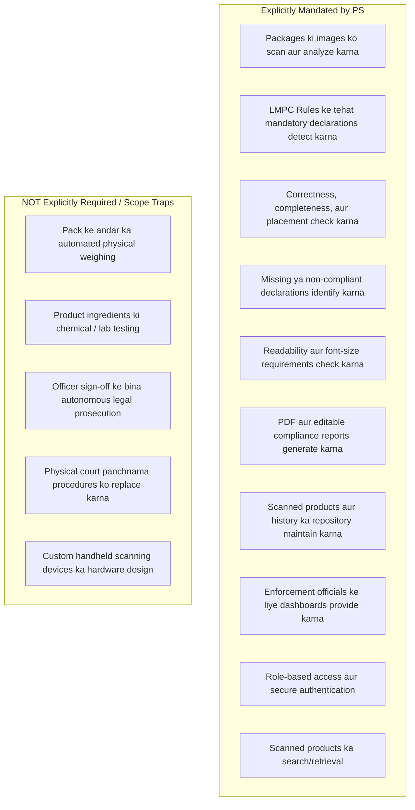
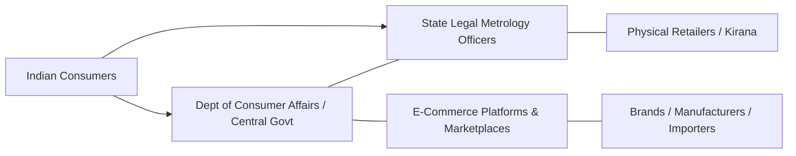
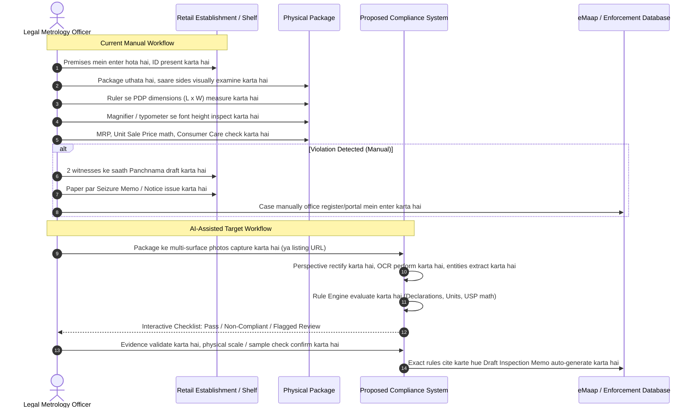
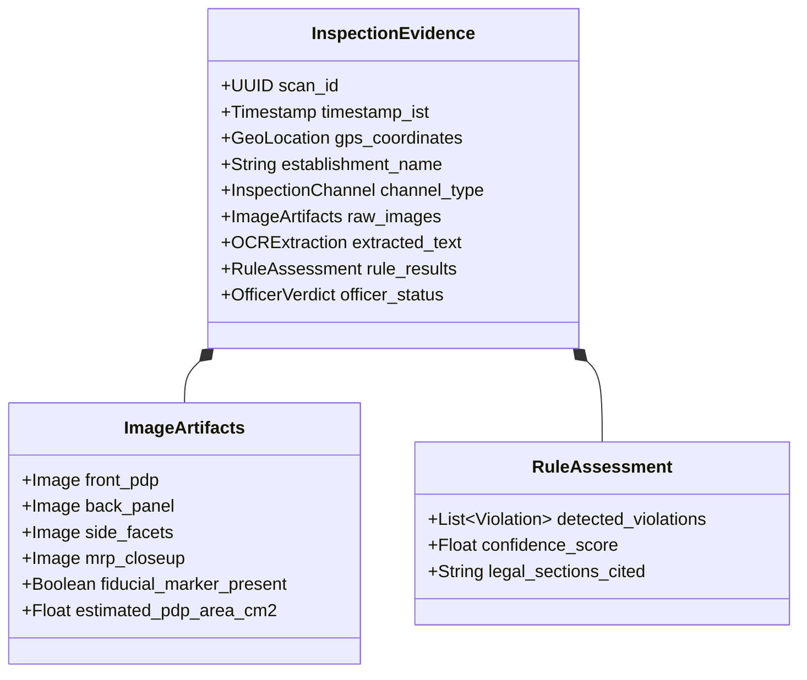
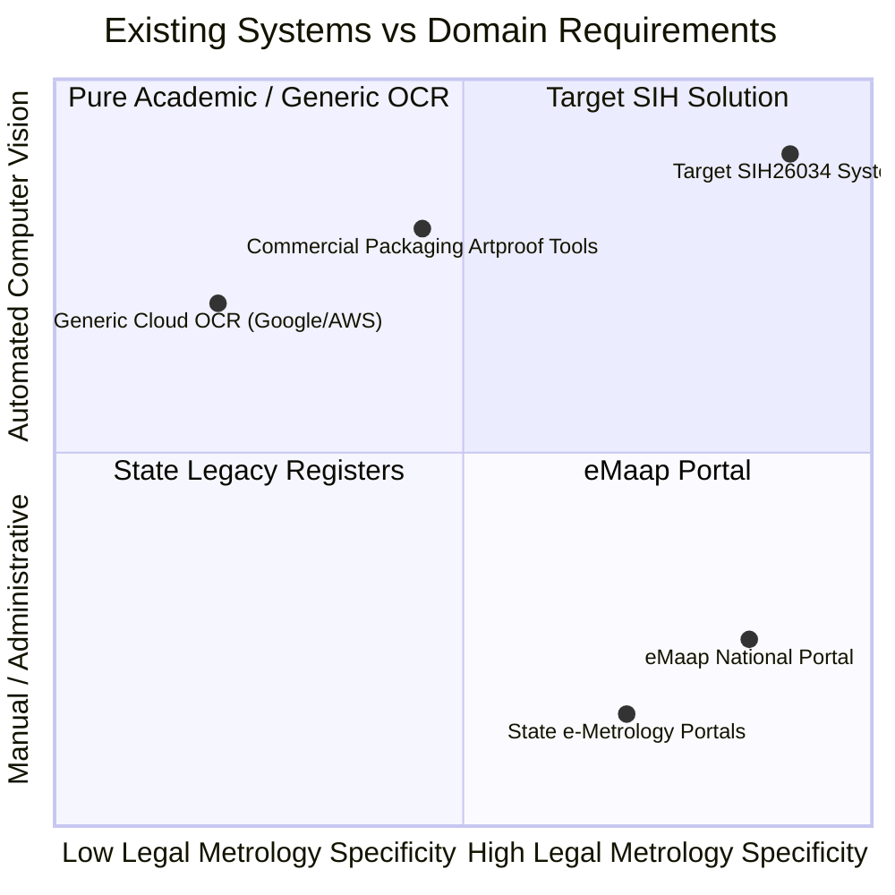
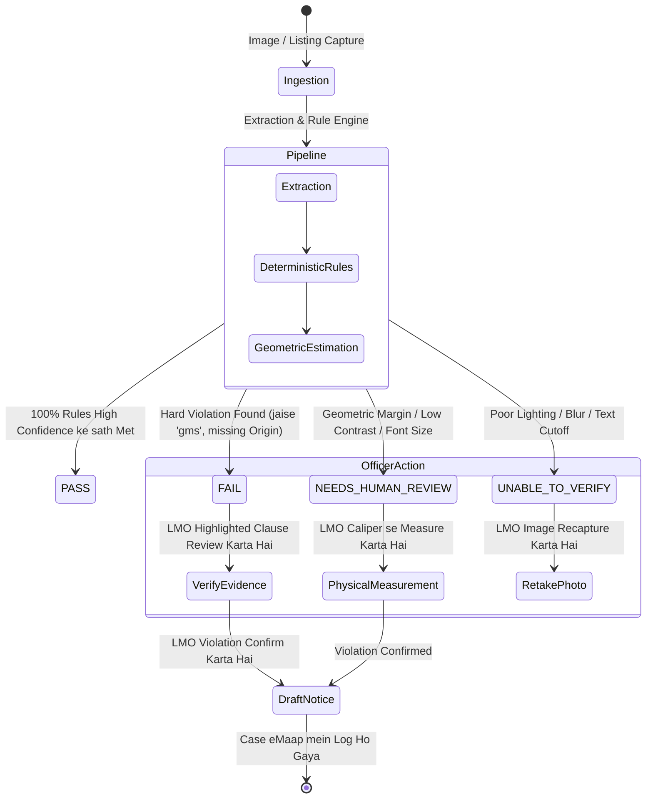
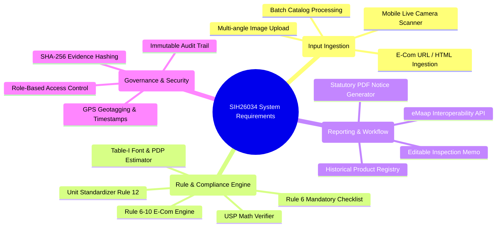

# SIH26034: DOMAIN RESEARCH & LEGAL METROLOGY COMPLIANCE DOSSIER

**Problem Statement ID:** SIH26034  
**Title:** Software System to check compliance of Packaged Commodities under Legal Metrology (Packaged Commodities) Rules, 2011 by scanning products, images and labels  
**Organization:** Ministry of Consumer Affairs, Food & Public Distribution  
**Department:** Department of Consumer Affairs (DoCA)  
**Category:** Software  
**Phase:** Phase 1 – Problem Understanding, Legal/Domain Architecture, aur Operational Boundary Analysis

---

## 01. EXECUTIVE SUMMARY

Department of Consumer Affairs (DoCA), Ministry of Consumer Affairs, Food & Public Distribution, Government of India ne Problem Statement **SIH26034** formulate kiya hai taaki ek acute enforcement bottleneck ko solve kiya ja sake: India bhar mein bikne wali har pre-packaged commodity—chahe woh kisi gaon ki kirana store par ho, modern supermarket mein ho, ya kisi e-commerce platform par—par **Legal Metrology Act, 2009** aur **Legal Metrology (Packaged Commodities) Rules, 2011 (LMPC Rules)** ke tehat statutory declarations hona mandatory hai.

### The Core Conflict

India ka consumer market diverse FMCG, electronics, apparel, aur pharmaceutical-adjacent categories ke across billions of pre-packaged stock-keeping units (SKUs) generate karta hai. Iske contrast mein, enforcement state-level Legal Metrology Officers (LMOs) ke ek limited cadre par depend karta hai jo physically market inspections conduct karte hain aur manually inspection memos draft karte hain. Meanwhile, e-commerce massively explode ho chuka hai, jahan millions of dynamic product listings aksar mandatory disclosures (jaise Country of Origin, Unit Sale Price, complete manufacturer identity) ko omit kar deti hain.

### What DoCA Seeks

DoCA ek aisa automated software system chahta hai jo product labels, packaging images, aur online listings ko scan karke LMPC Rules ke tehat compliance violations detect kar sake, structured compliance reports generate kare, aur enforcement officers ke liye ek audit-proof historical repository maintain kare.

### The Critical Domain Boundary

Automated compliance ke domain mein ek bohot bada misunderstanding yeh assume kar lena hai ki ek computer-vision ya OCR model simply "kisi photo ko dekh kar product ko illegal declare kar sakta hai." Legal metrology ke andar:

1. **Font Size Physical Hota Hai, Pixel-Based Nahi:** Statutory minimum font height (jaise Rule 7 ke Table-I ke tehat $1.0	ext{ mm}$ se $6.0	ext{ mm}$) strictly **Principal Display Panel (PDP)** ke surface area ($	ext{cm}^2$ mein) se govern hoti hai. Ek single uncalibrated 2D photo bina kisi known reference scale ya container geometry ke absolute physical millimeter measurements provide nahi kar sakti.
2. **Legal Evidence Standards:** Act ke Section 15 ke tehat ek regulatory violation notice ya seizure memo ke liye verifiable aur reproducible legal evidence ki zarurat hoti hai. Quasi-judicial ya court proceedings mein sirf probabilistic AI inference statutory proof ke roop mein stand nahi kar sakta.
3. **Dual Regimes:** Compliance framework **physical packaging** (jahan Rule 6(1) ke sabhi declarations jismein month/year of manufacture shamil hain mandatory hain) aur **e-commerce listings** (jahan Rule 6(10) ke tehat month/year of manufacture exempt hai, lekin Unit Sale Price aur Country of Origin strictly enforced hain, aur 2026 amendments ke tehat Country of Origin ka searchable/sortable hona mandatory hai) ke beech substantially differ karta hai.

Isliye ek viable system ko Legal Metrology Officers ke liye ek **AI-assisted regulatory triage aur decision-support engine** ke roop mein kaam karna hoga, jo findings ko clearly classify kare:

- **Deterministic Pass / Fail** (jaise missing text, non-standard unit symbols jaise "gms", missing Country of Origin, Unit Sale Price aur MRP ke beech mathematical mismatch),
- **Geometric Inferences Requiring Calibration** (jaise apparent font size vs. estimated PDP area), aur
- **Flags Requiring Physical / Human Verification** (jaise actual net quantity weight checks, manufacturer address ki authenticity, microscopic font verification).

---

## 02. PROBLEM STATEMENT IN PLAIN ENGLISH

### A. What Exactly is the Government Asking Us to Solve?

Government of India ek aisa software solution maang rahi hai jo packaged commodities ki photographs (physical retail se) aur digital product listings (e-commerce platforms se) ingest kare, automatically inspect kare ki kya mandatory legal declarations present hain, correct hain, readable hain, properly placed hain, aur Indian law ke mutabiq formatted hain, aur enforcement officials ko evidence-backed violation reports aur tracking dashboards ke saath empower kare.

### B. The Core Problem in One Sentence

**"India mein bikne wale packaged goods ka volume enforcement officers ki physical packaging aur online listings ko mandatory consumer-protection declarations ke liye manually inspect karne ki capacity se bohot zyada bada hai."**

### C. The Actual Operational Problem Behind the Statement

- **Physical Retail:** Ek inspector ko manually package uthana padta hai, uske saare facets rotate karke dekhne padte hain, fine print mein chhipe declarations locate karne padte hain, physical loupe ya caliper se letter height measure karni padti hai, calculate karna padta hai ki font Principal Display Panel area se match karta hai ya nahi, unit pricing ki mathematical correctness verify karni padti hai, manual panchnama/inspection memo likhna padta hai, aur paper files maintain karni padti hain.
- **E-Commerce Platforms:** Daily millions of third-party marketplace listings upload ya update hoti hain. Bohot si listings Country of Origin omit karti hain, true manufacturer ko mask karti hain, misleading MRPs dikhati hain, ya Unit Sale Price display nahi karti hain. Regulators ke paas manual screenshots aur time-consuming manual notices ke bina in listings ko crawl ya bulk-verify karne ka koi scalable tareeqa nahi hai.

### D. Meaning of Key Terms in This Context

- **Compliance of Packaged Commodities:** Legal Metrology Act, 2009 aur LMPC Rules, 2011 (amended) ke tehat laid down har statutory requirement ke saath package label aur listing ka absolute conformity.
- **Scanning Products, Images, and Labels:** Digital imagery (smartphone/camera se li gayi photos ya e-commerce listings se scrape ki gayi images) ka programmatic ingestion aur rule evaluation ke liye text, layout, bounding boxes, aur geometric relationships extract karna.
- **Mandatory Declarations:** Rule 6(1) dwara mandated specific informational items (jaise Manufacturer Identity, Net Quantity, MRP, Unit Sale Price, Date of Manufacture/Packing/Import, Consumer Care, Country of Origin).
- **Correctness:** Factual aur legal accuracy (jaise illegal "gms" ke bajaye official SI units "g" use karna; mathematical alignment jahan $	ext{Unit Sale Price} 	imes 	ext{Net Quantity} = 	ext{MRP}$).
- **Completeness:** Sabhi required sub-components ka present hona (jaise Consumer Care declaration mein contact person/office, address, telephone number, AUR email address hona chahiye; email omit karna Rule 6(1)(g) ka violation hai).
- **Placement:** Rule 8 ke mutabiq **Principal Display Panel (PDP)** ke relative declarations ki location, jismein Net Quantity statement ke aas-paas mandatory clear margins shamil hain.
- **Readability & Font Size:** Background contrast ke against legibility (Rule 9) aur Rule 7 ke Table-I mein diye gaye millimeter height schedule ka strict adherence.
- **Non-Compliant Declaration:** Aisa declaration jo missing ho, obscured ho, mathematically inconsistent ho, statutory height se chhota ho, prohibited abbreviations use karta ho, ya deceptively present kiya gaya ho.
- **Product Listing:** E-commerce platform par sale ke liye offer ki gayi pre-packaged commodity ka digital webpage, screen, ya API representation (Rule 6(10) dwara governed).

### E. Explicit vs. Non-Explicit Requirements



### F. Dangerous Assumptions to Avoid

1. **"Computer Vision bina physical scale reference ke millimeters accurately measure kar sakta hai":** Biscuit wrapper ki image mein pixels hote hain, millimeters nahi. Camera focal length, sensor size, distance, ya fiducial marker jane bina pixel height ko directly legal millimeters se correlate karna scientifically galat hai.
2. **"E-commerce rules physical package rules ke identical hote hain":** Rule 6(10) explicitly e-commerce listings se month aur year of manufacture/packing ko exempt karta hai kyunki fulfillment centers ke across inventory rotate hoti rehti hai. Amazon ya Flipkart listing ko manufacturing date missing hone par "Non-Compliant" mark karna basic legal ignorance ko show karta hai.
3. **"AI independently penalties issue kar sakta hai":** Indian Constitution, Legal Metrology Act, 2009, aur Jan Vishwas Act, 2023 ke tehat penal action ya improvement notices issue karne ke liye appointed Legal Metrology Officer ya Adjudicating Officer ki statutory authority exercise hona lazmi hai. AI koi autonomous judge nahi ban sakta.

---

## 03. THE REAL-WORLD PROBLEM & ON-THE-GROUND REALITY

### 3.1 Enforcement Machinery in India

Indian federal structure ke tehat, jahan Central Government (Department of Consumer Affairs) **Legal Metrology Act, 2009** aur **LMPC Rules, 2011** frame karti hai, wahi enforcement predominantly **State Governments** dwara execute kiya jata hai:

- **Hierarchy:** Controller of Legal Metrology (State Head) $
ightarrow$ Joint/Deputy/Assistant Controllers $
ightarrow$ Legal Metrology Officers (LMOs) / Inspectors of Legal Metrology (ILMs).
- **Jurisdiction:** Har LMO ko ek geographic circle ya district assign hota hai jo thousands of commercial establishments, warehouses, distribution centers, aur retail markets ko cover karta hai.

### 3.2 How Market Inspections Work Today

1. **Circle Rounds / Surprise Inspections:** Ek LMO retail markets, supermarkets, ya godowns visit karta hai.
2. **Visual Screening:** Officer visually shelves ko scan karta hai. Experienced officers typical red flags dhundte hain: MRP par paste kiye gaye stickers, dark backgrounds par tiny unreadable font, missing consumer care emails, ya foreign goods jismein Indian importer declaration gayab ho.
3. **Physical Scrutiny & Measurement:**
   - Font size check karne ke liye officer etched graticule wala magnifying loupe, typometer, ya vernier caliper use karta hai.
   - Officer Principal Display Panel (PDP) ka area ($L 	imes W$ rectangular boxes ke liye) calculate karta hai taaki decide ho sake ki Table-I ki kaunsi row apply hogi.
4. **Net Contents Verification:** Agar net quantity short hone ka shak hota hai, toh officer prescribed sample size (Rule 24 aur Ninth Schedule ke tehat) draw karta hai, unhe verified laboratory le jata hai ya portable calibrated weighing scale use karta hai, tare weight empty karta hai, aur Maximum Permissible Errors (MPE) ke against verify karta hai.
5. **Drafting the Inspection Memo / Panchnama:**
   - Agar koi violation milta hai, toh officer do independent witnesses (_panchas_) ki presence mein spot par hi **Inspection Memo / Panchnama** prepare karta hai.
   - Memo mein establishment ka naam, date, time, specific commodity, batch number, non-compliance ka nature (specific Rules cite karte hue), aur shopkeeper ke statements record kiye jaate hain.
6. **Seizure Memo (Form / Receipt):** Act ke Section 15 ke tehat, agar goods seize kiye jaate hain, toh ek formal Seizure Memo prepare karke retailer ko hand over kiya jata hai.
7. **Post-Inspection Proceedings:**
   - **Notice to Offender:** Retailer ko statutory notice issue kiya jata hai, aur label par named manufacturer/packer/importer ko letters dispatch kiye jaate hain.
   - **Compounding (Section 48):** Zyadatar first-time offenses compounding fees pay karne par administratively compound kar diye jaate hain.
   - **Adjudication / Prosecution:** Uncompounded ya repeat offenses ko Adjudicating Officer ya Judicial Magistrate ko refer kiya jata hai.

### 3.3 The Current Bottlenecks

| Step | Current Manual Mechanism | Operational Bottleneck | Consequence |
| :--- | :--- | :--- | :--- |
| **Market Coverage** | Individual LMOs dwara physical visits | LMOs aur retail establishments ka bohot low ratio (aksar 1 inspector per 5,000+ shops) | Packaged inventory ka 0.1% se bhi kam kabhi inspect ho pata hai |
| **Label Scrutiny** | Handheld magnifier se visual inspection | Thaka dene wala, subjective, human error ya oversight ki sambhavna | Inconsistent enforcement; minor violations miss ho jaate hain |
| **PDP Area & Font Math** | Manual ruler measurement & Table-I lookup | Ubaau arithmetic; routine checks mein tab tak rarely perform hota jab tak glaring violation na ho | Font size violations tab tak pakad mein nahi aate jab tak bohot bade na hon |
| **USP Verification** | Mental math ($	ext{Price} / 	ext{Quantity}$) | Odd quantities ke liye unit price calculate karna (jaise ₹73 for 185g = ₹0.3945/g) | Erroneous ya deceptive unit sale prices overlook ho jaate hain |
| **E-Commerce Monitoring** | Websites ki manual browsing | Tens of millions dynamic SKUs ko manually review karna impossible hai | Online listings mein non-compliance faila hua hai |
| **Record Keeping** | Paper dossiers, local registers | Disconnected state registries; states ke across repeat offenders ko first-time treat kiya jata hai | Habitual corporate offenders ko track karne mein asafalta |

---

## 04. WHY THIS PROBLEM EXISTS: SYSTEMIC ROOT CAUSES

1. **SKUs aur Hyper-Localization ka Explosion:** Fast-moving consumer goods (FMCG) aur direct-to-consumer (D2C) boom ne har saal hundreds of thousands naye brands aur package variants introduce kiye hain.
2. **Complex, Dynamic Regulatory Amendments:** LMPC Rules mein continuously updates hue hain (2017 e-commerce aur font rules, 2021 Unit Sale Price mandate, 2022 electronics ke liye QR code provisions, 2023 loose garment exemptions, 2026 Country of Origin searchability). Chhote packers aur third-party e-commerce sellers pace maintain karne ke liye struggle karte hain.
3. **Deliberate Deceptive Packaging (Shrinkflation & Dark Patterns):** Manufacturers aksar net contents reduce kar dete hain (jaise 100g se 85g) jabki visual package size same maintain rakhte hain, aur is change ko tiny fonts ya altered unit price displays se disguise kar dete hain.
4. **E-Commerce Intermediary Decoupling:** Information Technology Act, 2000 ke Section 79 aur LMPC Rules ke Rule 6(10) ke tehat, marketplace platforms historically argue karte rahe hain ki woh sirf intermediaries hain aur seller declarations ke liye responsible nahi hain, jisse ek enforcement grey area create ho gaya jahan fly-by-night sellers non-compliant listings upload kar dete hain.
5. **Standardized Machine-Readable Label Schemas ki Kami:** Simple GTIN numbers encode karne wale barcodes ke opposite, mandatory legal declarations freeform graphic layouts mein varying fonts, colors, aur spatial arrangements ke saath print kiye jaate hain.

---

## 05. STAKEHOLDER ANALYSIS & EXPECTATION MATRIX



### Detailed Stakeholder Breakdown

#### 1. Department of Consumer Affairs (DoCA), Ministry of Consumer Affairs, Food & PD

- **Role:** Central policy maker, Legal Metrology Act aur LMPC Rules ka custodian.
- **Needs:** National compliance analytics, trend monitoring, category aur platform ke hisab se non-compliance rates track karna, state enforcement par oversight.
- **What they expect:** Standardized data aggregation, national **eMaap** portal ke saath interoperability, National Consumer Helpline (NCH) par aane wali consumer grievances mein kami.
- **Rejection Triggers:** Aise black-box solutions jo violation ke legal grounds explain nahi kar sakte ya invalid legal notices generate karte hain.

#### 2. State Controllers and Legal Metrology Officers (LMOs)

- **Role:** Ground-level statutory enforcement, inspection, seizure, compounding, prosecution.
- **Needs:** Market raids ke dauran fast mobile/web screening tool, camera shots se declarations ka automated extraction, exact sections aur rules cite karne wale pre-filled inspection memos.
- **What they expect:** High specificity (low false alarms), clear visual evidence overlay, court mein defensible audit-trail.
- **What they will NOT trust:** Aisa tool jo exact word, number, ya missing mandatory phrase highlight kiye bina sirf "82% probability of violation" output deta ho.

#### 3. E-Commerce Entities (Marketplaces & Inventory Platforms)

- **Role:** Rule 6(10) ke tehat product listings ka digital display.
- **Needs:** Central Consumer Protection Authority (CCPA) aur State Metrology wings se regulatory notices avoid karne ke liye pre-listing catalog validation.
- **Expectations:** Seller-uploaded images aur listing metadata ka API-based verification.
- **Fears:** High false-positive rates jo legitimate seller inventory ko block kar dein aur onboarding slow kar dein.

#### 4. Manufacturers, Packers, and Importers

- **Role:** Rule 6(1) ke tehat physical packaging ke liye primary legally responsible entities.
- **Needs:** Multi-million package print cycles run karne se pehle pre-print packaging artwork compliance audits.
- **Expectations:** Table-I font sizes, PDP clearance, aur mandatory declaration wording ke saath aligned deterministic compliance checklists.

#### 5. Indian Consumers

- **Role:** Transparency aur fair trade ke end beneficiaries.
- **Needs:** Accurate net quantity, bina kisi unauthorized overwriting ke true MRP, products compare karne ke liye clear Unit Sale Price, grievances ke redressal ke liye accessible consumer care channels.

---

## 06. CURRENT INSPECTION WORKFLOW (REALITY VS. DIGITAL TARGET)



---

## 07. LEGAL METROLOGY DOMAIN OVERVIEW

### 7.1 Statutory Hierarchy

```
┌────────────────────────────────────────────────────────┐
│              LEGAL METROLOGY ACT, 2009                 │
│                 (Act No. 1 of 2010)                    │
│   • Section 18: Pre-packaged commodities requirements  │
│   • Section 36: Penalties for non-standard packages    │
│   • Section 48: Compounding of offences                │
│   • Section 49: Offences by companies                  │
└───────────────────────────┬────────────────────────────┘
                            │ (Section 52 dwara empowered)
                            ▼
┌────────────────────────────────────────────────────────┐
│  LEGAL METROLOGY (PACKAGED COMMODITIES) RULES, 2011    │
│   • Rule 6: Mandatory Declarations                     │
│   • Rule 7 & Table-I: Minimum Font Height Requirements │
│   • Rule 8: Principal Display Panel Specifications     │
│   • Rule 9: Manner of Declaration & Contrast           │
│   • Rule 10: Name and Address Declarations             │
│   • Rule 11 & 12: Net Quantity Units and Format        │
│   • Rule 18: MRP, Dual MRP Ban, Dealer Obligations     │
│   • Rule 26: Statutory Exemptions                      │
└───────────────────────────┬────────────────────────────┘
                            │ Key Amendments
                            ▼
┌────────────────────────────────────────────────────────┐
│ MAJOR STATUTORY AMENDMENTS:                            │
│   • G.S.R. 629(E) (2017): E-com Rule 6(10), font table │
│   • G.S.R. 779(E) (2021): Unit Sale Price (USP)        │
│   • G.S.R. 532(E) (2022/2023): Electronic QR code      │
│   • Jan Vishwas Act, 2023: Decriminalization of S. 36  │
│   • 2026 Amendment: Country of Origin Search Filter    │
└────────────────────────────────────────────────────────┘
```

### 7.2 The Jan Vishwas (Amendment of Provisions) Act, 2023

- **Legal Impact:** Parliament ne Ease of Doing Business promote karne ke liye pass kiya tha. Isne Legal Metrology Act, 2009 ke Section 36 ko amend kiya.
- **Decriminalization:** Section 36(1) ke tehat second ya subsequent offenses ke liye imprisonment ki penalty ko **omit** kar diya gaya.
- **Monetary Penalties & Improvement Notices:** Ek **Improvement Notice** mechanism introduce kiya gaya jisse first-time technical defaulters ko civil penalties lagne se pehle ek cure period mil sake. Fines ko har teen saal mein systematically 10% se compound kiya jata hai.
## 08. DETAILED RULE & REQUIREMENT ANALYSIS

### 8.1 Rule 6(1): Mandatory Declarations on Retail Packages

Retail sale ke liye intended har package par following clear declarations hona mandatory hai:

1. **Manufacturer / Packer / Importer Details (Rule 6(1)(a)):**
   - Manufacturer ka naam aur complete address.
   - Jahan manufacturer aur packer alag-alag hon: dono ke naam aur complete addresses.
   - Imported packages ke liye: manufacturer ke naam ke saath importer ka naam aur complete address.
2. **Country of Origin (Rule 6(1)(aa)):**
   - Sabhi goods ke liye country of origin, manufacture ya assembly state karna mandatory hai.
3. **Generic / Common Name (Rule 6(1)(b)):**
   - Package ke andar contain hone wali commodity ka common ya generic naam.
4. **Net Quantity (Rule 6(1)(c) & Rules 11–13):**
   - Weight (g, kg), volume (ml, l, L), length (cm, m), area ($m^2$), ya number (N, U) ke standard SI units mein declared hona chahiye.
5. **Date of Manufacture / Packing / Import (Rule 6(1)(d)):**
   - Woh month aur year jismein commodity manufacture, pack ya import hui hai. Permitted formats: `MM/YYYY` ya `Month Year`.
6. **Best Before / Expiry Date (Rule 6(1)(da)):**
   - Aisi commodities ke liye mandatory hai jo samay ke saath human consumption ke liye unfit ho sakti hain.
7. **Maximum Retail Price (MRP) (Rule 6(1)(e) & Rule 18):**
   - Is format mein expressed: `Maximum or Max. Retail Price Rs. ...... / ₹ ...... inclusive of all taxes`.
8. **Unit Sale Price (USP) (Rule 6(1)(f) introduced via G.S.R. 779(E)):**
   - Sabhi pre-packaged commodities ke liye mandatory hai, siwaye jab net quantity exactly 1 unit ho ya MRP unit price ke barabar ho.
9. **Consumer Care Details (Rule 6(1)(g)):**
   - Grievances ke liye contact kiye jaane wale person ya office ka naam, address, telephone number, aur email address.
10. **Sizes and Dimensions (Rule 6(1)(h) & Rule 7):**
    - Jahan commodity size ke hisab se bikti hai (jaise bedsheets, clothing, paper, cables), wahan dimensions declare karna mandatory hai.

---

## 09. MANDATORY DECLARATION MATRIX

| Declaration Item | Governing Rule | Exact Statutory Requirement | Input Type | Verification Logic | Exemptions / Caveats | Automation Boundary |
| :--- | :--- | :--- | :--- | :--- | :--- | :--- |
| **Manufacturer / Packer Name** | Rule 6(1)(a) & Rule 10 | Legal entity name clearly identified | Image Text / OCR | Entity extraction; prefix ("Mfg by", "Packed by") ki presence check karna | Imported goods Importer details state karte hain | **Automated Pass/Fail** |
| **Manufacturer Address** | Rule 6(1)(a) & Rule 10 | State aur PIN code ke saath complete postal address | Image Text / OCR | PIN code, city, state ke liye Regex/NER parsing | Electronic goods full address ke liye QR code use kar sakte hain (2023 amendment) | **Automated Format Check; Authenticity ke liye external DB required** |
| **Country of Origin** | Rule 6(1)(aa) | Exact declaration: "Country of Origin: [Country]" | Image Text / Listing Meta | ISO country list ke against Country entity match | None | **Automated Pass/Fail** |
| **Common / Generic Name** | Rule 6(1)(b) | Specific commodity name (jaise "Atta", "LED Bulb") | Image Text / Listing Meta | PDP par Noun phrase extraction | Electronic goods QR code use kar sakte hain | **Automated Presence Check** |
| **Net Quantity** | Rule 6(1)(c), Rules 11, 12 | Standard metric number + statutory unit symbol (g, kg, ml, l, m, N) | Image Text / OCR | Permitted unit symbols ke liye Regex validation; forbidden symbols ("gms", "ML") check karna | Packages $\le 10	ext{ g/ml}$ under Rule 26 | **Automated Text Check; Physical content ke liye weighing scale required** |
| **Month & Year of Mfg/Pack** | Rule 6(1)(d) | `MM/YYYY` ya text format mein Month & Year | Image Text / OCR | Date parser; check karna ki year $\le 	ext{Current Year} + 1$ | **Rule 6(10) ke tehat e-commerce listings par exempt** | **Physical par Automated Pass/Fail; E-com par Skip** |
| **Maximum Retail Price (MRP)** | Rule 6(1)(e), Rule 18 | `MRP Rs. X (incl. of all taxes)` | Image Text / OCR | Currency symbol (₹ ya Rs.), numerical amount, mandatory tax clause ke liye Regex | Institutional packs (Rule 3) | **Automated Text Check; Sticker over-printing ke liye visual anomaly detection required** |
| **Unit Sale Price (USP)** | Rule 6(1)(f), GSR 779(E) | Per g, kg, ml, l, ya number, rounded to 2 decimal places | Image Text / Listing Meta | Mathematical check: $	ext{USP} = 	ext{MRP} / 	ext{Quantity}$ | Agar package net quantity 1 unit ho ya MRP = USP toh exempt | **Automated Deterministic Verification** |
| **Consumer Care Details** | Rule 6(1)(g) | Must have: (1) Office/Person, (2) Address, (3) Tel No, (4) Email | Image Text / OCR | Multi-field verification: phone (10-digit / toll-free), valid email regex | Electronic goods partial info QR code par offload kar sakte hain | **Automated Completeness Check (Missing email/phone = Fail)** |
| **Dimensions / Size** | Rule 6(1)(h) | Standard metric units (cm, m) mein dimensions | Image Text / OCR | Applicable categories ke liye dimensional units ki presence check karna | Non-dimensional commodities | **Context-dependent Category Check** |

---

## 10. FONT SIZE, PLACEMENT & READABILITY DEEP DIVE

### 10.1 The Law: Table-I of Rule 7(2)

Mandatory declarations ke numerals aur letters ki statutory minimum height directly Principal Display Panel (PDP) ke area se linked hoti hai.

$$	ext{Table-I: Minimum Height of Numerals and Letters}$$

| Row | Area of Principal Display Panel ($A$) in $	ext{cm}^2$ | Minimum Height: Normal Case ($mm$) | Minimum Height: Blown, Formed, Moulded, Embossed or Perforated ($mm$) |
| :---: | :--- | :---: | :---: |
| **1** | $A \le 50$ | **1.0** | **2.0** |
| **2** | $50 < A \le 100$ | **1.5** | **3.0** |
| **3** | $100 < A \le 500$ | **2.5** | **4.0** |
| **4** | $500 < A \le 2500$ | **4.0** | **6.0** |
| **5** | $A > 2500$ | **6.0** | **8.0** |

#### Additional Geometric Rules under Rule 7 & 9

- **Stroke Width Ratio:** Kisi bhi letter ya numeral ki width uski **height ke one-third se kam nahi** honi chahiye (numeral `1` aur letters `i`, `I`, `l` ko chhod kar).
- **Net Quantity ke Aas-Paas Exclusion Clearance (Rule 8(2)):** Quantity declaration ke aas-paas ka area clear margin hona chahiye:
  - Upar aur neeche: kam se kam numeral ki height ke barabar.
  - Left aur right: kam se kam numeral ki height ka double ($2	imes$).

### 10.2 Principal Display Panel (PDP) Definition (Rule 8)

- **Rectangular Package:** Product name/branding contain karne wale ek entire side ka Height $	imes$ Width.
- **Cylindrical / Nearly Cylindrical Container:** Total height aur circumference ke product ka $40\%$ ($0.4 	imes H 	imes C$).
- **Any Other Shape:** Package ke total surface area ka $40\%$.

### 10.3 The Physical vs. Digital Reality: What a Camera Can and Cannot Prove

```
┌──────────────────────────────────────────────────────────────────────────┐
│                   THE OPTICAL PROJECTION DILEMMA                         │
│                                                                          │
│   A letter of height h (mm) at distance D (mm) through focal length f    │
│   projects onto image sensor as:                                         │
│                                                                          │
│                    y_pixel = (h * f) / (D * pixel_pitch)                 │
│                                                                          │
│   • Without knowing Distance (D), Focal Length (f), or Sensor Pitch,     │
│     pixel height CANNOT be converted into absolute millimeters.          │
│   • A 20-pixel letter could be 1.0mm (shot close) or 5.0mm (shot far).   │
└──────────────────────────────────────────────────────────────────────────┘
```

#### Automated Software Font Size ko Legally aur Scientifically Kaise Handle Kare?

1. **Uncalibrated Single Image (Wild Photo):**
   - **Scientific Truth:** Absolute millimeter measurement mathematically impossible hai.
   - **System Action:** **Relative Ratio** (Letter Height / Container Bounding Dimension) ya **Readability/Legibility Score** calculate kare. System "Likely Non-Compliant / Unverifiable" flag kar sakta hai, lekin **calibration ke bina sub-millimeter font ke liye definitive legal violation issue NAHI kar sakta**.
2. **Calibrated Capture (Fiducial Marker / Calibrated Reference Scale):**
   - Agar image standard reference object (jaise standard inspection card, coin, ya sath mein rakha gaya ArUco/Checkerboard scale) ke saath capture ki gayi hai, toh metric scale ($pixels\_per\_mm$) establish ho jata hai.
   - System physical height ko mm mein $\pm 0.1	ext{ mm}$ tolerance ke andar calculate kar sakta hai.
3. **Known Container Dimensions from Metadata:**
   - Agar user ya product catalog specify karta hai ki cereal box $25	ext{ cm} 	imes 18	ext{ cm}$ ka hai, toh system homography matrix compute kar sakta hai, PDP area ($450	ext{ cm}^2 
ightarrow$ Row 3: $2.5	ext{ mm}$ required) calculate kar sakta hai, perspective distortion unwarp kar sakta hai, aur font height ko calibrated box size ke against directly measure kar sakta hai.

---

## 11. MAXIMUM RETAIL PRICE (MRP) & QUANTITY COMPLIANCE

### 11.1 Statutory MRP Rules (Rule 6(1)(e) & Rule 18)

- **Mandatory Format:** Words "Maximum Retail Price" ya "Max. Retail Price" ya "MRP", uske baad currency symbol (₹ ya Rs.), numerical amount, aur mandatory suffix: **"inclusive of all taxes"** (ya "incl. of all taxes") shamil hona lazmi hai.
- **Overwriting / Smudging ki Prohibition (Rule 18(2)):** Koi bhi retail dealer, distributor, ya person MRP ko alter, obliterate, ya smudge nahi karega.
- **Stickers Prohibition:** Rule 18(2) ke tehat printed MRP par stickers paste karke prices badhana strictly prohibited hai. (Exception: GST rate cuts ke baad downward price revision ke liye Central Government ke specific circulars, ya imported goods ke liye customs clearance labeling).
- **Dual MRP par Ban (Rule 18(3)):** Koi bhi manufacturer ya packer different sales channels par same commodity ke identical packages par different MRPs declare nahi kar sakta (jaise identical mineral water bottle ko kirana store par ₹20 aur cinema halls/airports par ₹50 mein bechna illegal hai).

### 11.2 Unit Sale Price (USP) Mathematical Compliance (G.S.R. 779(E))

Unit Sale Price mandatory taur par following standardized denominators mein declare hona chahiye:

$$	ext{Prescribed Unit Sale Price Denominators}$$

| Net Quantity Range | Statutory USP Denominator | Example Calculation |
| :--- | :--- | :--- |
| **Weight $< 1	ext{ kg}$** | Per gram (`per g`) | $250	ext{ g}$ pack at ₹$100 
ightarrow$ **₹$0.40	ext{ per g}$** |
| **Weight $\ge 1	ext{ kg}$** | Per kilogram (`per kg`) | $5	ext{ kg}$ pack at ₹$450 
ightarrow$ **₹$90.00	ext{ per kg}$** |
| **Volume $< 1	ext{ litre}$** | Per millilitre (`per ml`) | $750	ext{ ml}$ bottle at ₹$150 
ightarrow$ **₹$0.20	ext{ per ml}$** |
| **Volume $\ge 1	ext{ litre}$** | Per litre (`per L` ya `per l`) | $2	ext{ L}$ bottle at ₹$120 
ightarrow$ **₹$60.00	ext{ per L}$** |
| **Length $< 1	ext{ metre}$** | Per centimetre (`per cm`) | $50	ext{ cm}$ ribbon at ₹$25 
ightarrow$ **₹$0.50	ext{ per cm}$** |
| **Length $\ge 1	ext{ metre}$** | Per metre (`per m`) | $10	ext{ m}$ wire at ₹$500 
ightarrow$ **₹$50.00	ext{ per m}$** |
| **Sold by Number / Count** | Per item ya number (`per piece`, `per N`, `per U`) | $10	ext{ pens}$ at ₹$100 
ightarrow$ **₹$10.00	ext{ per piece}$** |

$$	ext{Mathematical Consistency Invariant: } \left| (	ext{USP} 	imes 	ext{Declared Net Quantity}) - 	ext{Declared MRP} 
ight| \le 	ext{Rounding Tolerance (₹0.02)}$$

Agar koi OCR extract karta hai: Net Quantity = $400	ext{ g}$, MRP = ₹$200$, declared USP = ₹$0.60	ext{ per g}$, toh system turant ek **Mathematical Non-Compliance** flag karta hai ($400 	imes 0.60 = ₹240 
e ₹200$).

---

## 12. E-COMMERCE & PRODUCT LISTING SCOPE

### 12.1 The Specific Legal Mandate: Rule 6(10)

Rule 6(10) ke tehat (G.S.R. 629(E) ke through amended):

> _"Har e-commerce entity ko yeh ensure karna hoga ki sub-rule (1) mein specified mandatory declarations—siwaye us month aur year ke jismein commodity manufacture ya pack hui hai—e-commerce transactions ke liye use hone wale digital aur electronic network par display kiye jaayen."_

### 12.2 Physical Packaging vs. E-Commerce Listing Comparison

| Regulatory Parameter | Physical Retail Package (Rule 6(1)) | E-Commerce Product Listing (Rule 6(10)) |
| :--- | :--- | :--- |
| **Manufacturer/Packer Details** | Label par printed | Product specifications / description mein appear hona chahiye |
| **Country of Origin** | Label par printed | **Mandatory**; Product page par prominently display hona chahiye |
| **Searchable Country of Origin** | Not applicable | **July 1, 2026 se Mandatory** (Rule 6(10A): searchable & sortable filter) |
| **Net Quantity** | Spacing margin ke saath PDP par printed | Product title / attributes mein display hona chahiye |
| **MRP (incl. of all taxes)** | Package par printed | Declare hona mandatory; crossed-out fake inflated MRP nahi dikha sakte |
| **Unit Sale Price (USP)** | Package par printed | **Mandatory**; MRP ke sath display hona chahiye |
| **Month & Year of Mfg/Pack** | **Package par Mandatory** | Rule 6(10) ke tehat **STATUTORILY EXEMPT** |
| **Consumer Care Details** | Label par full address, phone, email | Listing page ya platform seller page par accessible hona chahiye |

### 12.3 Listing vs. Physical Package Mismatches

Consumer deception ka ek major source tab create hota hai jab digital listing ek cheez promise karti hai, lekin delivered physical product par alag declarations hote hain:

- Listing claim karti hai Country of Origin: _India_; Delivered physical pack par likha hai: _Made in China_.
- Listing claim karti hai Net Quantity: _1000 g_; Delivered pack par likha hai: _850 g_.
- Listing claim karti hai MRP: ₹*499* (discount karke ₹*399*); Delivered pack par printed MRP hai ₹*349* (actual printed MRP se upar overcharging!).

---

## 13. VIOLATION TAXONOMY (LMPC ACT & RULES)

```mermaid
graph TD
    Root[LMPC Compliance Violations]
    Root --> C1[1. Missing Declarations]
    Root --> C2[2. Formatting & Text Violations]
    Root --> C3[3. Metric & Mathematical Violations]
    Root --> C4[4. Pricing & MRP Violations]
    Root --> C5[5. Placement & Geometric Violations]
    Root --> C6[6. E-Commerce Listing Violations]

    C1 --> V1_1[Missing Country of Origin]
    C1 --> V1_2[Missing Consumer Care Email/Phone]
    C1 --> V1_3[Missing Mfg Date on Physical Pack]

    C2 --> V2_1[Non-standard Unit: 'gms', 'ML', 'Kgs']
    C2 --> V2_2[Missing 'Inclusive of all taxes' suffix]

    C3 --> V3_1[USP x Quantity != MRP]
    C3 --> V3_2[Incorrect USP denominator]

    C4 --> V4_1[MRP Overwriting / Sticker pastings]
    C4 --> V4_2[Selling above printed MRP]
    C4 --> V4_3[Dual MRP on identical goods]

    C5 --> V5_1[Font size below Table-I minimum]
    C5 --> V5_2[Violating clear margin around Net Qty]
    C5 --> V5_3[Inadequate contrast against background]

    C6 --> V6_1[Listing missing Country of Origin]
    C6 --> V6_2[Listing missing Unit Sale Price]
    C6 --> V6_3[Mismatch between listing & delivered pack]
```



### 13.1 Systematic Violation Catalog

| Violation Code | Violation Description | Statutory Basis | Detection Method | Physical Measurement Required? |
| :---: | :--- | :--- | :--- | :---: |
| **V-01** | Missing Country of Origin | Rule 6(1)(aa) | Text / Entity Search | No |
| **V-02** | Incomplete Consumer Care (missing email ya phone) | Rule 6(1)(g) | Regex / Structured Entity Check | No |
| **V-03** | Missing / Incomplete Manufacturer Address (no PIN code) | Rule 6(1)(a), Rule 10 | Address Parser / PIN code validation | No |
| **V-04** | Non-Standard Units ka use (jaise `gms`, `gm`, `kgs`, `ML`, `ltrs`) | Section 11, Rule 12 | Exact Token Match / Regex | No |
| **V-05** | MRP par missing "Inclusive of all taxes" clause | Rule 6(1)(e) | Fuzzy string matching | No |
| **V-06** | Missing Unit Sale Price (USP) | Rule 6(1)(f), GSR 779(E) | Entity & Number Parsing | No |
| **V-07** | USP, Quantity, aur MRP ke beech Mathematical Mismatch | Rule 6(1)(f) | Arithmetic validation engine | No |
| **V-08** | Table-I schedule se kam Font height | Rule 7(2), Table-I | Optical scale / Calibrated pixel analysis | **Yes (ya known PDP scale)** |
| **V-09** | Net Quantity clearance margins ka encroachment | Rule 8(2) | Bounding box spatial analysis | **Yes (Geometric)** |
| **V-10** | Price inflate karne ke liye printed MRP par pasted sticker | Rule 18(2) | Image edge / artifact visual inspection | **Yes (Physical confirmation)** |
| **V-11** | Deficient contrast (background ke against unreadable font) | Rule 9(1) | Color luminance contrast ratio ($WCAG \ge 4.5:1$) | No (Digital estimation) |
| **V-12** | E-commerce listing missing Country of Origin ya USP | Rule 6(10) | DOM / OCR text parsing | No |
| **V-13** | Identical package par Dual MRP | Rule 18(3) | Multi-image catalog cross-check | No |
| **V-14** | Declared quantity se kam Actual Net Contents | Section 36, Rule 24 | Lab gravimetric/volumetric testing | **Yes (Mandatory physical weigh)** |

---

## 14. DATA & EVIDENCE REQUIREMENTS MATRIX



### Input Data Dependency Breakdown

| Data Component | Source | Realistically Available in Wild Image? | Can It Be Inferred? | Impact if Missing |
| :--- | :--- | :---: | :---: | :--- |
| **Raw Packaging Images** | Mobile camera ya e-com scraper | Yes | N/A | Total system failure |
| **Text & Numerals** | Packaging label surface | Yes (via OCR) | N/A | Declarations par false alarms |
| **Camera Calibration / Distance** | Mobile EXIF / Sensor | Rarely (EXIF lacks distance) | No | **Absolute millimeters compute nahi ho sakte** |
| **Fiducial Scale / Known Ref** | Inspection card / Ruler | Inspector card place kare tabhi | No | Font size relative ratio tak restricted rahega |
| **Physical Dimensions ($L 	imes W$)** | Packaging box | No (2D projection only) | Agar product catalog ho toh infer ho sakta hai | Table-I row selection uncertain ho jayegi |
| **Actual Weight of Contents** | Physical scale | **Image se kabhi nahi** | Kabhi nahi | Short-weight violations detect nahi ho sakte |
| **Manufacturer Legal Existence** | MCA21 / GSTN Database | No | API integration ke through | Address fraud verify nahi ho sakta |
| **Historical Offenses of Brand** | eMaap Central Database | No | API integration ke through | 1st vs repeat offense distinguish nahi kar sakte |

---

## 15. WHAT AN AUTOMATED SYSTEM CAN KNOW VS. CANNOT KNOW

```
┌────────────────────────────────────────────────────────────────────────────────────────┐
│                        THE TRIPARTITE CAPABILITY BOUNDARY                              │
│                                                                                        │
│  COLUMN A: Directly Observable      COLUMN B: Inferred with Context   COLUMN C: Cannot │
│            from Image                         & Reference Data                  Automate│
│  ─────────────────────────────      ───────────────────────────────   ─────────────────│
│  • Words ki presence/absence        • Table-I font row (needs PDP     • True physical  │
│    ("Country of Origin", MRP)         dimensions or category)           net content    │
│  • Unit symbols ki correctness      • USP ki mathematical validity    • Address on MCA │
│    ("g" vs "gms")                     (needs Net Qty + MRP)             authenticity   │
│  • Consumer care completeness       • Relative font prominence        • Internal       │
│    (phone, email, address present)    (ratio of text to label area)     quality/content│
│  • Gross text format & wording      • WCAG background contrast ratio  • Exact mm       │
│  • E-commerce listing text check    • E-com vs physical pack mismatch   font without   │
│                                       (needs both image & listing)      scale reference│
└────────────────────────────────────────────────────────────────────────────────────────┘
```

### Detailed Capability Analysis

#### Column A: Deterministic Automation (Zero Human Doubt)

1. **Statutory Phrase Extraction:** Check karna ki kya MRP ke baad "inclusive of all taxes" appear hota hai.
2. **Prohibited Metric Symbols:** "g", "kg", "ml", "l" ke bajaye "gms", "gm", "Kgs", "ML", "ltrs" detect karna.
3. **Consumer Care Completeness:** Consumer care block ke andar email address regex aur telephone number regex ki presence check karna.
4. **Country of Origin Declaration:** Statutory prefix ke baad ek approved country name follow hone ko detect karna.
5. **Digital E-Commerce Disclosures:** Confirm karna ki kya Amazon ya Flipkart page par Country of Origin aur USP contained hain.

#### Column B: Inferred / Context-Assisted Automation

1. **Unit Sale Price Correctness:** Declared Net Quantity aur declared MRP ingest karke floating-point division perform karna, 2 decimal places tak round karna, aur extracted USP ke against check karna.
2. **Color Contrast & Legibility:** Text foreground pixels aur local background bounding box ke beech luminance histogram difference measure karna (ISO 9241-3 ke tehat $L_1 / L_2$ contrast ratio).
3. **Bounding Box Spacing (Rule 8(2)):** Net quantity numeral ke aas-paas pixel margins check karna taaki ensure ho sake ki koi bhi graphic elements $1	imes$ height (vertical) ya $2	imes$ height (horizontal) ke andar encroach na karein.

#### Column C: Hard Boundary – Requires Human / Physical Action

1. **Actual Millimeter Font Verification (uncalibrated photos mein):** Physical measuring scale ya calibrated reference ke bina court mein tik nahi sakta.
2. **Short Net Contents:** 500g biscuit packet ki image yeh reveal nahi kar sakti ki pack ke andar actual weight sirf 420g hai. Iske liye Rule 24 ke tehat physical calibrated balance zaruri hai.
3. **Physical Tampering / Re-stickering:** Yeh detect karna ki MRP sticker brand dwara paste kiya gaya tha ya kisi fraudulent shopkeeper dwara, physical tactile peeling aur adhesive residues ke chemical examination ki maang karta hai.
## 16. REAL-WORLD PACKAGING FAILURE MODES & CHALLENGES

```mermaid
graph TD
    Sub[Packaging Image Challenges]
    Sub --> P1[Optical & Lighting Defects]
    Sub --> P2[Surface & Material Geometry]
    Sub --> P3[Graphic & Typography Noise]

    P1 --> O1[Glossy Laminates par Specular Reflection / Glare]
    P1 --> O2[Cylindrical Cans par Deep Shadows]
    P1 --> O3[Handheld Smartphone Capture se Motion Blur]

    P2 --> S1[Bottles & Cans par Cylindrical Distortion]
    P2 --> S2[Wrinkled Foil & Crinkled Pouches / Chips Bags]
    P2 --> S3[Transparent Bottles jahan Background Liquid dikhta hai]

    P3 --> T1[Extreme Low Contrast: Yellow Pack par Gold Foil]
    P3 --> T2[Batch/MRP ke liye Dot-Matrix Thermal Overprinting]
    P3 --> T3[Tiny Font (1.0 mm) jo Camera Nyquist Limit approach karta hai]
```

### The "Dot-Matrix Overprinting" Problem

Legal metrology ka ek bohot specific challenge yeh hai ki jabki brand artwork continuous typography ke saath offset-printed hota hai, **Batch Number, Month/Year of Manufacture, aur MRP** assembly line par **thermal inkjet ya dot-matrix coders** ke through apply kiye jaate hain:

- Characters alag-alag ink dots (jaise `5 x 7` dot matrix) se bante hain.
- Greasy/plastic packaging films par inkjet nozzles clog ya smudge ho jaate hain.
- Continuous typography par train kiye gaye standard OCR engines fragmented dot-matrix digits par buri tarah fail ho jaate hain (`8` ko `3` ya `0` samajh lete hain, jisse galat MRP extract hoti hai).

---

## 17. INDIAN & MULTILINGUAL CONTEXT

### 17.1 Multilingual Packaging Realities

- **Official Languages:** Rule 9(2) allow karta hai ki declarations **Devnagri script mein Hindi** ya phir **English** mein hon. (State rules local regional languages ko bhi encourage kar sakti hain, jaise Karnataka mein Kannada, Tamil Nadu mein Tamil).
- **Dual-Language Declarations:** Indian FMCG packs ka ek bohot bada percentage ek face par English aur doosre par Hindi carry karta hai, ya side-by-side bilingual text carry karta hai (jaise "शुद्ध मात्रा / Net Quantity: 1 kg").
- **Devnagri Numerals vs. International Numerals:** Legal Metrology Act, 2009 ka Section 10 mandate karta hai ki sabhi numeration **Indian numerals ke international form** mein honi chahiye (yaani `1, 2, 3, 4, 5, 6, 7, 8, 9, 0`). Agar text Hindi mein bhi ho, tab bhi Devnagri script (`१, २, ३`) mein numerals declare karna Section 10 ke tehat inspectors dwara challenge kiya ja sakta hai!
- **Transliteration vs. Translation:** Words jaise "Maximum Retail Price" aksar transliterate hoke "अधिकतम खुदरा मूल्य" ya abbreviate hoke "एम.आर.पी." appear hote hain.

---

## 18. EXISTING SYSTEMS & COMPETITIVE LANDSCAPE



### Landscape Analysis

| System Name | Organization | Focus Area | Technology | Capabilities | Key Limitations / Gaps |
| :--- | :--- | :--- | :--- | :--- | :--- |
| **eMaap Portal** (`emaap.gov.in`) | DoCA, Central Govt | National Legal Metrology Licensing & Workflow | Web portal / Central DB | Rule 27 ke tehat online registrations, model approval, inspection tracking | Administrative only; **Zero automated image scanning ya label OCR** |
| **State e-Metrology Portals** (MH, TN, KA) | State Controllers | Verification fee collection, license renewals | State legacy web apps | Stamping scheduling, revenue collection | Fragmented databases; label verification capabilities bilkul nahi hain |
| **Commercial Artwork Proofing** (GlobalVision, Esko) | Private Enterprise | Pre-press digital graphic verification | Vector artwork inspection | Digital PDF ko brand master se compare karta hai | Pristine 300+ DPI vector PDFs chahiye; **Crumpled retail packs ki wild smartphone photos par completely fail ho jata hai** |
| **Academic / Hackathon OCR Prototypes** | Universities / Contests | Generic OCR detection | Basic Tesseract / EasyOCR | Raw text ko text box mein extract karta hai | Legal Metrology knowledge engine nahi hai; Table-I font sizes ya Rule 6 ki koi samajh nahi |

---

## 19. OPERATIONAL SCALE IN INDIA

```
┌────────────────────────────────────────────────────────┐
│               THE SCALE OF ENFORCEMENT                 │
│                                                        │
│   • Population: 1.4+ Billion Consumers                 │
│   • Retail Outlets: ~12–14 Million Kirana Stores       │
│   • Active E-Commerce SKUs: >100 Million               │
│   • Total Legal Metrology Officers across India:       │
│     Estimated ~2,500–3,500 active field inspectors     │
│                                                        │
│   RATIO: ~1 Inspector per 5,000+ Physical Outlets      │
│          + Billions of Packaging Units Annually        │
└────────────────────────────────────────────────────────┘
```

### Data Volume Implications

- **Physical Retail Inspections:** Ek single active inspector per week $10$ se $30$ establishments inspect karta hai, $50$ se $150$ packages scrutinize karta hai. All-India level par, yeh annually $500,000$ se zyada manual inspections represent karta hai.
- **E-Commerce Web Crawling:** Leading Indian platforms (Amazon India, Flipkart, Meesho, Blinkit, Zepto, BigBasket) par daily $50,000$ se zyada naye seller product listings post hoti hain. Is volume ki manual scrutiny physically impossible hai.

---

## 20. HUMAN-IN-THE-LOOP (HITL) REQUIREMENTS

### 20.1 Why AI Cannot Act Alone

Indian Evidence Act, 1872 (aur Bharatiya Sakshya Adhiniyam, 2023) ke saath-saath Legal Metrology Act, 2009 ke Section 15 ke tehat, penal proceedings ya seizure ek authorized statutory officer dwara execute hona mandatory hai. AI output purely **investigative decision-support** hai, direct legal evidence nahi.

### 20.2 The Four-Tier Regulatory Decision Architecture



#### Precise Legal Status Definitions

1. **PASS:** Rule 6(1) ya Rule 6(10) ke tehat sabhi mandatory declarations present hain, syntactically valid hain, units metric compliant hain, aur mathematical invariants match karte hain.
2. **FAIL / NON-COMPLIANT:** Unambiguous statutory requirements ka direct violation (jaise Country of Origin completely missing; net quantity mein banned symbol "gms" used; Unit Sale Price math MRP se match nahi karta).
3. **UNABLE TO VERIFY:** Image quality OCR confidence ko statutory legibility thresholds se neeche gira deti hai (jaise specular glare consumer care email ko obliterate kar deta hai; fold MRP ko obscure kar deta hai). System inspector ko instruct karta hai: _"Specular reflection on lower quadrant; please 45-degree angle par photo retake karein"_.
4. **NEEDS HUMAN REVIEW:** Ambiguous ya border-case conditions (jaise apparent font height Table-I cutoff ke $10\%$ ke andar hai; address ka unusual format hai; potential sticker peeling detect hui hai). Officer ko notice generate karne se pehle visually ya physically inspect karna hoga.

---

## 21. SECURITY, PRIVACY & AUDITABILITY CONSIDERATIONS

1. **Chain of Custody & Evidence Tampering:**
   - Field inspector dwara capture ki gayi koi bhi image jo legal notice lead karti hai, capture hone ke moment par hi cryptographically hash (SHA-256) honi chahiye.
   - Court mein contestation prevent karne ke liye image payload ke saath metadata (retail shop ke GPS coordinates, atomic network clock ka timestamp, device ID) bind hona mandatory hai.
2. **Role-Based Access Control (RBAC):**
   - **Field LMO / Inspector:** Scans upload karna, circle violations dekhna, inspection memos draft karna, compounding requests submit karna.
   - **Assistant / Deputy Controller:** Compounding notices review aur approve karna, uncompounded cases ko court escalate karna.
   - **State Controller / Central DoCA Admin:** High-level dashboard, national compliance indices dekhna, platform violation trends monitor karna, audit logs dekhna.
   - **Enterprise / E-Commerce Seller (External):** Public upload se pehle product catalogs check karne ke liye restricted pre-validation sandbox.
3. **Audit Logs:**
   - Har user action ke liye immutable, append-only logs (kisne scan kiya, kya flag hua, kis officer ne AI recommendation ko override kiya, kab notice issue hua).

---

## 22. DERIVED FUNCTIONAL REQUIREMENTS (FROM THE PS)



### Traceability Matrix

| Req ID | Functional Requirement | PS Mapping Clause | Legal / Operational Driver | Priority |
| :---: | :--- | :--- | :--- | :---: |
| **FR-01** | Multi-Image Package Scanning (Front, Back, Sides) | "Scanning and analyzing images of packaged commodities" | Packages multiple facets par declarations wrap karte hain | **Mandatory** |
| **FR-02** | E-Commerce Listing URL & Image Scrutiny | "scanning product listings to identify violations" | Rule 6(10) compliance monitoring | **Mandatory** |
| **FR-03** | Mandatory Declaration Extractor & Checklist | "Detecting mandatory declarations prescribed under LM rules" | Rule 6(1) statutory items | **Mandatory** |
| **FR-04** | Unit & Symbol Syntax Verifier | "Checking correctness, completeness and placement" | Section 11 & Rule 12 ("gms", "ML" par ban) | **Mandatory** |
| **FR-05** | Unit Sale Price (USP) Mathematical Validator | "Checking correctness... improper MRP declarations" | G.S.R. 779(E) mathematical check | **Mandatory** |
| **FR-06** | Font Size & PDP Margin Estimator | "Checking readability and font-size requirements" | Rule 7, Table-I, aur Rule 8(2) | **Mandatory** |
| **FR-07** | Readability & Color Contrast Scorer | "Checking readability" | Rule 9(1) conspicuous contrast mandate | **Mandatory** |
| **FR-08** | Automated Statutory PDF & Editable Notice Generator | "Generating PDF and editable compliance reports" | Section 15 inspection memo workflow | **Mandatory** |
| **FR-09** | Central Repository of Scanned Products & History | "Maintaining a repository of scanned products and compliance history" | S. 36 ke tehat repeat corporate offenders ko track karna | **Mandatory** |
| **FR-10** | Enforcement Officer Role-Based Dashboard | "Providing dashboards for enforcement officials" | Circle-level aur State-level oversight | **Mandatory** |
| **FR-11** | Cryptographic Evidence Sealing (Hashing & Geotagging) | "Role-based access and secure authentication" | Section 65B Indian Evidence Act admissibility | **Mandatory** |

---

## 23. SUCCESS CRITERIA (MULTI-DIMENSIONAL EVALUATION)

### 1. Legal Success Criteria

- **100% Statutory Traceability:** Har flagged violation ko Legal Metrology Act, 2009 ka exact Section aur LMPC Rules, 2011 ka exact Sub-rule cite karna hoga.
- **Zero Fictitious Violations:** System kabhi bhi kisi legal rule ko hallucinate nahi karega aur na hi physical packaging rules ko e-commerce listings par misapply karega (jaise e-commerce listing par missing manufacturing date flag nahi karega).
- **Admissible Evidence Generation:** Formatted inspection memos standard state Legal Metrology inspection formats ke saath strictly align hone chahiye.

### 2. Operational Success Criteria

- **Inspection Cycle Time Reduction:** Package scrutinize karne mein LMO dwara lagne wale time ko 5–8 minutes se reduce karke under 30 seconds karna.
- **High Specificity (Low False Alarms):** Unambiguous declarations (Country of Origin, MRP, Units) par false alarm rate $< 2\%$ hona chahiye.
- **Explainable Action Items:** UI ko violated statutory rule ke saath physical package image par direct offending text ke chaaron taraf bounding box display karna chahiye.

### 3. Technical Success Criteria

- **Robustness to Lighting & Angles:** $30^\circ$ perspective tilt, uneven shelf lighting, aur glossy reflections wali images ko successfully process karna.
- **Dot-Matrix Coder Decoupling:** Standard fonts ko confuse kiye bina thermal overprinted batch numbers aur dates ko correctly parse karna.
- **Clear Epistemic Boundary:** Jab image blurry ho ya resolution 1.0mm font verify karne ke liye insufficient ho, toh system ko speculative guess lagane ke bajaye **UNABLE TO VERIFY** output dena hoga.
## 24. KEY RISKS & CONSTRAINTS

| Risk Category | Specific Risk Event | Impact on Enforcement | Domain Mitigation Strategy |
| :--- | :--- | :--- | :--- |
| **Optical / Physical** | Uncalibrated 2D photo se absolute millimeters measure karne ki koshish karna | False court cases; magistrates dwara immediate dismissal | Calibrated scale / known dimensions require karna; warna relative ratio tak restrict karke physical measurement ke liye flag karna |
| **Legal / Procedural** | Automated system bina officer review ke penalty notice issue kar de | Principles of natural justice aur statutory mandate ka violation | System sirf _Draft Inspection Memo_ generate kare; gazetted LMO ka digital signature mandatory ho |
| **Data / Technical** | Generative OCR models dwara text ka hallucination | Physical pack par na exist karne wale typo ke liye manufacturer ko cite karna | Dual-engine OCR cross-verification; officer ke verification ke liye raw crop preview display karna |
| **Domain Exception** | Kisi exempted pack (jaise $<10	ext{ g}$ ya institutional pack) ko non-compliant flag karna | Legitimate businesses ka harassment; trust ka loss | Pehle package net quantity aur category ingest karna; rule execution se pehle Rule 26 aur Rule 3 exemption filters evaluate karna |
| **E-Commerce Reality** | Scan ke baad dynamic marketplace seller content ka change ho jana | Platform claim karega ki notice ke time listing compliant thi | Timestamped, cryptographically archived screenshot aur DOM snapshot ko evidence ke roop mein preserve karna |

---

## 25. OPEN QUESTIONS & UNKNOWNS

1. **eMaap ke Saath Integration Protocol:** Newly launched national `emaap.gov.in` portal external inspection memo ingestion ke liye kaun sa exact REST API ya data exchange standard support karta hai?
2. **Sole Seizure Basis ke Roop mein Smartphone Photos ka Statutory Status:** Kya relevant State Metrology Manual offending carton ke physical seizure ko primary physical evidence ke roop mein require karta hai, ya Jan Vishwas Act ke tehat Improvement Notice initiate karne ke liye geotagged digital photograph legally sufficient hai?
3. **Standard Reference Scale Feasibility:** Kya State Legal Metrology departments inspectors ke liye ek standard calibrated reference card (jaise credit-card-sized checkerboard scale) carry karna mandate karenge taaki font size verification ke waqt photos lete samay use product ke paas rakha ja sake?
4. **Composite / Multi-Pack Commodities ki Handling:** Jab ek primary container 4 smaller individually wrapped sachets hold karta hai (jaise noodles with tastemaker, multi-pack soaps), toh Rule 24 ke tehat outer carton vs. inner sachet declarations kaise handle hote hain?
5. **MCA21 / GSTN Database tak Access:** Kya compliance engine ko Ministry of Corporate Affairs (MCA21) database ka read-only API access grant kiya ja sakta hai taaki declared manufacturer name aur registered address legally active corporate entities hain ya nahi, yeh automatically verify kiya ja sake?

---

## 26. JUDGE-PERSPECTIVE ANALYSIS: WHAT SEPARATES WINNERS FROM AMATEURS

### What a Domain Expert Judge Expects You to Understand

- Ministry of Consumer Affairs ya Legal Metrology ka judge immediately aapki **Rule 7 ke Table-I** ki knowledge test karega. Woh puchenge: _"Aapke software ne yeh kaise decide kiya ki is biscuit packet par 1.5mm font required tha ya 2.5mm font?"_ Agar aapki team ne jawab diya: _"Hamare AI ne ise small font classify kar diya,"_ toh aapko spot par hi eliminate kar diya jayega. Aapko **Principal Display Panel (PDP)** area ki calculation aur optical projection constraints explain karne honge.
- Judge aapki **2017, 2021, aur 2023 amendments** ki knowledge test karega: Unit Sale Price (USP), Rule 6(10) e-commerce exemptions, aur electronic QR code rules.

### Deadly Misconceptions That Expose Weak Preparation

1. **FSSAI ko Legal Metrology ke Saath Confuse Karna:** FSSAI nutritional values, ingredients, allergens, aur food safety logos govern karta hai. Legal Metrology net quantity, MRP, unit sale price, manufacturer identity, country of origin, aur metric standards govern karti hai. Inhe mix up karna domain focus ki kami dikhata hai.
2. **Yeh Claim Karna ki AI Packages ko Weigh Kar Sakta Hai:** Yeh claim karna ki aapka computer vision model "short quantity" detect kar sakta hai (jaise pack mein 100g ke bajaye 90g hai) yeh prove karta hai ki aapko samajh nahi hai ki images sirf container dekhti hain, andar ke contents ka mass nahi.
3. **"gms" ko Valid Maanna:** Yeh sochna ki "gms" ya "kgs" acceptable English hai. Yeh Act ke Section 11 ke tehat ek statutory violation hai.
4. **Missing Mfg Dates ke Liye E-Commerce Listings ko Penalize Karna:** Amazon listing ko packaging ke month aur year omit karne ke liye illegal declare karna Rule 6(10) ke explicit statutory exemption ki basic ignorance show karta hai.

### Key Questions Judges Will Ask & How to Stand Out

- _Judge:_ "Lighting glare jab MRP ko cover kar leta hai tab kya hota hai?"  
  _Superficial Team:_ "Hamara AI text guess kar leta hai."  
  _Expert Team:_ "System mandatory field ke upar specular saturation detect karta hai, confidence floor compute karta hai, aur inspector ke liye specific recapture guideline ke sath **UNABLE TO VERIFY** state trigger karta hai."
- _Judge:_ "Aap court admissibility kaise handle karte hain?"  
  _Expert Team:_ "Har captured frame on-device SHA-256 hash se sign hota hai, GPS coordinates aur network time se bind hota hai, aur Section 65B Indian Evidence Act (BSA Section 63) ki compliance mein export hota hai."

---

## 27. TEAM LEADER EXPLANATION: COMMUNICATING WITH YOUR 6-MEMBER TEAM

### 1. The 30-Second Elevator Pitch

> _"India mein bikne wale har single packaged product ko strict legal labeling rules follow karne padte hain—tax clauses ke saath MRP, 'gms' ke bajaye 'g' jaise metric units, Unit Sale Price, aur Country of Origin. Abhi ke time par, kuch hazaar government inspectors ko millions of products magnifying glasses ke saath manually check karne padte hain. Government chahti hai ki hum ek smart system banayein jo product photos aur e-commerce listings scan kare, legal violations instantly pakad le, aur officer ke liye ready legal inspection report generate kar de."_

### 2. The 1-Minute Operational Summary

> _"Ise Legal Metrology Officer ke ek digital assistant ke roop mein samjhein. Jab ek inspector supermarket mein enter hota hai, toh har fine-print declaration ko manually check karne aur Unit Sale Price MRP se match karta hai ya nahi yeh mental math karne ke bajaye, woh package facets ki photos click karta hai. Hamara software text extract karta hai, Legal Metrology Packaged Commodities Rules 2011 ke tehat har mandatory rule check karta hai, missing ya illegal cheezon ko highlight karta hai (jaise 'gms' use karna ya customer care email gayab hona), aur ek ready-to-sign inspection report auto-generate karta hai. Yeh Amazon ya Flipkart jaisi online listings par bhi exactly yahi karta hai, jahan missing Country of Origin ek bohot bada issue hai."_

### 3. The 3-Minute Deep Briefing

> _"Is hackathon ko jeetne ke liye, humein law kisi bhi aur se behtar samajhna hoga. Breakdown yeh raha:_  
> _First: Package par Rule 6 ke tehat mandatory declarations hote hain—Manufacturer, Country of Origin, Net Quantity, Mfg Date, MRP, Unit Sale Price, aur Consumer Care. Ek bhi item missing hone par package illegal ho jata hai._  
> _Second: Precision matter karti hai. 'Net Qty: 500 gms' likhna Section 11 ke tehat illegal hai. Ise 'g' hona chahiye. 250g ke pack par ₹100 MRP declare karke 'Unit Sale Price: ₹0.40 per g' declare na karna 2021 amendment ke tehat illegal hai._  
> _Third: Font size ka trap. Law yeh nahi kehta ki 'font 12pt hona chahiye'. Law kehta hai ki Principal Display Panel ke surface area ke base par font height 1.0mm, 1.5mm, 2.5mm, ya 4.0mm honi chahiye. Smartphone photo mein pixels hote hain, millimeters nahi. Humein scientifically honest rehna hoga: reference scale ya known dimensions ke bina hum exact millimeters prove nahi kar sakte, isliye hamare system ko findings ko 'Definite Violations', 'Format Errors', aur 'Flags Needing Physical Verification' mein categorize karna hoga._  
> _Fourth: Physical retail aur e-commerce alag hain. Rule 6(10) ke tehat, e-commerce listings ko manufacturing date ki zarurat nahi hoti kyunki warehouse stock rotate hota hai, lekin Country of Origin aur Unit Sale Price strictly display hona mandatory hai._  
> _Hamara system ek complete regulatory engine hoga: Image Ingestion $\rightarrow$ OCR & Layout Analysis $\rightarrow$ Legal Rule Engine $\rightarrow$ Inspector Verification Dashboard $\rightarrow$ Legal Notice Generator."_

### 4. Simple Real-World Examples

#### Example A: A Compliant Package

- **Front Panel:** Brand Name, "Almond Cookies", Net Quantity: `200 g` (numeral ke aas-paas 5mm ka clear space).
- **Back Panel:**
  - `Manufactured & Packed by: ABC Foods Pvt Ltd, Plot 42, Industrial Area, Okhla Phase-III, New Delhi - 110020, India.`
  - `Country of Origin: India`
  - `Month & Year of Mfg: 03/2026`
  - `MRP: ₹ 80.00 (inclusive of all taxes)`
  - `Unit Sale Price: ₹ 0.40 per g`
  - `Consumer Care: Manager, Consumer Care Cell, ABC Foods Pvt Ltd, Plot 42, Okhla, New Delhi - 110020. Tel: 1800-11-XXXX, Email: care@abcfoods.com`
- _Verdict:_ Sabhi statutory parameters ke across **PASS**.

#### Example B: A Non-Compliant Package (Glaring Violations)

- Label reads: `Net Wt: 200 gms` _(Violation 1: Section 11 & Rule 12 ke tehat non-standard unit symbol 'gms')_.
- Label reads: `MRP: Rs. 100/-` _(Violation 2: Rule 6(1)(e) ke tehat mandatory statutory suffix 'inclusive of all taxes' missing hai)_.
- Missing Unit Sale Price _(Violation 3: G.S.R. 779(E) ke tehat packs $<1	ext{ kg}$ ke liye mandatory hai)_.
- Consumer Care reads: `For feedback call 98XXXXXXXX` _(Violation 4: Rule 6(1)(g) ke tehat email address aur physical address missing hai)_.
- _Verdict:_ 4 distinct legal counts par **NON-COMPLIANT (FAIL)**.

#### Example C: When System Must Say "Unable to Verify"

- Ek shiny metallic potato-chip bag ki photo jahan overhead fluorescent light bottom right corner par seedhe severe white glare spot create karti hai.
- OCR yeh determine nahi kar sakta ki glare ke neeche email address exist karta hai ya nahi.
- _Incorrect System Behavior:_ "Pass" (yeh assume karke ki wahan hai) ya "Fail" (yeh assume karke ki gayab hai).
- _Correct System Behavior:_ **UNABLE TO VERIFY**. Display message: _"Lower panel par glaring reflection hai. Mandatory Consumer Care declaration obscured hai. Please camera 30 degrees tilt karke recapture karein."_

---

## 28. KEY INSIGHTS SYNTHESIS

1. **Legal Metrology ek Rule-Based Science Hai, Koi Generative Guessing Game Nahi:** Compliance precise statutory boolean aur arithmetic conditions se govern hoti hai. Computer vision/OCR ka role sirf reality ko structured text aur geometry mein parse karna hai; compliance verdict ek deterministic legal rule engine dwara hi render hona chahiye.
2. **"Millimeter Paradox" Asli Litmus Test Hai:** Jo teams yeh claim karti hain ki woh random 2D smartphone photo se physical font millimeters measure kar sakti hain, unhe knowledgeable judges disqualify kar denge. Jo teams projective geometry limitation ko recognize karti hain aur calibrated ya hybrid verification workflows provide karti hain, wahi true engineering maturity demonstrate karti hain.
3. **Jan Vishwas Act ne Penalty Paradigm ko Shift Kar Diya:** 2026 mein enforcement missing comma ke liye immediate imprisonment ki dhamki dene ke baare mein nahi hai; yeh structured, legally sound **Improvement Notices** aur compoundable civil penalties issue karne ke baare mein hai. Software ko is modern legislative philosophy ko reflect karna hoga.
4. **E-Commerce Next Enforcement Frontier Hai:** Rule 6(10A) dwara searchable Country of Origin filters mandate karne ke saath, regulatory attention heavily online marketplaces par focused hai. Ek aisa solution jo retail package imagery aur digital e-commerce listings dono handle karta hai, uski real-world utility exponential hai.

---

## 29. WHAT WE KNOW NOW

1. Hum **Legal Metrology Act, 2009** ke exact sections jaante hain (Sections 10, 11, 15, 18, 36, 48, 49).
2. Hum **Rule 6(1)** ke tehat mandatory declarations ka complete set aur **Rules 8, 9, 10, 11, aur 12** ke tehat unke formatting rules jaante hain.
3. Hum **Rule 7(2) ke Table-I** mein exact millimeter height requirements aur PDP area ke sath unka scaling jaante hain.
4. Hum G.S.R. 779(E) ke tehat **Unit Sale Price (USP)** ki exact mathematical formulation jaante hain.
5. Hum specific exemptions jaante hain: **Rule 26** ($<10	ext{ g/ml}$, fast food, loose garments), **Rule 3** ($>25	ext{ kg/L}$, industrial/institutional), aur **Rule 6(10)** (e-commerce listings par manufacturing date exempt).
6. Hum **Legal Metrology Officers** ka on-the-ground operational workflow jaante hain (inspection $
ightarrow$ panchnama $
ightarrow$ seizure memo $
ightarrow$ compounding / adjudication).
7. Hum jaante hain ki DoCA ne national administrative portal ke roop mein **eMaap** launch kiya hai, aur yeh hackathon problem statement missing intelligent scanning aur inspection engine create karne ke liye design kiya gaya hai.

---

## 30. WHAT WE NEED TO RESEARCH NEXT (BEFORE SOLUTION DESIGN)

1. **Indian Packaging Surfaces par OCR Character Error Rate:** Reflective laminates, curved bottles, aur dot-matrix batch codes par text extraction ka empirical benchmarking.
2. **Calibration Reference Design:** Inspectors ke liye metric scale capture karne ke practical tareeqon ka evaluation (jaise standard printable credit-card-sized reference marker, ya ARKit/ARCore par software-assisted AR plane detection).
3. **Key States ke Across Legal Notice Templates:** State Legal Metrology Directorates (jaise Delhi, Maharashtra, Karnataka) dwara use kiye jaane wale official inspection memo aur notice formats collect karna taaki auto-generated reports statutory expectations se match karein.
4. **E-Commerce Web Crawling & Scraping Legalities:** Terms of service violate kiye bina marketplace listings ingest karne ke technical guidelines, official seller APIs ya structured product feed formats ka use.
5. **Offline Edge Capability Requirements:** Rural aur semi-urban Indian markets jahan LMOs field inspections conduct karte hain, wahan network connectivity constraints assess karna aur on-device local inference ki necessity determine karna.

---

## 31. MASTER EVIDENCE & SOURCE TABLE

| Fact / Legal Claim | Primary Statutory Source | Source Type | Specific Section / Rule | Notification / Amendment | Applicability (2026) | Regulatory Confidence |
| :--- | :--- | :--- | :--- | :--- | :--- | :---: |
| Sabhi pre-packaged goods par mandatory declarations required | Legal Metrology Act, 2009 | OFFICIAL | Section 18(1) | Act No. 1 of 2010 | Currently Enforced | 100% |
| Mandatory declarations list (Mfg, MRP, Net Qty, Date, Origin) | LMPC Rules, 2011 | OFFICIAL | Rule 6(1)(a) to (h) | Initial 2011 Notification | Currently Enforced | 100% |
| Sabhi packages par Mandatory Country of Origin declaration | LMPC Rules, 2011 | OFFICIAL | Rule 6(1)(aa) | G.S.R. 629(E) (23.06.2017) | Currently Enforced | 100% |
| Pre-packaged goods par Mandatory Unit Sale Price (USP) | LMPC Rules, 2011 | OFFICIAL | Rule 6(1)(f) | G.S.R. 779(E) (02.11.2021) | Currently Enforced | 100% |
| PDP area par based minimum font height schedule | LMPC Rules, 2011 | OFFICIAL | Rule 7(2), Table-I | G.S.R. 629(E) (23.06.2017) | Currently Enforced | 100% |
| Stroke width numeral/letter height ke 1/3 se kam nahi | LMPC Rules, 2011 | OFFICIAL | Rule 7(3) | Initial 2011 Notification | Currently Enforced | 100% |
| Principal Display Panel definitions (Rectangular, Cylindrical) | LMPC Rules, 2011 | OFFICIAL | Rule 2(h) & Rule 8 | Initial 2011 Notification | Currently Enforced | 100% |
| Net Qty ke aas-paas mandatory exclusion space / clear margin | LMPC Rules, 2011 | OFFICIAL | Rule 8(2) | Initial 2011 Notification | Currently Enforced | 100% |
| E-commerce platforms par declarations ka mandatory display | LMPC Rules, 2011 | OFFICIAL | Rule 6(10) | G.S.R. 629(E) (23.06.2017) | Currently Enforced | 100% |
| E-commerce listings par Month/Year of Mfg ka exemption | LMPC Rules, 2011 | OFFICIAL | Rule 6(10) | G.S.R. 629(E) (23.06.2017) | Currently Enforced | 100% |
| E-com par searchable aur sortable Country of Origin filter | LMPC Rules, 2011 | OFFICIAL | Rule 6(10A) | 2026 Amendment | Enforced July 2026 | 100% |
| Non-standard units (jaise 'gms', 'ML', 'kgs') par prohibition | Legal Metrology Act, 2009 | OFFICIAL | Section 11 & Rule 12 | Act No. 1 of 2010 | Currently Enforced | 100% |
| MRP par alteration, smudging, ya stickering par prohibition | LMPC Rules, 2011 | OFFICIAL | Rule 18(2) | Initial 2011 Notification | Currently Enforced | 100% |
| Retail channels ke across dual MRP par absolute ban | LMPC Rules, 2011 | OFFICIAL | Rule 18(3) | G.S.R. 629(E) (23.06.2017) | Currently Enforced | 100% |
| Electronic products ke liye QR Code allowance | LMPC Rules, 2011 | OFFICIAL | Rule 6(1) Proviso | 2022 / 2023 Amendments | Currently Enforced | 100% |
| Statutory exemptions ($<10	ext{ g/ml}$, loose garments, fast food) | LMPC Rules, 2011 | OFFICIAL | Rule 26 | 2011 / 2022 Amendments | Currently Enforced | 100% |
| Section 36(1) ka Decriminalization & Improvement Notices | Jan Vishwas Act, 2023 | OFFICIAL | Act No. 18 of 2023 | Gazette of India (11.08.2023) | Currently Enforced | 100% |
| LMO dwara inspection, entry, search aur seizure ki powers | Legal Metrology Act, 2009 | OFFICIAL | Section 15 & Rules 24–25 | Act No. 1 of 2010 | Currently Enforced | 100% |
| Unified National Legal Metrology Portal (`eMaap`) | Dept of Consumer Affairs | OFFICIAL | National Portal | Operational Feb 2025 | Active Deployment | 100% |

---

## 32. RESEARCH QUALITY & COMPLIANCE SELF-AUDIT

| Quality Audit Parameter | Status | Evidence in Report |
| :--- | :---: | :--- |
| **Primary Government Sources Used?** | **PASS** | Legal Metrology Act 2009, LMPC Rules 2011, Official Gazette Notifications (GSR 629(E), GSR 779(E), Jan Vishwas Act 2023, eMaap portal). |
| **Current Version of Law Verified?** | **PASS** | 2021 USP rules, 2022/2023 electronics QR code amendments, 2023 Jan Vishwas decriminalization, aur 2026 e-com Country of Origin filter mandate incorporated. |
| **Physical vs. E-Commerce Distinguished?** | **PASS** | Section 12 specifically Rule 6(1) physical packaging ko Rule 6(10) e-commerce listing requirements se separate karta hai. |
| **Avoided Premature Solutioning?** | **PASS** | Koi AI models, frameworks, database schemas, ya code propose nahi kiya gaya. Strictly legal, physical, aur operational problem boundaries par focus hai. |
| **Physical Font Measurement Reality Addressed?** | **PASS** | Section 10 optical projection dilemma ko explicitly explain karta hai aur establish karta hai ki 2D uncalibrated photos court mein millimeter dimensions prove nahi kar sakti. |
| **Identified What CANNOT Be Automated?** | **PASS** | Section 15 clear tripartite boundary establish karta hai: Observable vs. Inferred vs. Human/Physical Required. |
| **Role-Based Operational Reality Covered?** | **PASS** | Section 06 mein current state panchnama, seizure memo, aur inspection workflows detailed hain. |
| **Audit & Evidence Admissibility Addressed?** | **PASS** | Section 21 mein hashing, geotagging, timestamping, aur Section 65B compliance specified hai. |

---

_End of Phase 1 Domain Research Dossier (Hinglish Version)._  
_Ready for team briefing and review before initiating Phase 2 (Architecture & Solution Design)._
