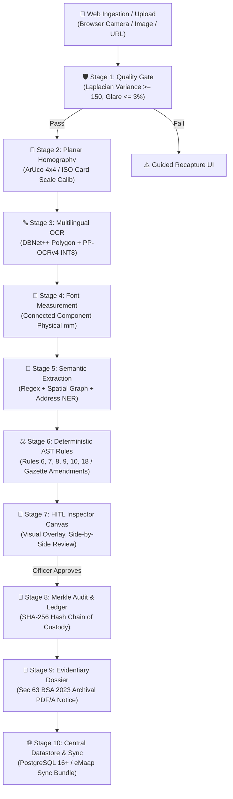

# NyayaDrishti-LM (न्याय दृष्टि)

### Online AI-Powered Legal Metrology Compliance Inspection & Verification Web Platform
#### Problem Statement ID: SIH26034 | Smart India Hackathon 2026

[](https://www.sih.gov.in/)
[](https://www.sih.gov.in/)
[](https://consumeraffairs.nic.in/)
[](https://consumeraffairs.nic.in/)
[]()
[]()
[](https://github.com/anonymousgrouphp-collab/sih26034/actions/workflows/ci.yml)
[](LICENSE)
[](https://www.python.org/)
[](https://fastapi.tiangolo.com/)
[](https://reactjs.org/)
[](https://onnxruntime.ai/)

---

## 📌 Executive Summary

**NyayaDrishti-LM** is an enterprise-grade, **Online-First Web Application** engineered for the **Department of Consumer Affairs (DoCA)**, Ministry of Consumer Affairs, Food & Public Distribution, Government of India. The system includes an **Optional Local Inspection Capability (Mode B)** to guarantee uninterrupted field operational resilience in remote or network-deprived circles.

The platform automates the audit of packaged commodities against the statutory provisions of the **Legal Metrology Act, 2009** and the **Legal Metrology (Packaged Commodities) Rules, 2011** (incorporating all gazette amendments up to 2026, including G.S.R. 629(E), G.S.R. 779(E), and G.S.R. 128(E)).

Operating as an **Augmented Diagnostic Assistant** with a mandatory **Human-in-the-Loop (HITL)** adjudication workflow, the system performs sub-second optical verification, physical millimeter font height measurement, spatial semantic extraction, centralized dashboard analytics, and cryptographically generates **Section 63 Bharatiya Sakshya Adhiniyam, 2023 (BSA 2023)** compliant electronic evidentiary dossiers.

---

## 🌐 Operational Modes & Connectivity Model

NyayaDrishti-LM operates across three clearly demarcated connectivity tiers:

- **Mode A: Online Web Mode (Primary Production):** Centralized web application running in modern web browsers (Chrome, Edge, Firefox), backed by FastAPI, PostgreSQL 16+, central file storage, and server-side INT8 ONNX CPU inference. Features multi-user RBAC, centralized audit history, and national/state compliance dashboards.
- **Mode B: Optional Local Inspection Mode (Secondary Field Resiliency):** Lightweight standalone execution engine running on field laptops (`localhost:8000`) for officers deployed in zero-connectivity wholesale mandis or basements. Executes core optical calibration, OCR, and rule validation locally using local SQLite (SQLCipher), queueing signed sync bundles for upload to Mode A.
- **Mode C: External Integrations (Future Roadmap):** Future national registry webhooks for eMaap, MCA21, and GSTN verification.

---

## 🏗️ 12-Stage Pipeline Architecture

The system executes a deterministic 12-stage modular pipeline from optical capture to statutory notice generation:



---

## ⚖️ Ground Truth Statutory & Technical Constants

| Parameter / Metric | Statutory / Engineering Constant | Legal Authority / Specification |
|:---|:---|:---|
| **Area $> 2500\text{ cm}^2$ Minimum Font Height** | **6.0 mm** *(Correcting historical 8.0 mm typo)* | Gazette Notification **G.S.R. 629(E)** dated 23.06.2017 |
| **Unit Sale Price (USP) Mandate** | Explicit per g/ml or per kg/L (2 decimal places) | Gazette Notification **G.S.R. 779(E)** dated 02.11.2021 |
| **E-Commerce Country of Origin** | Mandatory structured, searchable filter (Rule 6(10A)) | Gazette Notification **G.S.R. 128(E)** dated 13.02.2026 |
| **Electronic Evidence Admissibility** | **Section 63 BSA 2023** *(Repealed 65B IEA 1872)* | Bharatiya Sakshya Adhiniyam, 2023 (w.e.f. 01.07.2024) |
| **Optical Scale Calibration Margin** | **$\le 0.15\text{ mm}$ (Synthetic) / $\le 0.30\text{ mm}$ (Retail)** | Planar Homography vs Digital Calipers Ground Truth |
| **Web Round-Trip Latency (TARGET)** | **$\le 1800\text{ ms}$** | Network upload + server CPU inference + rule evaluation |
| **Local Engine Latency (BENCHMARK)** | **$\le 1200\text{ ms}$** | INT8 Quantized ONNX Runtime on 4-Core CPU |
| **Open-Source License Safety** | **Strictly Permissive (Apache-2.0 / MIT)** | Zero AGPL-3.0 copyleft models (Ultralytics strictly banned) |
| **System Philosophy** | **Augmented Diagnostic Assistant (HITL)** | Constitutional Due Process & Administrative Law |

---

## 📚 Master Documentation & Specifications Index

The repository houses an authoritative, frozen specification suite:

| Document | Description | Format |
|:---|:---|:---:|
| [SYSTEM_MODES_AND_CONNECTIVITY.md](SYSTEM_MODES_AND_CONNECTIVITY.md) | Mode A (Online Web), Mode B (Local Resiliency), Mode C (Integrations) | [Markdown](SYSTEM_MODES_AND_CONNECTIVITY.md) |
| [CONNECTIVITY_REQUIREMENTS.md](CONNECTIVITY_REQUIREMENTS.md) | 24-Row Component Dependency Matrix & Failure Behavior | [Markdown](CONNECTIVITY_REQUIREMENTS.md) |
| [01_MASTER_PROJECT_BLUEPRINT.md](01_MASTER_PROJECT_BLUEPRINT.md) | Single Source of Truth (SSOT), vision, constants, schedule | [PDF](01_MASTER_PROJECT_BLUEPRINT.pdf) |
| [02_FINAL_REQUIREMENTS_SPECIFICATION.md](02_FINAL_REQUIREMENTS_SPECIFICATION.md) | Master Functional (FR 01-22) & Non-Functional (NFR 01-10) Specs | [PDF](02_FINAL_REQUIREMENTS_SPECIFICATION.pdf) |
| [03_FINAL_ARCHITECTURE.md](03_FINAL_ARCHITECTURE.md) | Online-first modular monolith, C4 containers, Docker topology | [PDF](03_FINAL_ARCHITECTURE.pdf) |
| [04_FINAL_MVP_SCOPE.md](04_FINAL_MVP_SCOPE.md) | MoSCoW feature hierarchy, P0 web MVP scope, cut list | [PDF](04_FINAL_MVP_SCOPE.pdf) |
| [05_TECHNOLOGY_DECISION_RECORD.md](05_TECHNOLOGY_DECISION_RECORD.md) | 13 Formal Architecture Decision Records (ADR-01 to ADR-13) | [PDF](05_TECHNOLOGY_DECISION_RECORD.pdf) |
| [06_DATA_AND_MODEL_STRATEGY.md](06_DATA_AND_MODEL_STRATEGY.md) | Synthetic dataset DS-SYNTH-001, pilot DS-PILOT-050, INT8 ONNX | [PDF](06_DATA_AND_MODEL_STRATEGY.pdf) |
| [07_API_AND_INTERFACE_CONTRACTS.md](07_API_AND_INTERFACE_CONTRACTS.md) | OpenAPI 3.1 REST specs, Pydantic v2 pipeline DTOs | [PDF](07_API_AND_INTERFACE_CONTRACTS.pdf) |
| [08_DATABASE_SPECIFICATION.md](08_DATABASE_SPECIFICATION.md) | PostgreSQL 16+ Primary DDL, SQLite Mode B, storage separation | [PDF](08_DATABASE_SPECIFICATION.pdf) |
| [09_UI_UX_BLUEPRINT.md](09_UI_UX_BLUEPRINT.md) | React 18 SPA, Field HUD, Adjudication Canvas, Central Dashboard | [PDF](09_UI_UX_BLUEPRINT.pdf) |
| [10_SECURITY_AND_AUDIT_SPECIFICATION.md](10_SECURITY_AND_AUDIT_SPECIFICATION.md) | Web TLS 1.3, JWT RBAC, Section 63 BSA Merkle DAG, DPDP Act | [PDF](10_SECURITY_AND_AUDIT_SPECIFICATION.pdf) |
| [11_TESTING_AND_VALIDATION_PLAN.md](11_TESTING_AND_VALIDATION_PLAN.md) | 5-tier test pyramid, Web API/E2E tests, caliper benchmarks | [PDF](11_TESTING_AND_VALIDATION_PLAN.pdf) |
| [12_DEMO_PLAN.md](12_DEMO_PLAN.md) | 3-tier live evaluation fallback, 3-minute pitch, Q&A defense | [PDF](12_DEMO_PLAN.pdf) |
| [13_SIX_MEMBER_EXECUTION_PLAN.md](13_SIX_MEMBER_EXECUTION_PLAN.md) | Granular workstreams, APIs, and daily assignments for 6 devs | [PDF](13_SIX_MEMBER_EXECUTION_PLAN.pdf) |
| [14_GITHUB_WORKFLOW.md](14_GITHUB_WORKFLOW.md) | Trunk-based git strategy, PR gates, AGPL exclusion CI, DoD | [PDF](14_GITHUB_WORKFLOW.pdf) |
| [15_RISK_AND_CONTINGENCY_REGISTER.md](15_RISK_AND_CONTINGENCY_REGISTER.md) | 14 Red-team failure modes, tripwires, and fallback mitigations | [PDF](15_RISK_AND_CONTINGENCY_REGISTER.pdf) |
| [16_DECISION_LOG.md](16_DECISION_LOG.md) | Architectural Decision Log (ADL 01-19) & trade-off rationales | [PDF](16_DECISION_LOG.pdf) |
| [17_OPEN_QUESTIONS.md](17_OPEN_QUESTIONS.md) | Bounded technical questions with frozen working defaults | [PDF](17_OPEN_QUESTIONS.pdf) |
| [CLAIMS_WE_MUST_NOT_MAKE.md](CLAIMS_WE_MUST_NOT_MAKE.md) | Legally hazardous & connectivity claims blacklist | [PDF](CLAIMS_WE_MUST_NOT_MAKE.pdf) |
| [COMPLETE_PROJECT_END_TO_END_GUIDE.md](COMPLETE_PROJECT_END_TO_END_GUIDE.md) | Comprehensive 50+ page end-to-end technical guidebook | [PDF](COMPLETE_PROJECT_END_TO_END_GUIDE.pdf) |
| [FINAL_AUTHENTICITY_AND_ACCURACY_AUDIT.md](FINAL_AUTHENTICITY_AND_ACCURACY_AUDIT.md) | Comprehensive pre-development authenticity and accuracy audit | [Markdown](FINAL_AUTHENTICITY_AND_ACCURACY_AUDIT.md) |

### 🔬 Research Dossiers (Bilingual: English & Hinglish)

| Research Dossier | Scope & Focus | Formats |
|:---|:---|:---:|
| **Phase 1: Domain & Legal Metrology** | Statutory frameworks, GSR 629(E), GSR 779(E), Section 63 BSA 2023 | [English](PHASE_1_SIH26034_Domain_Research_Dossier.md) ([PDF](PHASE_1_SIH26034_Domain_Research_Dossier.pdf)) \| [Hinglish](PHASE_1_SIH26034_Domain_Research_Dossier_HINGLISH.md) ([PDF](PHASE_1_SIH26034_Domain_Research_Dossier_HINGLISH.pdf)) |
| **Phase 2: Technology & Benchmarking** | Optical math, ArUco homography, DBNet++, PP-OCRv4, INT8 CPU optimization | [English](PHASE_2_RESEARCH_REPORT.md) ([PDF](PHASE_2_RESEARCH_REPORT.pdf)) \| [Hinglish](PHASE_2_RESEARCH_REPORT_HINGLISH.md) ([PDF](PHASE_2_RESEARCH_REPORT_HINGLISH.pdf)) |
| **Phase 3: Solution Architecture** | 12-stage modular monolith, HITL adjudication canvas, cryptographic Merkle ledger | [Blueprint](PHASE_3_SOLUTION_BLUEPRINT.md) ([PDF](PHASE_3_SOLUTION_BLUEPRINT.pdf)) |

---

## 🛠️ Technology Stack & Decisions

```
┌───────────────────────────────────────────────────────────────────────────┐
│                           PRESENTATION TIER                               │
│  React 18+ SPA  •  Vite  •  Tailwind CSS  •  HTML5 Canvas  •  Lucide      │
│          Accessible on Chrome 120+, Edge, Firefox (Desktop & Mobile)      │
└───────────────────────────────────────────────────────────────────────────┘
                                     │
                             HTTPS / TLS 1.3 / OpenAPI 3.1
                                     │
┌───────────────────────────────────────────────────────────────────────────┐
│                        REVERSE PROXY & GATEWAY                            │
│           Nginx (Reverse Proxy, TLS 1.3, Rate Limiting, 15MB Upload Cap)  │
└───────────────────────────────────────────────────────────────────────────┘
                                     │
┌───────────────────────────────────────────────────────────────────────────┐
│                             API & ORCHESTRATION                           │
│     FastAPI 0.110+ (Python 3.11+)  •  Pydantic v2  •  Uvicorn ASGI        │
│          OAuth2 Bearer JWT Auth  •  SlowAPI  •  Lifespan Management       │
└───────────────────────────────────────────────────────────────────────────┘
                                     │
┌───────────────────────────────────────────────────────────────────────────┐
│                          COMPUTER VISION & OCR                            │
│  OpenCV 4.9+ (ArUco, Homography) • DBNet++ (Detection) • PP-OCRv4 (Rec)   │
│         ONNX Runtime INT8 (CPU Vectorized) • Tesseract 5 (Fallback)       │
│               Colocated on Server CPU  /  Local Runner CPU                │
└───────────────────────────────────────────────────────────────────────────┘
                                     │
┌───────────────────────────────────────────────────────────────────────────┐
│                        RULE ENGINE & COMPLIANCE                           │
│    Deterministic Python AST Engine • Gazette Temporal Epoch Router        │
└───────────────────────────────────────────────────────────────────────────┘
                                     │
┌───────────────────────────────────────────────────────────────────────────┐
│                       EVIDENCE & PERSISTENCE                              │
│   ReportLab PDF/A (Sec 63 BSA 2023) • SHA-256 Merkle Chain of Custody     │
│   PostgreSQL 16+ [Primary Datastore] • SQLite 3.45+ (SQLCipher) [Mode B]  │
│   Decoupled Central File Storage: /storage/uploads/ & /storage/evidence/  │
└───────────────────────────────────────────────────────────────────────────┘
```

---

## 📅 6-Day Execution Plan (07 – 13 September 2026)

| Day & Date | Milestone Focus | Deliverables |
|:---|:---|:---|
| **Day 1 (07 Sep)** | **Foundations & Contracts** | Git repo, CI pipeline, Pydantic DTOs, PostgreSQL DDL models, Vite skeleton |
| **Day 2 (08 Sep)** | **Pre-Processing & Data** | OpenCV ArUco detector, Laplacian quality gate, synthetic label generator |
| **Day 3 (09 Sep)** | **OCR & Measurement** | DBNet++ & PP-OCRv4 ONNX pipeline, connected component font engine |
| **Day 4 (10 Sep)** | **Rule Engine & UI** | Deterministic AST legal rules, HITL Inspector Adjudication Canvas |
| **Day 5 (11 Sep)** | **Evidence, DB & Notice**| Section 63 BSA 2023 PDF/A generator, SHA-256 Merkle DAG, e-commerce audit, DB sync |
| **Day 6 (12 Sep)** | **Testing & Benchmarks** | End-to-end regression tests, physical vernier caliper validation, demo polish |
| **Day 7 (13 Sep)** | **Final Submission** | Online Web Portal Live Evaluation & Department of Consumer Affairs presentation |

---

## 🚀 Quick Start & Development Setup

### Prerequisites
- Python 3.11+
- Node.js 18+ (for frontend client)
- PostgreSQL 16+ (or Docker)
- Git

### 1. Run via Docker Compose (Recommended)
```bash
docker-compose up --build
```
Access the application at `http://localhost:3000` (Frontend SPA) and `http://localhost:8000/docs` (FastAPI Swagger UI).

### 2. Standalone Local Mode (Mode B for Field Inspection)
```bash
python local_runner.py
```

---

## 👥 Core Engineering Team & Contributors

NyayaDrishti-LM is developed by a six-member parallel engineering workstream under Smart India Hackathon 2026:

| Member | Workstream & Focus | Subsystem Scope | GitHub Profile |
|:---|:---|:---|:---:|
| **Kunal Raj** | **Member 1: CV & Metrology** | Optical quality gate, ArUco 4×4 calibration, planar homography, PDP metric surface area | [@kunal-raj-dev](https://github.com/kunal-raj-dev) |
| **Parmarth Kumar** | **Member 2: Multilingual OCR** | DBNet++ text detection, PP-OCRv4 Indic recognition, ONNX INT8 CPU inference | [@parmarth-kumar](https://github.com/parmarth-kumar) |
| **Harsh Patel** | **Member 3: Semantic Extraction** | Statutory field parsing (MRP, Net Qty, Dates, Address, PIN), banned unit flagger | [@anonymousgrouphp-collab](https://github.com/anonymousgrouphp-collab) |
| **Ambika Bansal** | **Member 4: Statutory Rule Engine** | AST statutory engine, Table-I font schedule (Row 5 = 6.0 mm), USP math, 4-state triage | [@bansalambika12-ship-it](https://github.com/bansalambika12-ship-it) |
| **Shailendra Pratap Singh** | **Member 5: Evidence & Cryptography** | FastAPI REST services, PostgreSQL 16 schema, Merkle DAG, Section 63 BSA 2023 certificate, Form-1 PDF | [@shailendrapratap1](https://github.com/shailendrapratap1) |
| **Parmarth Kumar** | **Member 6: Frontend & HUD** | React 18 + Vite SPA, Metrology workbench, split-view Adjudication Canvas, zero-broken-image HUD | [@parmarth-kumar](https://github.com/parmarth-kumar) |

See **[CONTRIBUTORS.md](CONTRIBUTORS.md)** for full details and attribution policies.

---

## 🤝 Community & Governance

- **[Contributing Guidelines](CONTRIBUTING.md)**: Branching policy, definition of done (DoD), commit standards.
- **[Code of Conduct](CODE_OF_CONDUCT.md)**: Contributor Covenant v2.1 code of conduct.
- **[Security Policy](SECURITY.md)**: Vulnerability disclosure procedure and Section 63 BSA 2023 evidence integrity.
- **[GitHub Engineering Workflow](14_GITHUB_WORKFLOW.md)**: Trunk-based branching and automated gate controls.

---

## 🛡️ License & Compliance

This project is licensed under the **[Apache License 2.0](LICENSE)**.

All deep learning models, optical pipelines, and software libraries used in NyayaDrishti-LM adhere strictly to permissive licenses (Apache-2.0, MIT, BSD-3-Clause, PostgreSQL). **GNU AGPL-3.0 dependencies are strictly prohibited** to safeguard institutional legal integrity.

---

<p align="center">
  <b>Department of Consumer Affairs (DoCA)</b><br/>
  Ministry of Consumer Affairs, Food & Public Distribution • Government of India<br/>
  <i>Smart India Hackathon 2026</i>
</p>
