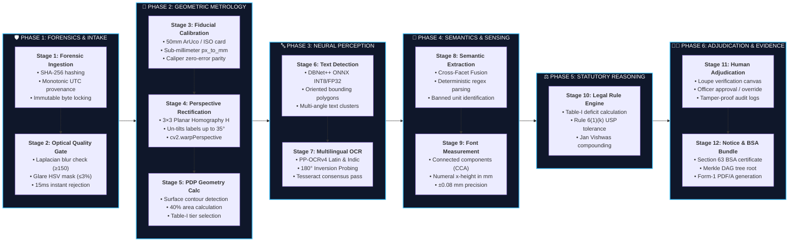
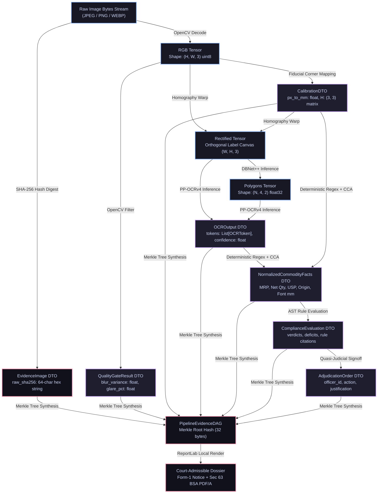
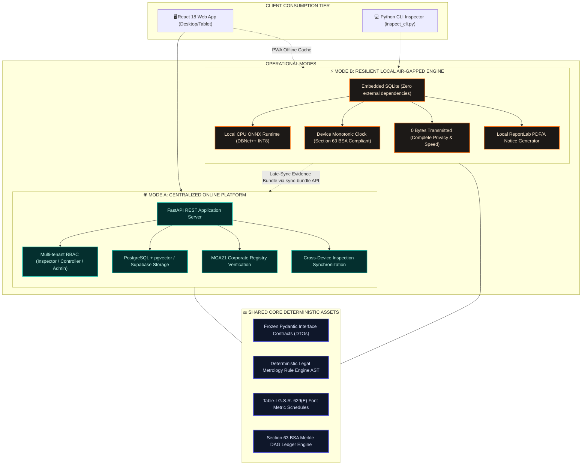

# NIRIKSHAK (SIH26034) — COMPLETE 12-STAGE PIPELINE PRESENTATION & FLOWCHART GUIDE

**Department of Consumer Affairs (DoCA), Government of India**
_Legal Metrology Act, 2009 | LMPC Rules, 2011 | Section 63 Bharatiya Sakshya Adhiniyam, 2023 (BSA)_

---

## 📌 TABLE OF CONTENTS

1. [Executive Summary for Judges &amp; PPT](#1-executive-summary-for-judges--ppt)
2. [Diagram 1: Master End-to-End System Operational Flowchart](#2-diagram-1-master-end-to-end-system-operational-flowchart)
3. [Diagram 2: 12-Stage Architecture Matrix (Grouped Functional View)](#3-diagram-2-12-stage-architecture-matrix-grouped-functional-view)
4. [Diagram 3: Data Transformation &amp; Cryptographic Provenance Pipeline](#4-diagram-3-data-transformation--cryptographic-provenance-pipeline)
5. [Diagram 4: Dual-Engine Topology (Mode A Online Web vs Mode B Offline Resilient)](#5-diagram-4-dual-engine-topology-mode-a-online-web-vs-mode-b-offline-resilient)
6. [Stage-by-Stage Technical Deep Dive (Stages 1 to 12 Verified)](#6-stage-by-stage-technical-deep-dive-stages-1-to-12-verified)
7. [How to Export These Diagrams for PowerPoint Slides](#7-how-to-export-these-diagrams-for-powerpoint-slides)

---

## 1. Executive Summary for Judges & PPT

### 🎯 The Core Philosophy:

> **"AI Observes, Deterministic Rules Verify, and the Human Officer Decides."**

- **AI's Limited Role:** AI (DBNet++ and PP-OCRv4) is strictly used as the "eyes" of the system to locate and transcribe text from physical packages. AI **never** makes legal decisions or guesses numbers.
- **Deterministic Rule Engine (AST):** 100% of compliance evaluations run via mathematical and legal rules codified from official Gazette notifications. No LLM hallucinations.
- **Quasi-Judicial Human Sovereignty:** Only an authorized Legal Metrology Officer (LMO) / Controller can approve violations, record compoundings, or issue statutory show-cause notices.

---

## 2. Diagram 1: Master End-to-End System Operational Flowchart

_This flowchart depicts the entire operational lifecycle, including ingestion sources, quality checks, fallback loops, multi-panel fusion, legal reasoning, adjudication, and legal notice generation._

```mermaid
flowchart TD
    %% Styling Definitions
    classDef inputStyle fill:#1e293b,stroke:#38bdf8,stroke-width:2px,color:#f8fafc;
    classDef stageStyle fill:#0f172a,stroke:#818cf8,stroke-width:2px,color:#f8fafc;
    classDef decisionStyle fill:#312e81,stroke:#a855f7,stroke-width:2px,color:#f8fafc;
    classDef rejectStyle fill:#450a0a,stroke:#ef4444,stroke-width:2px,color:#fca5a5;
    classDef passStyle fill:#064e3b,stroke:#10b981,stroke-width:2px,color:#a7f3d0;
    classDef finalStyle fill:#14532d,stroke:#22c55e,stroke-width:3px,color:#ffffff;

    %% INTAKE TIER
    subgraph S0 ["📥 INTAKE & INGESTION TIER"]
        A1["📸 Physical Field Intake<br/>(Smartphone / Web Camera)"]:::inputStyle
        A2["🌐 E-Commerce URL / DOM<br/>(Amazon / Blinkit / Flipkart)"]:::inputStyle
    end

    %% STAGE 1: FORENSIC INGESTION
    subgraph S1 ["STAGE 1: FORENSIC INGESTION & HASHING"]
        B1["🔒 Compute SHA-256 Hash<br/>on Raw Byte Stream"]:::stageStyle
        B2["⏱️ Timestamp Provenance Entry<br/>(Monotonic Clock + Device ID)"]:::stageStyle
        B1 --> B2
    end
    A1 --> B1
    A2 -->|Rule 6-10 Digital Pathway| B1

    %% STAGE 2: OPTICAL QUALITY GATE
    subgraph S2 ["STAGE 2: OPTICAL QUALITY GATE"]
        C1["🔍 Laplacian Blur Variance<br/>σ² threshold ≥ 150.0"]:::stageStyle
        C2["☀️ Specular Glare Masking<br/>HSV V>245, S<15 (≤ 3.0%)"]:::stageStyle
        C3["📐 Perspective Skew Check<br/>Tilt angle ≤ 15.0°"]:::stageStyle
        C1 & C2 & C3 --> C4{"Quality Gate<br/>Passed?"}:::decisionStyle
    end
    B2 --> C1

    %% REJECTION GUIDANCE
    R1["⚠️ Real-Time Retake Guidance<br/>'Hold Steady / Tilt 15° to Avoid Glare'<br/>(Zero heavy ML compute wasted)"]:::rejectStyle
    C4 -->|No - Blurry/Glare| R1
    R1 -.->|Officer Retakes Image| A1

    %% STAGE 3 & 4: GEOMETRIC METROLOGY
    subgraph S34 ["STAGES 3 & 4: FIDUCIAL CALIBRATION & RECTIFICATION"]
        D1{"Fiducial Standard<br/>Detected?"}:::decisionStyle
        D2["🎯 ArUco 4x4_50<br/>(50.0 mm Marker)"]:::stageStyle
        D3["💳 ISO 7810 ID-1 Card<br/>(85.60 × 53.98 mm)"]:::stageStyle
        D4["⚠️ Uncalibrated Mode<br/>(Text checked; font routed to Review)"]:::rejectStyle
        D5["📏 Resolve Metric Scale S<br/>px_to_mm = px / mm"]:::stageStyle
        D6["📐 Compute 3×3 Homography (H)<br/>cv2.warpPerspective Rectification"]:::stageStyle
    end
    C4 -->|Yes - Clear Image| D1
    D1 -->|ArUco Found| D2 --> D5
    D1 -->|Card Found| D3 --> D5
    D1 -->|No Reference| D4 --> D6
    D5 --> D6

    %% STAGE 5: PDP AREA CALCULATION
    subgraph S5 ["STAGE 5: PRINCIPAL DISPLAY PANEL (PDP)"]
        E1["📦 Packaging Contour Segmentation<br/>(Canny / Morphological Edge)"]:::stageStyle
        E2{"Package Geometry<br/>Type?"}:::decisionStyle
        E3["Rectangular Box<br/>PDP = 40% of (H × W)"]:::stageStyle
        E4["Cylindrical Bottle<br/>PDP = 40% of (H × C)"]:::stageStyle
        E5["Flexible Pouch<br/>PDP = 40% Front Face"]:::stageStyle
        E6["📊 Resolve Statutory PDP Area (cm²)<br/>Select Table-I Row Threshold"]:::stageStyle
    end
    D6 --> E1 --> E2
    E2 -->|Rectangular| E3 --> E6
    E2 -->|Cylindrical| E4 --> E6
    E2 -->|Pouch/Other| E5 --> E6

    %% STAGES 6 & 7: MULTILINGUAL VISION
    subgraph S67 ["STAGES 6 & 7: MULTILINGUAL TEXT PERCEPTION"]
        F1["🔲 DBNet++ Text Detector<br/>(Oriented 4-Point Bounding Polygons)"]:::stageStyle
        F2["🔤 PaddleOCR PP-OCRv4 (Latin)<br/>+ PP-OCRv3 (Devanagari Hindi)"]:::stageStyle
        F3{"Confidence<br/>< 0.92?"}:::decisionStyle
        F4["🔄 180° Inversion Probing<br/>(Upside-Down Packaging Correction)"]:::stageStyle
        F5{"Confidence<br/>< 0.65?"}:::decisionStyle
        F6["🤖 Tesseract v5 Consensus Fallback"]:::stageStyle
        F7["📋 Normalized OCR Token Stream<br/>(Text, Polygons, Confidence)"]:::stageStyle
    end
    E6 --> F1 --> F2 --> F3
    F3 -->|Yes| F4 --> F5
    F3 -->|No| F5
    F5 -->|Yes| F6 --> F7
    F5 -->|No| F7

    %% STAGE 8 & 9: SEMANTIC EXTRACTION & METROLOGY
    subgraph S89 ["STAGES 8 & 9: SEMANTIC EXTRACTION & METROLOGY"]
        G1["🧩 Multi-Facet Cross-Panel Fusion<br/>(Front + Back + Side + Stamp)"]:::stageStyle
        G2["🏷️ Statutory Entity Parsers<br/>• MRP & Currency (₹, Rs., /-) | Net Qty<br/>• USP | Dates (Mfg/Exp) | Origin<br/>• Manufacturer Address & 6-Digit PIN<br/>• Consumer Care 4-Tuple Contact"]:::stageStyle
        G3["🚫 Banned Unit Symbol Detector<br/>(Flags 'gms', 'gm', 'Kgs', 'ML', 'ltrs')"]:::stageStyle
        G4["🔬 Physical Font Measurement Engine<br/>CCA Numeral x-height: h_mm = h_px / px_to_mm<br/>(Precision: ±0.08 mm)"]:::stageStyle
    end
    F7 --> G1 --> G2 --> G3 --> G4

    %% STAGE 10: LEGAL RULE ENGINE AST
    subgraph S10 ["STAGE 10: DETERMINISTIC STATUTORY RULE ENGINE"]
        H1["⚖️ Rule 6(1)(h) & Table-I Schedule<br/>Measured mm vs Minimum Statutory mm"]:::stageStyle
        H2["🧮 Rule 6(1)(k) USP Math<br/>|USP × Qty - MRP| ≤ 0.02 Tolerance"]:::stageStyle
        H3["📝 Rule 6(1)(e) Mandatory Clauses<br/>'inclusive of all taxes' verification"]:::stageStyle
        H4["🇮🇳 Rule 6(10) E-Commerce & Origin<br/>Country of Origin & Digital Listing Audit"]:::stageStyle
        H5["💰 Jan Vishwas Act, 2023 Schedule<br/>Sec 48/49 Compounding Assessment"]:::stageStyle
        H6{"4-State Legal<br/>Verdict"}:::decisionStyle
    end
    G4 --> H1 & H2 & H3 & H4 & H5 --> H6

    %% STAGE 11: QUASI-JUDICIAL ADJUDICATION
    subgraph S11 ["STAGE 11: HUMAN-IN-THE-LOOP ADJUDICATION"]
        J1["🖥️ Officer Adjudication Canvas<br/>(Interactive Loupe + Bounding Box Overlays)"]:::stageStyle
        J2{"Officer Judicial<br/>Disposition"}:::decisionStyle
        J3["✅ Confirm Violation<br/>(Endorse AI Statutory Finding)"]:::stageStyle
        J4["✏️ Judicial Override<br/>(Mandatory Remarks Recorded)"]:::stageStyle
    end
    H6 -->|PASS / FAIL / REVIEW / UNABLE| J1 --> J2
    J2 -->|Confirm| J3
    J2 -->|Override| J4

    %% STAGE 12: EVIDENCE DOSSIER & NOTICE
    subgraph S12 ["STAGE 12: EVIDENCE DOSSIER & NOTICE GENERATION"]
        K1["🔗 Merkle DAG Cryptographic Root<br/>(Chains Stages 1 to 11 SHA-256)"]:::stageStyle
        K2["📜 Section 63 BSA 2023 Digital Certificate<br/>(Device Fingerprint + Monotonic Clock)"]:::stageStyle
        K3["📄 Form-1 / Form-2 Show-Cause Notice<br/>(Court-Admissible PDF/A with Verification QR)"]:::finalStyle
    end
    J3 & J4 --> K1 --> K2 --> K3
```

---

## 3. Diagram 2: 12-Stage Architecture Matrix (Grouped Functional View)

_This horizontal pipeline diagram categorizes the 12 stages into 6 operational departments, showing exact module ownership, core tasks, and operational objectives._

---

## 4. Diagram 3: Data Transformation & Cryptographic Provenance Pipeline

_Illustrates how raw physical input is successively transformed across data contracts, tensor shapes, and Merkle cryptographic nodes._

---

## 5. Diagram 4: Dual-Engine Topology (Mode A Online Web vs Mode B Offline Resilient)

_Shows how Nirikshak guarantees 100% operational availability both in high-bandwidth central offices and in zero-connectivity rural field raids._

---

## 6. Stage-by-Stage Technical Deep Dive (Stages 1 to 12 Verified)

This table can be directly used as presentation slide notes or backup slides for judge Q&A:

| Stage # | Stage Name                          | Inputs                                           | Core Technology & Algorithms                                                     | Key Outputs                                                    | Statutory Basis                                             | Failure Fallback                                                                    |
| :-----: | :---------------------------------- | :----------------------------------------------- | :------------------------------------------------------------------------------- | :------------------------------------------------------------- | :---------------------------------------------------------- | :---------------------------------------------------------------------------------- | --- | --- | --- |
|  **1**  | **Forensic Ingestion & Hashing**    | Raw image file bytes stream                      | SHA-256 cryptographic digest, monotonic UTC clock timestamping                   | `raw_sha256`, device provenance node                           | Sec. 63 Bharatiya Sakshya Adhiniyam, 2023                   | 0-byte or corrupt stream triggers`400 Bad Request`                                  |
|  **2**  | **Optical Quality Gate**            | Raw BGR image tensor                             | Laplacian variance ($\sigma^2$), HSV saturation thresholding ($V > 245, S < 15$) | `QualityGateResult` (`is_valid`, blur score, glare %)          | Sec. 63 BSA (Data Integrity Standard)                       | $\sigma^2 < 150$ or glare $> 3\%$ emits instant retake HUD advisory without ML cost |
|  **3**  | **Fiducial Calibration**            | Label image with reference object                | OpenCV ArUco 4x4_50 detector, ISO-7810 card contour matcher                      | `px_to_mm` scale factor, reference coordinates                 | Rule 2(h) read with Rule 7, LMPC Rules, 2011                | Missing fiducial routes to**Uncalibrated Mode** (`REQUIRES_REVIEW`)                 |
|  **4**  | **Perspective Rectification**       | Angled packaging image + 4 corner points         | 4-point planar homography matrix$H$, `cv2.warpPerspective`                       | Flat orthogonal label canvas                                   | Metrology standard measurement angle                        | Tilt$> 35^\circ$ flags perspective distortion warning to officer                    |     |     |     |
|  **5**  | **PDP Geometry Calculation**        | Rectified label canvas, packaging classification | Canny edge, contour area integration, 40% surface area formula                   | Statutory`pdp_area_cm2`, Table-I row selector                  | Rule 2(k) & Rule 7(1), LMPC Rules, 2011                     | Unclear boundary prompts officer manual caliper confirmation                        |
|  **6**  | **Multi-Oriented Text Detection**   | Rectified label canvas                           | DBNet++ (Real-Time Text Detector, ONNX INT8/FP32)                                | Oriented 4-point bounding polygons                             | Rule 6 LMPC Mandatory Declarations                          | Tight text bounding boxes undergo polygon dilation and merge                        |
|  **7**  | **Multilingual Scene OCR**          | Cropped polygon text patches                     | PaddleOCR PP-OCRv4 (English) + PP-OCRv3 (Devanagari) + 180° inversion probe      | `OCROutput` tokens list with confidence scores                 | Rule 6(3) Bilingual English & Hindi mandate                 | Conf$< 0.92$ probes 180° flip; Conf $< 0.65$ runs Tesseract v5                      |
|  **8**  | **Semantic Entity Extraction**      | Multilingual tokens + bounding coordinates       | Deterministic regex AST, Spatial proximity trees, Cross-Facet Fusion             | `NormalizedCommodityFacts` (MRP, Net Qty, USP, Dates, Address) | Rule 6(1)(a)-(p), Rule 12 Banned Units (`gms`)              | Incomplete address preserves valid lines while flagging missing PIN                 |
|  **9**  | **Physical Font Measurement**       | Binarized numeral crops +`px_to_mm` scale        | Connected-Components Analysis (CCA), Numeral x-height extraction                 | Measured font height in mm ($\pm 0.08\text{ mm}$)              | Rule 6(1)(h) read with Table-I, G.S.R. 629(E)               | Noisy stroke contours fall back to median bounding-box height                       |
| **10**  | **Deterministic Legal Rule Engine** | `NormalizedCommodityFacts` + font height         | Abstract Syntax Tree (AST) evaluator, historical Gazette resolver                | `ComplianceEvaluation` list, 4-state verdict                   | LM Act 2009 Sec 36, LMPC Rules 2011, Jan Vishwas 2023       | Missing Mfg date applies current rules + flags date absence                         |
| **11**  | **Human-in-the-Loop Adjudication**  | Rule engine evaluation + high-res canvas         | Interactive web HUD, zoom loupe, digital signature module                        | Officer Adjudication Order, override justification logs        | Quasi-judicial principles of administrative natural justice | Override strictly requires mandatory written officer remarks                        |
| **12**  | **Evidence Bundler & Legal Notice** | Sealed inspection findings & officer signature   | Merkle DAG cryptographic root calculation, ReportLab PDF/A generator             | Form-1/2 Legal Notice PDF, Sec 63 BSA Digital Certificate      | Sec 36(1) LM Act, Sec 63 BSA, Form-1 Legal Notice Schedule  | Local PDF rendering fallback exports structured JSON evidence bag                   |

---

## 7. How to Export These Diagrams for PowerPoint Slides

1. **Option A (Mermaid Live Editor — Recommended for Vector HD):**
   - Open [mermaid.live](https://mermaid.live).
   - Copy any of the `mermaid` code blocks from Section 2, 3, 4, or 5.
   - Paste into the editor.
   - Click **Download SVG** (for infinitely scalable, crisp slides in PowerPoint) or **Download PNG (4K)**.
2. **Option B (Direct VS Code / Markdown Preview):**
   - Use the Markdown Preview Mermaid Support extension in VS Code.
   - Right-click and copy image directly into your presentation slide deck.
3. **Option C (Slide Organization Advice):**
   - **Slide 1 (Solution Overview):** Use **Diagram 2 (Architecture Matrix)** to show the 6 phases and complete coverage.
   - **Slide 2 (Technical Workflow):** Use **Diagram 1 (Master Flowchart)** to demonstrate optical quality gates, exception handling, and quasi-judicial human control.
   - **Slide 3 (Legal & Judicial Validity):** Use **Diagram 3 (Cryptographic Provenance)** to explain why your evidence will never get dismissed in court under Section 63 BSA 2023.
